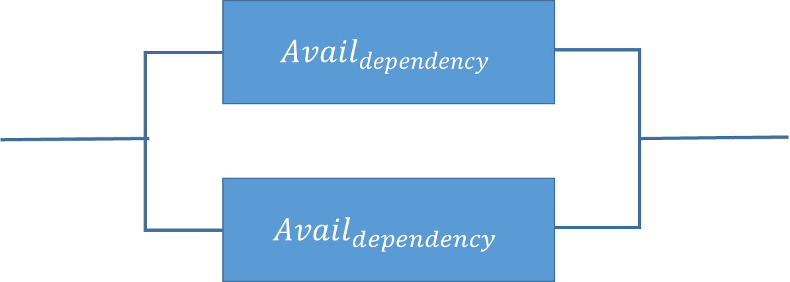

# Availability

_Availability_ (also known as _service availability_)
is both a commonly used metric to quantitatively measure resiliency, as well as a target
resiliency objective.

- **Availability** is the percentage of time that a workload
  is available for use.

_Available for use_ means that it performs its agreed function
successfully when required.

This percentage is calculated over a period of time, such as a month, year, or trailing
three years. Applying the strictest possible interpretation, availability is reduced anytime
that the application isn’t operating normally, including both scheduled and unscheduled
interruptions. We define _availability_ as follows:

- Availability is a percentage uptime (such as 99.9%) over a period of time (commonly
  a month or year)
- Common short-hand refers only to the “number of nines”; for example, “five nines”
  translates to being 99.999% available
- Some customers choose to exclude scheduled service downtime (for example, planned
  maintenance) from the _Total Time_ in the formula.
  However, this is not advised, as your users will likely want to use your service during
  these times.
  Here is a table of common application availability design goals and the maximum length
  of time that interruptions can occur within a year while still meeting the goal. The table
  contains examples of the types of applications we commonly see at each availability tier.
  Throughout this document, we refer to these values.

| Availability | Maximum Unavailability (per year) | Application Categories                                     |
| ------------ | --------------------------------- | ---------------------------------------------------------- | --------------------------------------------------------------------------------------------------------------------------------------------------------------------------------------------------------------------------------------------------------------------------------------------------------------------------------------------------------------------------------------------------------------------------------------------------------------------------------------------------------------------------------------------------------------------------------------------------------------------------------------------------------------------------------------------------------------------------------------------------------------------------------------------------------------------------------------------------------------------------------------------------------------------------------------------------------------------------------------------------------------------------------------------------------------------------------------------------------------------------------------------------------------------------------------------------------------------------------------------------------------------------------------------------------------------------------------------------------------------------------------------------------------------------------------------------------------------------------------------------------------------------------------------------------------------------------------------------------------------------------------------------------------------------------------------------------------------------------------------------------------------------------------------------------------------------------------------------------------------------------------------------------------------------------------------------------------------------------------------------------------------------------------------------------------------------------------------------------------------------------------------------------------------------------------------------------------------------------------------------------------------------------------------------------------------------------------------------------------------------------------------------------------------------------------------------------------------------------------------------------------------------------------------------------------------------------------------------------------------------------------------------------------------------------------------------------------------------------------------------------------------------------------------------------------------------------------------------------------------------------------------------------------------------------------------------------------------------------------------------------------------------------------------------------------------------------------------------------------------------------------------------------------------------------------------------------------------------------------------------------------------------------------------------------------------------------------------------------------------------------------------------------------------------------------------------------------------------------------------------------------------------------------------------------------------------------------------------------------------------------------------------------------------------------------------------------------------------------------------------------------------------------------------------------------------------------------------------------------------------------------------------------------------------------------------------------------------------------------------------------------------------------------------------------------------------------------------------------------------------------------------------------------------------------------------------------------------------------------------------------------------------------------------------------------------------------------------------------------------------------------------------------------------------------------------------------------------------------------------------------------------------------------------------------------------------------------------------------------------------------------------------------------------------------------------------------------------------------------------------------------------------------------------------------------------------------------------------------------------------------------------------------------------------------------------------------------------------------------------------------------------------------------------------------------------------------------------------------------------------------------------------------------------------------------------------------------------------------------------------------------------------------------------------------------------------------------------------------------------------------------------------------------------------------------------------------------------------------------------------- |
| 99%          | 3 days 15 hours                   | Batch processing, data extraction, transfer, and load jobs |
| 99.9%        | 8 hours 45 minutes                | Internal tools like knowledge management, project tracking |
| 99.95%       | 4 hours 22 minutes                | Online commerce, point of sale                             |
| 99.99%       | 52 minutes                        | Video delivery, broadcast **workloads**                    |
| 99.999%      | 5 minutes                         | ATM transactions, telecommunications **workloads**         | **Measuring availability based on requests.** For your service it may be easier to count successful and failed requests instead of “time available for use”. In this case the following calculation can be used:  This is often measured for one-minute or five-minute periods. Then a monthly uptime percentage (time-base availability measurement) can be calculated from the average of these periods. If no requests are received in a given period it is counted at 100% available for that time. **Calculating availability with hard dependencies.** Many systems have hard dependencies on other systems, where an interruption in a dependent system directly translates to an interruption of the invoking system. This is opposed to a soft dependency, where a failure of the dependent system is compensated for in the application. Where such hard dependencies occur, the invoking system’s availability is the product of the dependent systems’ availabilities. For example, if you have a system designed for 99.99% availability that has a hard dependency on two other independent systems that each are designed for 99.99% availability, the workload can theoretically achieve 99.97% availability: Availinvok × Avail*dep1* × Avail*dep2* = Availworkload 99.99% × 99.99% × 99.99% = 99.97% It’s therefore important to understand your dependencies and their availability design goals as you calculate your own. **Calculating availability with redundant components.** When a system involves the use of independent, redundant components (for example, redundant resources in different Availability Zones), the theoretical availability is computed as 100% minus the product of the component failure rates. For example, if a system makes use of two independent components, each with an availability of 99.9%, the effective availability of this dependency is 99.9999%:  Availeffective = *Avail*MAX − ((100%−Availdependency)×(100%−Availdependency)) 99.9999% = 100% − (0.1%×0.1%) _Shortcut calculation_: If the availabilities of all components in your calculation consist solely of the digit nine, then you can sum the count of the number of nines digits to get your answer. In the above example two redundant, independent components with three nines availability results in six nines. **Calculating dependency availability.** Some dependencies provide guidance on their availability, including availability design goals for many AWS services. But in cases where this isn’t available (for example, a component where the manufacturer does not publish availability information), one way to estimate is to determine the **Mean Time Between Failure (MTBF)** and **Mean Time to Recover (MTTR)**. An availability estimate can be established by:  For example, if the MTBF is 150 days and the MTTR is 1 hour, the availability estimate is 99.97%. For additional details, see [Availability and Beyond: Understanding and improving the resilience of distributed systems on AWS](../../../whitepapers/latest/availability-and-beyond-improving-resilience/availability-and-beyond-improving-resilience.md "../../../whitepapers/latest/availability-and-beyond-improving-resilience/availability-and-beyond-improving-resilience.md"), which can help you calculate your availability. **Costs for availability.** Designing applications for higher levels of availability typically results in increased cost, so it’s appropriate to identify the true availability needs before embarking on your application design. High levels of availability impose stricter requirements for testing and validation under exhaustive failure scenarios. They require automation for recovery from all manner of failures, and require that all aspects of system operations be similarly built and tested to the same standards. For example, the addition or removal of capacity, the deployment or rollback of updated software or configuration changes, or the migration of system data must be conducted to the desired availability goal. Compounding the costs for software development, at very high levels of availability, innovation suffers because of the need to move more slowly in deploying systems. The guidance, therefore, is to be thorough in applying the standards and considering the appropriate availability target for the entire lifecycle of operating the system. Another way that costs escalate in systems that operate with higher availability design goals is in the selection of dependencies. At these higher goals, the set of software or services that can be chosen as dependencies diminishes based on which of these services have had the deep investments we previously described. As the availability design goal increases, it’s typical to find fewer multi-purpose services (such as a relational database) and more purpose-built services. This is because the latter are easier to evaluate, test, and automate, and have a reduced potential for surprise interactions with included but unused functionality. |
