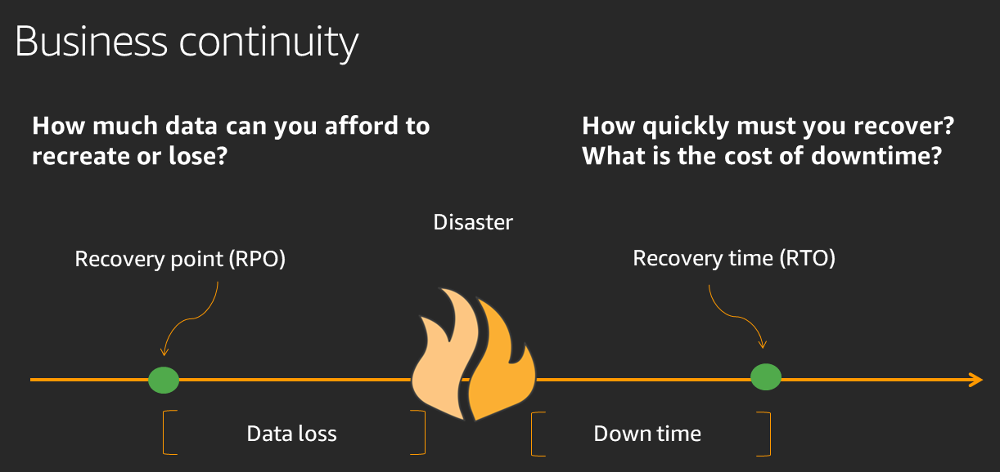

# Disaster Recovery (DR) objectives

In addition to availability objectives, your resiliency strategy should also include
Disaster Recovery (DR) objectives based on strategies to recover your workload in case of a
disaster event. Disaster Recovery focuses on one-time recovery objectives in response to
natural disasters, large-scale technical failures, or human threats such as attack or error.
This is different than availability which measures mean resiliency over a period of time in
response to component failures, load spikes, or software bugs.

**Recovery Time Objective (RTO)** Defined by the organization.
RTO is the maximum acceptable delay between the interruption of service and restoration of
service. This determines what is considered an acceptable time window when service is
unavailable.

**Recovery Point Objective (RPO)** Defined by the organization.
RPO is the maximum acceptable amount of time since the last data recovery point. This
determines what is considered an acceptable loss of data between the last recovery point and
the interruption of service.

_The relationship of RPO (Recovery Point Objective), RTO (Recovery Time
Objective), and the disaster event._

RTO is similar to MTTR (Mean Time to Recovery) in that both measure the time between
the start of an outage and workload recovery. However MTTR is a mean value taken over
several availability impacting events over a period of time, while RTO is a target, or
maximum value allowed, for a _single_ availability impacting event.
