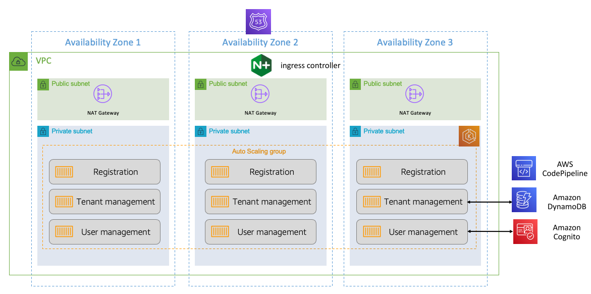
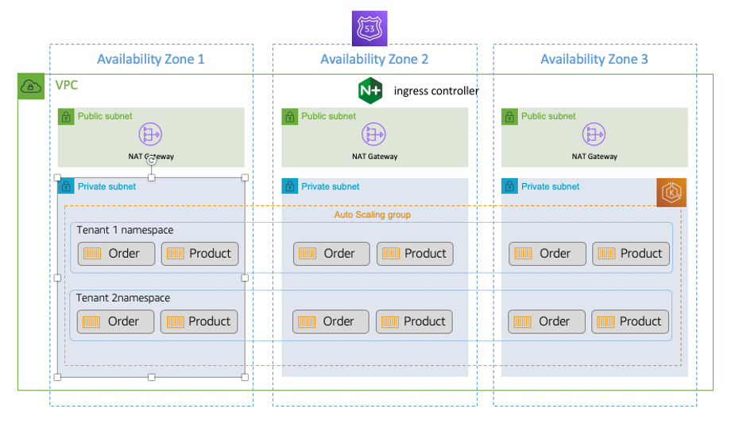
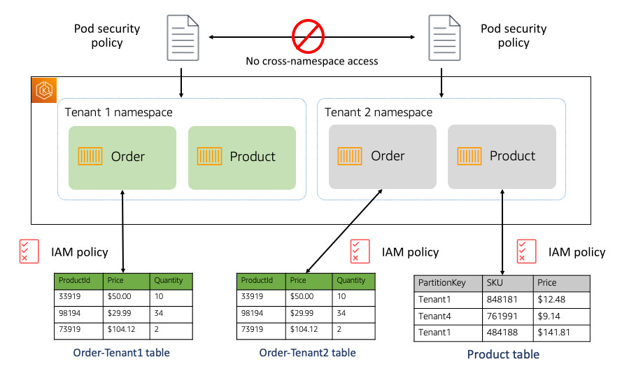

# Amazon EKS SaaS

For many SaaS providers, the profile of Amazon Elastic Kubernetes Service (Amazon EKS) represents a good fit with their
microservices development and architectural goals. It provides a
way to build and deploy multi-tenant microservices that can help
them realize their agility, scale, cost, and operational goals
without requiring a complete shift in their development tooling
and mindset. The rich community of Kubernetes tools and solutions
also offers SaaS developers a range of different options for
building, managing, securing, and operating their SaaS
environments.

For container-based environments, much of the architecture is
focused on how to successfully ensure that we’re preventing
cross-tenant access. While there can be a temptation to allow
tenants to share containers, this presumes that tenants would be
comfortable with a notion of soft multi-tenancy. For most SaaS
environments, though, the isolation requirements demand a more
robust implementation of isolation.

These isolation factors can have a significant impact on the
architectural model that gets built with Amazon EKS. The general
guidance for building SaaS architectures with Amazon EKS is to
prevent any sharing of containers across tenants. While this adds
complexity to the footprint of the architecture, it addresses the
fundamental need to ensure that we have created an isolation model
that will address the domain, compliance, and regulatory needs of
multi-tenant customers.

Let’s look at a sample architecture to see the fundamental
elements of a SaaS Amazon EKS environment. Since there are lots of
moving parts to this solution, let’s start by looking at the
shared services that are used to support the core, horizontal
concepts that span all of our tenants (shown in Figure 4).

First, you’ll notice that we have the foundational elements that are
part of any highly available, highly scalable AWS architecture.
The environment includes a VPC that consists of three Availability
Zones. Routing of inbound traffic from tenants is managed by
Amazon Route 53, which is configured to direct incoming
application requests to the endpoint defined by our NGINX ingress
controller. The controller enables selected routing within our
Amazon EKS cluster that is essential to the multi-tenant routing
that you’ll see below.

_Figure 4: Amazon EKS SaaS shared services architecture_

The services running in the Amazon EKS cluster represent a
sampling of a few of the common services that are typically part
of a SaaS environment. Registration is used to orchestrate the
onboarding of new tenants. Tenant management manages the state and
attributes of all the tenants in the system, storing this data in
an Amazon DynamoDB table. User management provides the basic
operations to add, delete, enable, disable, and update tenants.
The identities it manages are stored in Amazon Cognito. AWS CodePipeline is also included to represent the tooling that is
used to provision each new tenant that is onboarded to the system.

This architecture only represents the foundational elements of our
SaaS environment. We now need to look at what it means to
introduce tenants into this environment. Given the isolation
considerations described previously, our Amazon EKS environment
will create separate namespaces for each tenant and secure those
namespaces to ensure that we have a robust tenant isolation model.

_Figure 5: Deploying tenant environments in Amazon EKS_

The diagram in Figure 5 provides a view of these namespaces within
our SaaS architecture. On the surface, this architecture looks
very much like the previous baseline diagram. The key difference
is that we’ve deployed the services that are part of our
application into separate namespaces. In this example, there are
two tenants with distinct namespaces. Within each, we have
deployed some sample services (Order and Product).

Each of the tenant namespaces are provisioned by the registration
service that is shown above. This would use continuous delivery
services (like AWS CodePipeline) to kick-off a pipeline that
creates the namespace, deploys the services, creates tenant
resources (databases, etc.), and configures the routing. This is
where the ingress controller comes into play. Each provisioned
namespace creates a separate ingress resource for each of the
microservices in that namespace. This enables tenant traffic to be
routed to the appropriate tenant namespace.

While namespaces allow you to have clear boundaries between the
tenant resources in your Amazon EKS cluster, these namespaces are
more of a grouping construct. The namespace alone does not ensure
that your tenant loads are protected from cross-tenant access.

To enhance the isolation story of our Amazon EKS environment,
we’ll need to introduce different security constructs that can
restrict the access of any tenant running in a given namespace.
The diagram in Figure 6 provides a high-level illustration of an
approach you can take to control the experience of each tenant.

_Figure 6: Isolating tenant resources_

There are two specific constructs introduced here. At the
namespace level, you’ll see that we have created separate pod
security policies. These are native Kubernetes networking security
policies that can be attached to a policy. In this example, these
policies are used to limit network traffic between tenant
namespaces. This represents a coarse-grained way to prevent one
tenant from accessing the compute resources of another tenant.

In addition to securing the namespaces, you also must ensure that
the resources accessed by the services running in a namespace are
restricted. In this example, we have two examples of isolation.
The Order microservice uses a table per tenant model (silo) and
has IAM policies that restrict access to a specific tenant. The
Product microservice uses a pooled model where tenant data is
comingled and relies on an IAM policy that’s applied to each item
to restrict tenant access.
