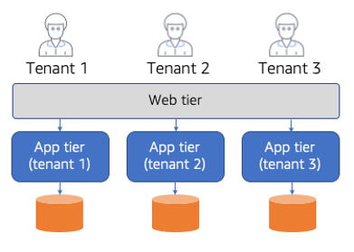

# The bridge model

While the silo and pool models have very distinct approaches to isolation, the
isolation landscape for many SaaS providers is less absolute. As you look at real
application problems and you decompose your systems into smaller services, you will
often discover that your solution will require a mix of the silo and pool models. This
mixed model is what we would refer to as the bridge model of isolation. The diagram in
Figure 18 provides an example of how the bridge model might be realized in a SaaS
solution.

_Figure 18: Bridge isolation model_

This diagram highlights how the bridge model enables you to combine the silo and
pool models. Here we have a monolithic architecture with classic web and application
tiers. The web tier, for this solution, is deployed in a pool model that is shared by
all tenants. While the web tier is shared, the underlying business logic and storage of
our application are actually deployed in a silo model where each tenant has its own
application tier and storage.

If the monolith was broken into microservices, each of the various microservices in
your system could leverage combinations of the silo and pool models. More detail on this
approach will follow in the description of specifics of applying silo and pool models
with different AWS constructs. The key takeaway here is that your view of the silo and
pool models will be much more granular for environments that are decomposed into a
collection of services that have varying isolation requirements.
