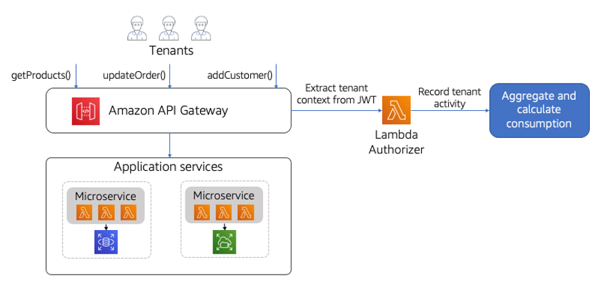
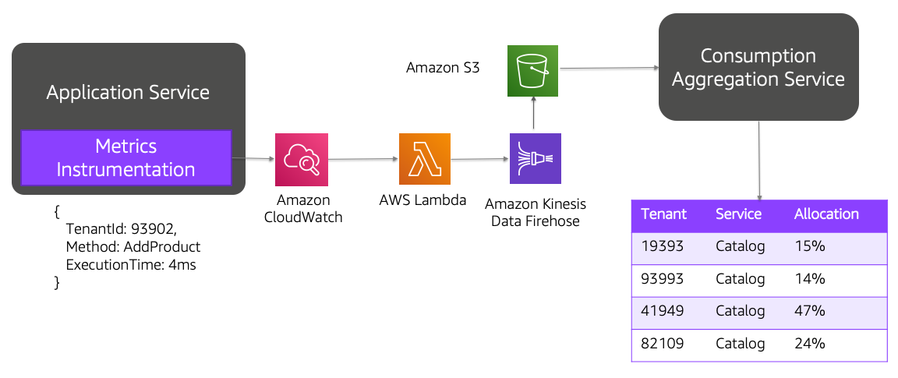
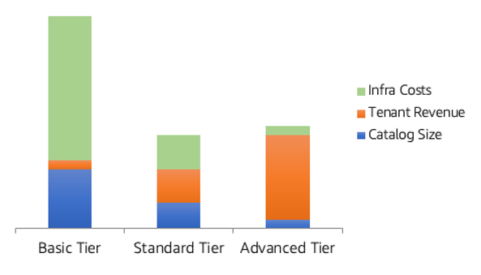
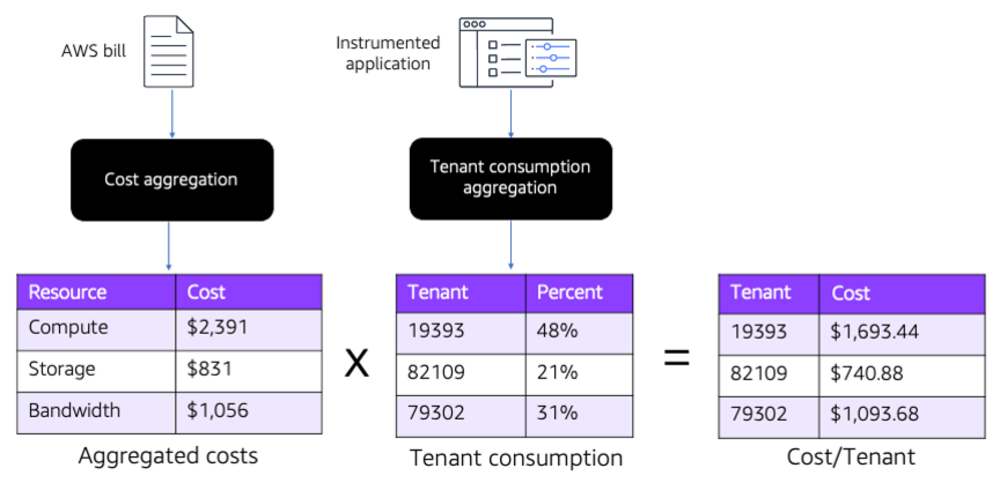

# Expenditure awareness

| SaaS COST 1: How do you measure the resource consumption of individual tenants?                |
| ---------------------------------------------------------------------------------------------- | ------------------------------------------------------------------------------------------------------------------------------------------------------------------------------------------------------------------------------------------------------------------------------------------------------------------------------------------------------------------------------------------------------------------------------------------------------------------------------------------------------------------------------------------------------------------------------------------------------------------------------------------------------------------------------------------------------------------------------------------------------------------------------------------------------------------------------------------------------------------------------------------------------------------------------------------------------------------------------------------------------------------------------------------------------------------------------------------------------------------------------------------------------------------------------------------------------------------------------------------------------------------------------------------------------------------------------------------------------------------------------------------------------------------------------------------------------------------------------------------------------------------------------------------------------------------------------------------------------------------------------------------------------------------------------------------------------------------------------------------------------------------------------------------------------------------------------------------------------------------------------------------------------------------------------------------------------------------------------------------------------------------------------------------------------------------------------------------------------------------------------------------------------------------------------------------------------------------------------------------------------------------------------------------------------------------------------------------------------------------------------------------------------------------------------------------------------------------------------------------------------------------------------------------------------------------------------------------------------------------------------------------------------------------------------------------------------------------------------------------------------------------------------------------------------------------------------------------------------------------------------------------------------------------------------------------------------------------------------------------------------------------------------------------------------------------------------------------------------------------------------------------------------------------------------------------------------------------------------------------------------------------------------------------------------------------------------------------------------------------------------------------------------------------------------------------------------------------------------------------------------------------------------------------------------------------------------------------------------------------------------------------------------------------------------------------------------------------------------------------------------------------------------------------------------------------------------------------------------------------------------------------------------------------------------------------------------------------------------------------------------------------------------------------------------------------------------------------------------------------------------------------------------------------------------------------------------------------------------------------------------------------------------------------------------------------------------------------------------------------------------------------------------------------------------------------------------------------------------------------------------------------------------------------------------------------------------------------------------------------------------------------------------------------------------------------------------------------------------------------------------------------------------------------------------------------------------------------------------------------------------------------------------------------------------------------------------------------------------------------------------------------------ |
|                                                                                                | Measuring and attributing costs in a multi-tenant environment begins with having a solid strategy for attributing consumption to tenants. This will require teams to design and develop a consumption mapping model that represents a clear view of how tenants are consuming the resources of your system. The ultimate goal is to arrive at a collection of insights that will allow you to allocate a percentage of consumption to each tenant of your system. Assembling this view of consumption can be particularly challenging in a multi-tenant environment where tenants might be sharing some or all of the system’s resources. This more fine-grained consumption model removes many of the options and tooling strategies that are often used to attribute consumption in an AWS environment (tagging, for example). While there’s no single model for defining how tenant consumption is captured in a SaaS architecture, there are some common strategies that should be considered when selecting a strategy for your application. First, you’ll want to look at the overall cost profile of your SaaS environment and determine how your application is influencing the costs in your AWS bill. For some environments, your costs might be heavily concentrated in a few areas of your application. In these scenarios, you might get a better ROI on gathering consumption data for just those areas that contribute most to your bill. For example, if Amazon S3 represents 1% of your bill, there might be little value in calculating your tenant’s Amazon S3 consumption. The other factor you’ll want to consider here is granularity. There are less invasive approaches that can approximate tenant consumption that may be adequate for your environment. This really comes down to striking a balance between the level of consumption detail you’re after and the complexity of instrumenting and capturing the data that’s need to attribute consumption. Let’s start by looking at the simplest model for approximating tenant consumption. The diagram in Figure 25 provides a conceptual view of one way you could capture tenant activity in a minimally invasive model. The basic approach here is to inspect each call that is made to the API using as AWS Lambda authorizer. The authorizer would extract the tenant context from the incoming JWT and publish an event that records this activity for the tenant. An alternate approach to this would be to use AWS X-Ray to capture this data (instead of the Amazon API Gateway).  _Figure 25: Minimally invasive capture of tenant consumption_ There’s also a placeholder on the diagram for aggregating and calculating tenant consumption. The strategy and tools you choose to fill in this gap will depend on the nature of the data, its lifecycle, and how it fits into your broader SaaS metrics and analytics story. You may choose to include this data as part of the general metrics footprint of your SaaS environment, pulling out the insights that are essential to allocating consumption to tenants. This particular approach relies on tracking frequency of calls for each tenant as a way to infer the level of consumption for each tenant. While the number of calls to a service might not precisely correlate to consumption, for some environments this may represent a reasonable compromise. A more granular view of consumption can be created by introducing more specialized instrumentation into the details of your application. The diagram in Figure 26 provides a view of how you might introduce metrics instrumentation into the microservices of your SaaS application.  _Figure 26: Instrumenting microservices with tenant consumption events_ In this example, we’ve introduced metrics instrumentation into each microservice of our application. These microservices will capture more detailed data about how tenants are consuming this service and its related resources. This detailed data is published as an event and aggregated. Here we’ve shown Amazon CloudWatch, AWS Lambda, Amazon Data Firehose, and Amazon S3 being used to publish and ingest the data. This data would then be analyzed and, based on your own modeling, arrive at a distribution of consumption across tenants. Attributing tenant consumption gets more challenging as you look beyond the microservices of your application. You might have to develop specific, targeted strategies on a service-by-service basis. Storage services, for example, might require a separate service that can profile storage consumption. This might require looking at IOPS, data footprint, and other factors to analyze consumption for tenants. |
| SaaS COST 2: How are you correlating tenant consumption with the costs of your infrastructure? |
| ---                                                                                            |
|                                                                                                | The dynamic nature of SaaS environments can make it challenging to understand how the cost profile of your system’s infrastructure might be changing. The shifting needs and mix of tenants in your system will likely lead to significant fluctuations in the cost of operating your SaaS environment. At the same time, a SaaS business needs to have a clear picture of how tenants are influencing costs to make strategic decisions about how to build, sell, and operate their SaaS application. To understand the business value of having better insights into how tenants are influencing costs for the business, let’s look at one example of how cost data could be applied in a SaaS environment. The graph in Figure 27 provides an example of a scenario where the costs of a SaaS environment were correlated with revenue from those tenants and the size of the ecommerce catalog being managed by these tenants.  _Figure 27: Costs per tenant by tier_ This graph illustrates the distribution of costs across the tiers of a SaaS offering. Here you’ll see a large difference between the infrastructure costs of Basic and Advanced tier tenants. The key observation is that the Basic tier, which generates the smallest revenue, is responsible for the largest portion of the system’s infrastructure costs. Meanwhile, the Advanced tier, which generates the most revenue, has a much smaller cost footprint. This imbalance likely means there’s something wrong with our model. This is just one example of how having access to costs broken down by tenants and tiers is essential to SaaS providers. Access to this cost per tenant data allows a SaaS organization to assess a wide range of architectural considerations that can be influencing the cost profile of your environment. It can also help guide pricing and tiering strategies. There are two fundamental aspects associated with assembling this cost per tenant data. First, you’ll need some way to attribute and calculate tenant consumption to arrive at a percentage of consumption for each tenant (see above for details on how this consumption data is collected). After you have the consumption data, you’ll need to correlate this data with cost information from your AWS bill to arrive at a cost per tenant calculation. There are a number of options available for accessing the collection billing data. AWS provides APIs that can be used to ingest and aggregate this billing data or you can explore a range of APN Partner solutions to ingest this data and access the costs through these solutions. The shortest path here is often to engage with an APN Partner to deal with the nuances of ingesting and summarizing AWS cost. The high-level view of this experience is captured in Figure 28. You’ll see that we have two distinct sets of data that we need to collect. One process will aggregate and ingest the data from your AWS bill summarizing the costs in a manner that aligns with the granularity of costs that are relevant to your cost per tenant model. Next, you’ll see the tenant consumption aggregation which analyzed tenant activity and assigns a percentage of consumption to each tenant. Finally, these consumption percentages are applied to the infrastructure costs to arrive at the cost per tenant.  _Figure 28: Calculating cost per tenant_ After you have this data, you can choose how best to represent the resulting costs. Generally, it would seem valuable to have costs per tenant across a range of services that are core to your business. However, you could use weighting and calculate an overall cost per tenant for other analyses that you might perform.                                                                                                                                                                                                                                                                                                                                                                                                                                                                                                                                                                                                                                                                                                                                                                                                                                                                                                                                                                                                                           |
