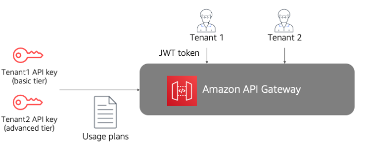

# Foundations

| SaaS REL 1: How do you limit an individual tenant’s ability to impose load that might impact availability for other tenants of your system?
|
| --- |
| | The workloads of tenants in a multi-tenant environment can be continually shifting. Tenants may impose different types of load on the system. New tenants with new workload profiles might also be continually added to the system. These factors can make it very challenging for SaaS companies to create an architecture that is resilient enough to react and respond to these evolving needs. These variations in load can have an adverse impact on a tenant’s experience. Imagine a scenario where a single tenant ends up placing an extreme load on some aspect of your system. This can be especially pronounced if they can interact with your system via an API. In this case, the load of this tenant could end up consuming a disproportionate level of the system’s resources which, in turn, could end up impacting the reliability of the overall system or another tenant’s experience. This ability for one tenant to impact another can get more complicated for systems that have a tiered offering. For example, a system might have basic, advanced, and premium tiers. If each of these tiers are allowed to impose any level of load on the system, we might find that the basic tier is impacting the reliability of a premium tier tenant. In a multi-tenant environment, you need to be especially proactive in your efforts to identify workloads and patterns of consumption that could impact the reliability of your system. Reliability issues in a multi-tenant environment can easily cascade through your system and, potentially, impact the experience of _all_ of your customers. To address these workload issues, your system must introduce mechanisms that can detect and resolve workload issues before they can impact the reliability of your application. The architecture of your application and your application stack will influence the strategies you apply to prevent tenant’s from impacting the reliability of your system and the experience of other tenants. One common approach is to use throttling to prevent tenants from consuming excess resources. The diagram in Figure 21 provides an example of doing this using Amazon API Gateway. In this example, you’ll see that we have leveraged usage plans with API Gateway to define separate usage experiences for each tenant of the system. This approach uses separate API keys for the basic and advanced tiers of the system and these keys are connected to usage plans that have different SLAs. This approach enables two different levels of control. First, it can ensure that _all_ tenants are prevented from saturating our system with requests through the configuration of the usage plans. The other benefit is that we can use these usage plan configurations to prevent lower tier tenants from impacting the experience of higher tier tenants. While this model relies on API Gateway to implement a throttling policy, this core concept can be applied to other infrastructure constructs. The fundamental goal of this approach is to have some ability to monitor and manage access at the entry point to your application, detecting and throttling any tenant that may impose load that could impact the overall reliability of your environment.  _Figure 21: Throttling tenants by tier_
| SaaS REL 2: How do you proactively detect and maintain tenant health? |
| --- |
| | Reliability in a SaaS environment is often very much influenced by a provider’s ability to proactively identify and remediate issues before they impact a tenant. Building a proactive view of health in a multi-tenant environment requires you to surface additional reliability data that provides more detailed, tenant-aware insights into the health trends of your tenant workloads. These tenant-aware insights are used to identify tenant specific trends, activities, or insights that can effectively capture condition that could impact the reliability for that tenant or the entire system. Having this data and surfacing it proactively, allows you to build alarms, policies, and automation that can attempt to heal the system without incurring an outage. To make this possible, you’ll need to introduce code into your application that will publish health insights with tenant context. This starts by identifying the workflows and events in your architecture that represent useful health data. This could be consumption data, scaling insights, latency metrics, and so on. Each of these insights would be published via log file or to a data warehouse that would aggregate the data. Once you have this health data aggregated in a repository, you can then introduce tooling that can surface alarms or trigger policies based on an analysis of the aggregated health data.
| SaaS REL 3: How are you testing the multi-tenant capabilities of your SaaS application? |
| --- |
| | The testing model for a multi-tenant environment goes beyond simply ensuring that the functionality of your application works as expected. SaaS providers must also create tests that will validate that your system can effectively address common reliability challenges that are associated with a multi-tenant solution. There are a number of different dimensions that you’ll want to include as part of your multi-tenant testing strategy. In many cases, these tests are targeted at validating the constructs that you have in place to address the scale, operations, and reliability footprint of your SaaS product. It’s important to note that SaaS testing is often about simulating the extremes that your application might encounter. You should be focused on building a suite of tests that can effectively model and evaluate how your system will respond to the expected and the unexpected. In addition to ensuring that customers have a positive experience, your tests must also consider how cost effectively it is achieving scale. If you are over-allocating resources in response to activity, you’re likely impacting the bottom line for the business. Some specific areas where you might augment your load and performance testing strategy in a SaaS environment are:  • **Cross-tenant impact tests** – Create tests that simulate scenarios where a subset of your tenants place a disproportionate load on your system. This will allow you to determine how the system responds when load is not distributed evenly among tenants, and assess how this might affect overall tenant experience. If your system is decomposed into separately scalable services, you’ll want to create tests that validate the scaling policies for each service to ensure that they’re scaling on the right criteria.  • **Tenant consumption tests** – Create a range of load profiles (for example, flat, spikey, and random) that track both resource and tenant activity metrics, and determine the delta between consumption and tenant activity. You can ultimately use this delta as part of a monitoring policy that could identify suboptimal resource consumption. You can also use this data with other testing data to determine if you’ve sized your instances correctly, have IOPS configured correctly, and are optimizing your AWS footprint.  • **Tenant workflow tests** – Use these tests to assess how the different workflows of your SaaS application respond to load in a multi-tenant context. The idea is to pick well-known workflows of your solution, and concentrate load on those workflows with multiple tenants to determine if these workflows create bottlenecks or over-allocation of resources in a multi-tenant setting.  • **Tenant onboarding tests** – As tenants sign up for your system, you want to be sure that they have a positive experience and that your onboarding flow is resilient, scalable, and efficient. This is especially true if your SaaS solution provisions infrastructure during the onboarding process. You’ll want to determine that a spike in activity doesn’t overwhelm the onboarding process. This is also an area where you might have dependencies on third-party integrations (billing, for example). You’ll likely want to validate that these integrations can support their SLAs. In some cases, you might implement fallback strategies to handle potential outage for these integrations. In these cases, you’ll want to introduce tests that verify that these fault tolerance mechanisms are performing as expected.  • **API throttling tests** – The idea of API throttling is not unique to SaaS solutions. In general, any API you publish should include the notion of throttling. With SaaS, you also need to consider how tenants at different tiers can impose load via your API. A tenant in a free tier, for example, might not be allowed to impose the same load as a tenant in the gold tier. This enables you to verify that the throttling policies associated with each tier are being successfully applied and enforced.  • **Data distribution tests** – In most cases, SaaS tenant data will not be uniformly distributed. These variations in a tenant’s data profile can create an imbalance in your overall data footprint, and might affect both the performance and cost of your solution. To offset this dynamic, SaaS teams will typically introduce sharding policies that account for and manage these variations. Sharding policies are essential to the performance and cost profile of your solution, and, as such, they represent a prime candidate for testing. Data distribution tests allow you to verify that the sharding policies you’ve adopted will successfully distribute the different patterns of tenant data that your system may encounter. Having these tests in place early might help you avoid the high cost of migrating to a new partitioning model after you’ve already stored significant amounts of customer data.  • **Tenant isolation testing** – SaaS customers expect that every measure will be taken to ensure that their environments are secured and inaccessible by other tenants. To support this requirement, SaaS providers build in a number of policies and mechanisms to secure each tenant’s data and infrastructure. Introducing tests that continually validate the enforcement of these policies is essential to any SaaS provider. As you can see, this test list is focused on ensuring that your SaaS solution will be able to handle load in a multi-tenant context. Load for SaaS is often unpredictable, and you will find that these tests often represent your best opportunity to uncover key load and performance issues before they impact one or all of your tenants. In some cases, these tests might also surface new points of inflection that may merit inclusion in the operational view of your system.
