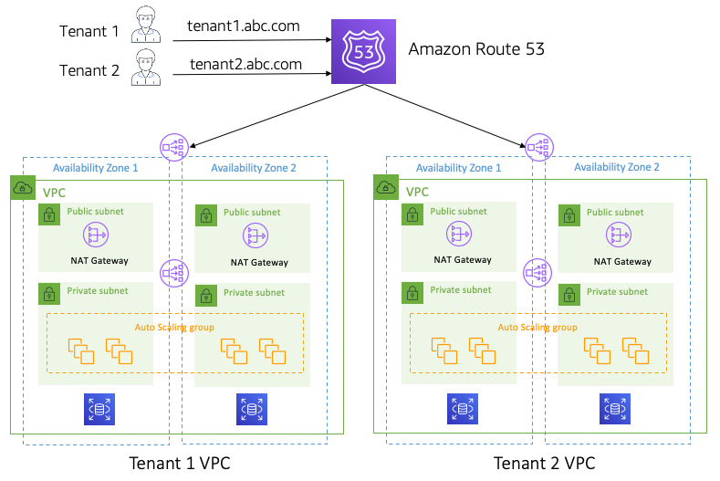
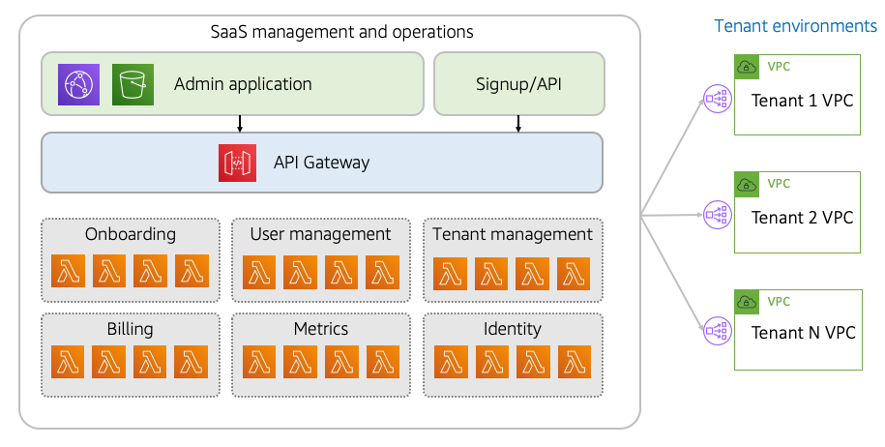

# Full stack isolation

SaaS organizations are motivated by the economies of scale that
come with sharing infrastructure resources across tenants. At the
same time, there are real-world factors that might result in a
SaaS architecture where some or all of the tenants within your
environment require dedicated (siloed) infrastructure. Compliance,
noisy neighbor, tiering strategies, legacy technologies—these are
among the long list consideration that could lead you to offering
tenants their own infrastructure. This is referred to as a siloed
or full stack isolation SaaS.

This approach is frequently mistaken for a managed service
provider (MSP) where a company’s product is installed and managed
on a one-off basis for individual customers. This approach, while
valid, does not align with the SaaS tenets. The key to a SaaS
model is to adopt a value system where _all_
tenants are managed and operated through a single, unified
experience. This means that every tenant is running the same
version of the software, they all get deployments at the same
time, they are all onboarded through the same process, and they
are all managed through a single operational experience, which
applies to all tenants.

This approach doesn’t deliver the cost efficiencies of a shared
infrastructure model (pool). Its distributed nature can also make
operations and deployment more complex. Still, done right, a full
stack model can still achieve the agility, innovation, and
operational efficiency goals that are central to the SaaS mindset.

The diagram in Figure 7 provides a clearer picture of the full
stack isolation (silo) model. Each tenant environment in this
model is straightforward. You’ll see here that we’ve provided a
separate VPC for each tenant. These VPCs hold the full isolated
stack that will be used by each tenant. The compute and storage
constructs could be composed from any combination of AWS services.
The key is that each tenant environment is meant to have the same
infrastructure configuration and the same version of your product.
So, adding new tenants is as simple as provisioning another VPC
with the same infrastructure footprint for each tenant.

You’ll also notice that this model use Amazon Route 53 to route
the incoming traffic to the appropriate VPC. The routing relies on
a model where subdomains are assigned to each tenant. This is a
very common pattern in SaaS environments. This routing can also be
achieved by inspecting the contents of a tenant JWT token,
determining their tenant context, and triggering routing rules
through an injected tenant header. This approach, however, can
push account limits and might require tuning to address the
latency of a runtime resolution of a tenant’s identity. Still, it
is a valid option for some SaaS environments.

_Figure 7: Full stack (silo) isolation_

While this example illustrates a VPC-per-tenant model, there are
other architectures that can be used to implement the full stack
model. Some organizations might choose to use an
account-per-tenant model where each tenant environment is deployed
in a separate provisioned account. The option you choose will vary
depending on the number of tenants you need to support and the
overall management experience that you’re targeting. In some
cases, the number of tenants you need to support could exceed the
number of VPCs that can be created within an AWS account.

## Unified onboarding, management, and operations

The real SaaS elements of the full stack isolation (silo) model
come in when we look at the onboarding, management, and
operations of this experience. To realize the full value
proposition of SaaS, this model must introduce a collection of
services that can be used to manage and operate all of the
tenant environments.

The diagram in Figure 8 provides a view of these extra layers of
services. What we introduce here is an entirely separate set of
services that are built around the needs of the SaaS provider’s
administration and management experience.

_Figure 8: Managing full stack isolated environments_

While the stack of our tenant environments is shaped by domain,
legacy, and other requirements, the stack of our management
experience is completely driven by the goals and usage patterns
that can be quite different than those that apply to tenants.

This management very much conforms to a classic serverless SaaS
application model. You’ll see that we have two entry points into
our administration environment. One is the Admin application
that uses Amazon CloudFront and Amazon S3 to serve up the
application experience that is used by SaaS administrators to
manage and configure tenant environment. You’ll also see the
signup and API experience highlighted here. This represents the
ability to trigger tenant onboarding via a public API request.
This API can also be part of a SaaS provider’s developer API
experience.

Finally, we’ve also highlighted a collection of microservices
that represent the shared services that are used to orchestrate
the onboarding, management, and operations experience. We’ve
chosen Lambda as the model for our microservices, based on its
management, scale, and cost efficiency model. These services
could be implemented with other AWS compute services.

On the right-hand side of the diagram, you’ll see the individual
VPCs that represent each of our tenant environments. In this
VPC-per-tenant model, you’ll need to open a valid path for your
management plane to be able to configure and access the
resources of these tenant environments. AWS offers a number of
options for this, including AWS PrivateLink, VPC peering, and
Amazon EventBridge. The option you choose will depend on the
nature of the management experience you are building.
