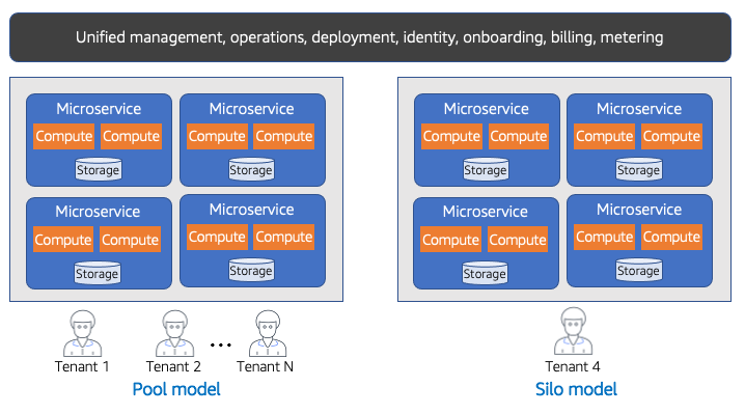

# Hybrid SaaS deployment

The needs of customers in SaaS environments can vary significantly
for a business. While there are significant cost and operational
advantages to building a SaaS solution that has all customers
running in shared infrastructure model (pool), there might be
times when customers are not willing to share infrastructure
resources with other tenants.

This need for one-off customers to have their own environment can
be challenging for SaaS providers. While SaaS providers feel the
business pressure to support this model, they also know that
supporting variations of this nature will undermine the overall
SaaS goals of the business. Each new one-off customer can add
operational overhead and complexity. As each new customer is added
in this model, you quickly find yourself sliding further away from
the innovation, agility, and cost efficiency benefits that come
from a shared infrastructure model.

There are, however, architectural and operational strategies that
can embrace this model without fully compromising your SaaS
vision. The diagram in Figure 9 provides a conceptual view of how
you could address this challenge.

_Figure 9: Hybrid deployment model_

In this diagram, you’ll notice that we have two separate
deployments of our SaaS environment. The left side is deployed in
a pooled model with shared infrastructure. The majority of our
tenants are running in this environment. However, on the right
side, we’ve deployed a separate copy of the multi-tenant
environment that is hosting one tenant (tenant 4).

The key to this strategy is that both environments (the left and
right) are running the _same_ version of the
SaaS application. Any new changes or updates are applied to both
environments at the same time. More importantly, you’ll see that
we have a single, unified management experience that spans both of
these environments. Onboarding, identity, metering, and billing
are shared and common to both environments.

This shared experience allows a SaaS organization to manage and
operate these environments through a single pane of glass. By
fitting these one-off tenants into this model, you’re able to
minimize the impact to the overall agility and operational
efficiency of your SaaS environment. This model impacts cost
efficiency and adds operational complexity. However, it can
represent a reasonable compromise for many SaaS companies.
