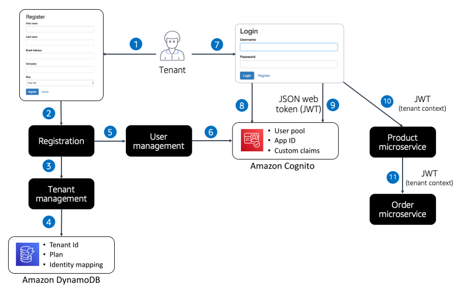

# Identity and access management

| SaaS SEC 1: How are you associating tenant context with users and applying that context within your SaaS architecture? |
| ---------------------------------------------------------------------------------------------------------------------- | ---------------------------------------------------------------------------------------------------------------------------------------------------------------------------------------------------------------------------------------------------------------------------------------------------------------------------------------------------------------------------------------------------------------------------------------------------------------------------------------------------------------------------------------------------------------------------------------------------------------------------------------------------------------------------------------------------------------------------------------------------------------------------------------------------------------------------------------------------------------------------------------------------------------------------------------------------------------------------------------------------------------------------------------------------------------------------------------------------------------------------------------------------------------------------------------------------------------------------------------------------------------------------------------------------------------------------------------------------------------------------------------------------------------------------------------------------------------------------------------------------------------------------------------------------------------------------------------------------------------------------------------------------------------------------------------------------------------------------------------------------------------------------------------------------------------------------------------------------------------------------------------------------------------------------------------------------------------------------------------------------------------------------------------------------------------------------------------------------------------------------------------------------------------------------------------------------------------------------------------------------------------------------------------------------------------------------------------------------------------------------------------------------------------------------------------------------------------------------------------------------------------------------------------------------------------------------------------------------------------------------------------------------------------------------------------------------------------------------------------------------------------------------------------------------------------------------------------------------------------------------------------------------------------------------------------------------------------------------------------------------------------------------------------------------------------------------------------------------------------------------------------------------------------------------------------------------------------------------------------------------------------------------------------------------------------------------------------------------------------------------------------------------------------------------------------------------------------------------------------------------------------------------------------------------------------------------------------------------------------------------------------------------------------------------------------------------------------------------------------------------------------------------------- |
|                                                                                                                        | The move to a multi-tenant architecture often begins with identity. Each user that accesses your application must be connected with a tenant. This binding of a user identity to a tenant is informally referred to as a _SaaS identity_. The key attribute of the SaaS identity is that it elevates tenant context to a first-class construct, connecting it directly to the overall authentication and authorization model of your SaaS application. This approach allows tenant context to flow through all the layers of the architecture using the same architecture constructs that are used to convey and access user identity. For example, if you have 100 microservices in your application, you want each of those services to be able to acquire and apply tenant context without requiring a roundtrip to another service. Managing this context through another service adds latency and often creates bottlenecks in your architecture. Injecting tenant context into your identity can be achieved through multiple patterns. The identity provider and technology you select for your application will directly shape the approach and strategies that you’ll end up applying to introduce this context into your experience. While the tools might change, the fundamental need is to introduce tenancy into the overall authentication experience of your environment where tenancy is injected at the point where a user enters your application. The diagram in Figure 15 provides an example of how this is commonly achieved using AWS services. This example includes the common components and technologies that would be used to inject tenant context into a SaaS environment. This is illustrated on the left side of the diagram, where a tenant completes a sign-up form, and triggers a call to your application’s registration service.  _Figure 15: Injecting tenant content_ This registration service creates a tenant and then creates a user in Amazon Cognito. As part of this process, you introduce custom claims into user’s attributes that hold information about the user’s relationship to a tenant. These custom claims become part of the identity signature of your user, connecting them directly with a tenant as a first-class construct. After the onboarding is completed, you then can look at how these user and tenant attributes are applied when a user logs in (the right-hand side of the diagram). Here you’ll see that the user authenticates against Amazon Cognito and, as part of that process, returns a JSON web token (JWT) that includes the custom claims created during the onboarding process. Now you have a token that has all the information that you need to inject tenant context into the interactions with multi-tenant application services. In this example, we show the JWT being passed as a bearer token in the header of each request to the Product microservice. This service can now acquire and apply the context from this token without calling another service. Finally, this Product microservice makes a call to an Order microservice, passing the JWT in the header of the request. This illustrates how the tenant context can flow across all of your microservice calls without adding any additional lookups or latency. This example happens to rely on Amazon Cognito to connect the user and tenant identities. However, this same model could be implemented with other identity providers or alternate authentication schemes. The key here is that you’re building an authentication experience that can yield a representation that connects tenant and users. This representation should then be available to all the layers of your solution. |
