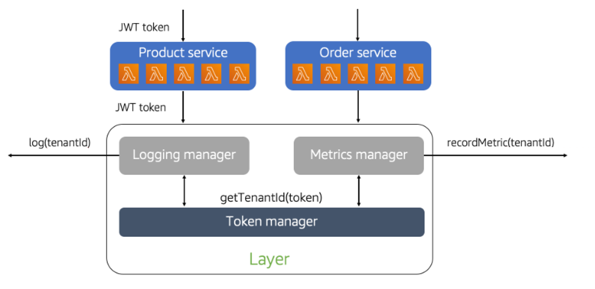

# Layers hide tenant details

One of our goals with any SaaS architecture is to limit
developer awareness of tenant details. In serverless SaaS
environments, you can use Lambda layers as a way to create
shared code that can implement multi-tenant policies outside the
view of developers.

The diagram in Figure 3 provides an example of how Lambda layers
can be used to address these multi-tenant concepts. Here you’ll
see that we have two separate microservices (Product and Order)
that have a need to publish log and metrics data. The key detail
here is that both services need to inject tenant context into
their log messages and metric events. However, it would be less
than ideal to have each service implementing these policies on
their own. Instead, we’ve introduced a layer that includes code
that manages the publishing of this data.

_Figure 3: Lambda layers hide away tenant details_

You’ll notice that our layer includes logging and metrics
helpers that accept a JWT token. This allows each microservice
to simply call these functions and supply the token without any
concern for which tenant they are working with. Then, within the
layer, the code uses the JWT token to resolve the tenant context
and inject it into the log messages and metric events.

This is just a snippet of how layers can be applied to hide
tenant context. The real value is that the policies and
mechanisms for injecting tenant context are completely removed
from the developer experience. They’re also updated, versioned,
and deployed separately. This allows these policies to be more
centrally managed in your environment without introducing
separate microservices that could add latency and create
bottlenecks.
