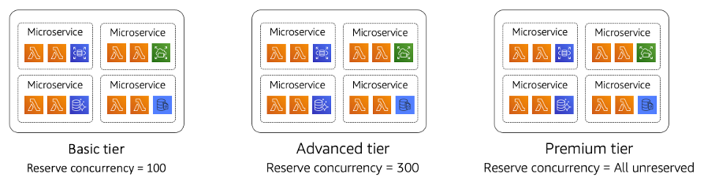

# Monitoring

| SaaS PERF 3: How do you enable varying levels of performance for different tenant tiers and plans? |
| -------------------------------------------------------------------------------------------------- | --------------------------------------------------------------------------------------------------------------------------------------------------------------------------------------------------------------------------------------------------------------------------------------------------------------------------------------------------------------------------------------------------------------------------------------------------------------------------------------------------------------------------------------------------------------------------------------------------------------------------------------------------------------------------------------------------------------------------------------------------------------------------------------------------------------------------------------------------------------------------------------------------------------------------------------------------------------------------------------------------------------------------------------------------------------------------------------------------------------------------------------------------------------------------------------------------------------------------------------------------------------------------------------------------------------------------------------------------------------------------------------------------------------------------------------------------------------------------------------------------------------------------------------------------------------------------------------------------------------------------------------------------------------------------------------------------------------------------------------------------------------------------------------------------------------------------------------------------------------------------------------------------------------------------------------------------------------------------------------------------------------------------------------------------------------------------------------------------------------------------------------------------------------------------------------------------------------------------------------------------------------------------------------------------------------------------------------------------------------------------------------------------------------------------------------------------------------------------------------------------------------------------------------------------------------------------------------------------------------------------------------------------------------------------------------------------------------------------------------------------------------------------------------------------------------------------------------------------------------------------------------------------------------------------------------------------------------------------------------------------------------------------------------------------------------------------------------------------------------------------------------------------------------------------------------------------------------------------------------------------------------------------------------------------------------------------------------------------------------------------------------------------------------------------------------------------------------------------------------------------------------------------------------------------------------------------------------------------------------------------------------------------------------------------------------------------------- |
|                                                                                                    | SaaS solutions are often offered in a tiered model where tenants will have access to different experiences. Performance can often be an area that is used to differentiate tiers of a SaaS environment, using performance as a way to create a value boundary that would compel tenants to move to higher level tiers. In this model, your architecture will introduce constructs that will monitor and control the experience of each tier. This isn’t just about maximizing performance—it’s also about limiting the consumption of lower tiered tenants. Even if your system could accommodate the load of these tenants, you might choose to limit this load purely based on cost or business considerations. This is often part of ensuring that the cost footprint of a tenant correlates with the revenue that tenant contributes to the business. The least complex way to approach this problem is to introduce throttling policies that are associated with individual tenant tiers. As a tenant reaches a limit, you would apply the throttling and limit their consumption. There are also scenarios where you can use specific AWS configurations to configure the consumption profile of a tenant tiers. For example, in AWS Lambda, you can use reserve concurrency to limit the consumption of a given tenant tier. The diagram in Figure 24 provides an example of how this could be realized.  _Figure 24: Controlling tenant performance with reserve concurrency_ In this example, we’ve created three separate tenant tiers and deployed three separate collections of our SaaS application’s microservices for each of these tiers. These collections are also configured with separate reserve concurrency settings which are used to determine how many concurrent function invocations can be running for that group of functions. The Basic tier has a reserve concurrency of 100 and the Advanced tier has 300. The idea here is that the consumption of my lower end tiers will be capped, leaving all the remain concurrency for the premium tier. This approach aligns nicely with our goal of offering the best experience our preferred tiers while also limiting a lower tier’s ability to consume excess resources and impact the performance of our higher tier tenants. Containers also have unique strategies for addressing tiering for performance. Within Amazon EKS, for example, you can configure separate `ResourceQuotas` and `LimitRanges` to control the amount of resources that are available in a namespace. While these constraints are helpful in configuring a tenant’s performance experience, some SaaS applications will actually address performance through application design and decomposition strategies. This might be achieved by deploying siloed microservices for higher tier tenants, eliminating any noisy neighbor considerations for these specific services. In fact, you might find that the decomposition of your system into microservices might be directly influenced by the tiering and performance profile you are targeting. In some cases, your SaaS application might also introduce architectural constructs that optimize the experience of higher tier tenants. Imagine, for example, offering caching of key data to premium tier tenants. By limiting the cache to just these users, you avoid the expense of having a cache that must support all users. The effort to introduce these optimizations should be offset with enough value to the customer and the business to warrant the investment. |
