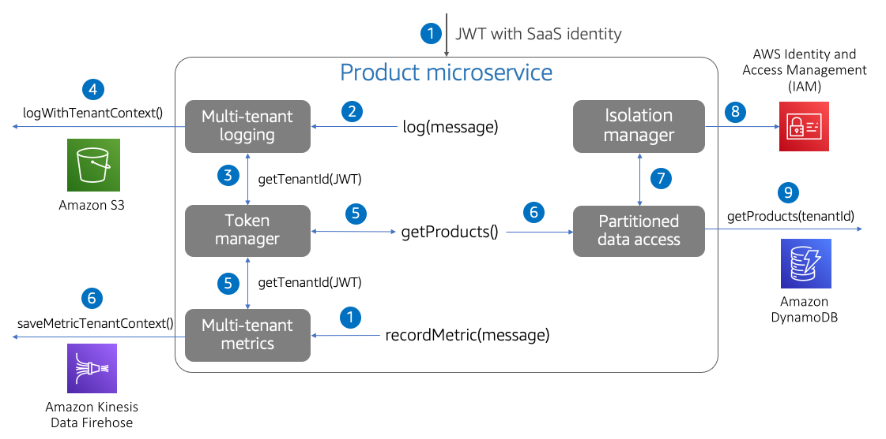

# Multi-tenant microservices

The microservices running in a multi-tenant environment must
address additional considerations. These microservices must be
able to reference and apply tenant context within each service. At
the same time, it’s also our goal to limit the degree to which
developers need to introduce any tenant awareness into their code.

To achieve this goal, SaaS microservices—regardless of their
compute model—should introduce libraries, modules, and shared
constructs that can push tenant-specific processing into code.
These constructs hide the policies and mechanisms that are needed
to resolve and apply tenant context.

The diagram in Figure 10 provides a view into how you can
streamline multi-tenant development of your microservices. The key
idea here is that we’ve taken anything that relies on tenant
context and used libraries to apply multi-tenant policies.

This example illustrates a number of scenarios where a SaaS
microservice might need access to tenant context. The flow starts
with a call into our microservice with a request to get a list of
products. Somewhere in the code of our service, your service logs
a message. The microservice developer simply logs a message to a
logging wrapper. This wrapper gets the tenant context from the
Token Manager and injects that context into our message that is,
in this example, published to Amazon S3. Our log policies and how
tenant data lands in logs in managed by whichever policies we
choose to include in our logging helper.

This theme continues across the rest of the experience here. Our
call to getProducts() first gets the tenant identifier from the
Token Manager. It then uses this context to get tenant-scoped
credentials from an isolation manager before using these
credentials to get the product data from DynamoDB.

_Figure 10: Developing multi-tenant microservices_

Finally, our service records a metric (perhaps execution time)
using the same mechanism for resolving the tenant identifier and
injecting tenant context into the metrics messages.

The practices outlined here are not meant to introduce heavyweight
constructs into your microservices. This abstraction of tenancy
follows the general design practices of pushing common concepts
into shared code. It’s important to note that all of the concepts
represented in this diagram are running within the context of a
single microservice. Each of these blocks simply represent code
that is reused by your microservice. Breaking these concepts into
separate services would add latency and complexity that would
typically not be justified.
