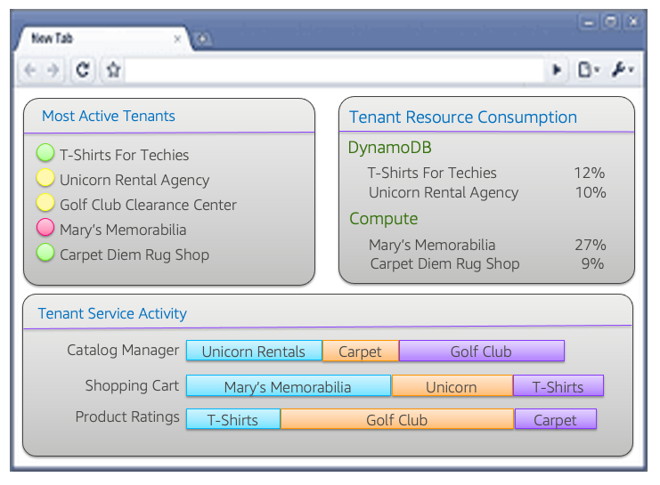
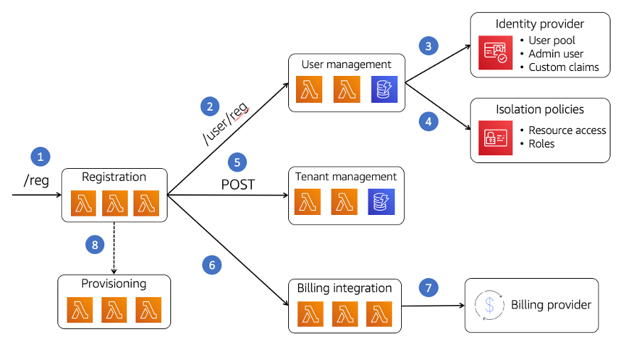
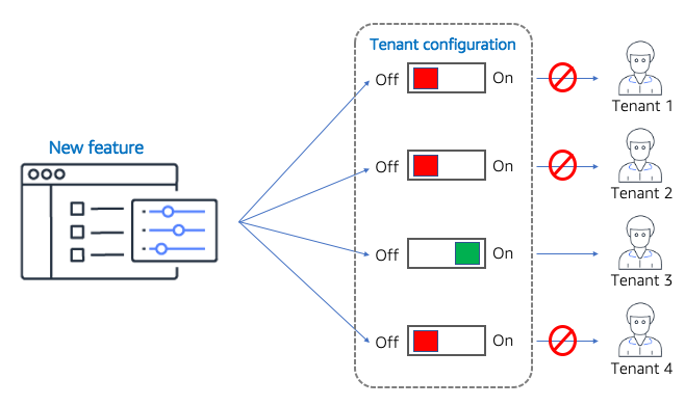

# Operate

| SaaS OPS 1: How are you able to effectively monitor and manage the operational health of a multi-tenant environment? |
| -------------------------------------------------------------------------------------------------------------------- | ------------------------------------------------------------------------------------------------------------------------------------------------------------------------------------------------------------------------------------------------------------------------------------------------------------------------------------------------------------------------------------------------------------------------------------------------------------------------------------------------------------------------------------------------------------------------------------------------------------------------------------------------------------------------------------------------------------------------------------------------------------------------------------------------------------------------------------------------------------------------------------------------------------------------------------------------------------------------------------------------------------------------------------------------------------------------------------------------------------------------------------------------------------------------------------------------------------------------------------------------------------------------------------------------------------------------------------------------------------------------------------------------------------------------------------------------------------------------------------------------------------------------------------------------------------------------------------------------------------------------------------------------------------------------------------------------------------------------------------------------------------------------------------------------------------------------------------------------------------------------------------------------------------------------------------------------------------------------------------------------------------------------------------------------------------------------------------------------------------------------------------------------------------------------------------------------------------------------------------------------------------------------------------------------------------------------------------------------------------------------------------------------------------------------------------------------------------------------------------------------------------------------------------------------------------------------------------------------------------------------------------------------------------------------------------------------------------------------------------------------------------------------------------------------------------------------------------------------------------------------------------------------------------------------------------------------------------------------------------------------------------------------------------------------------------------------------------------------------------------------------------------------------------------------------------------------------------------------------------------------------------------------------------------------------------------------------------------------------------------------------------------------------------------------------------------------------------------------------------------------------------------------------------------------------------------------------------------------------------------------------------------------------------------------------------------------------------------------------------------------------------------------------------------------------------------------------------------------------------------------------------------------------------------------------------------------------------------------------------------------------------------------------------------------------------------------------------------------------------------------------------------------------------------------------------------------------------------------------------------------------------------------------------------------------------------------------------------------------------------------------------------------------------------------------------------------------------------------------------------------------------------------------------------------------------------------------------------------------------------------------------------------------------------------------------------------------------------------------------- |
|                                                                                                                      | In multi-tenant environments, where all of an organization’s customers might be deployed in a shared infrastructure model, the need for a more detailed operational view of health is often essential to the success and growth and of a SaaS business. Any outage or health issue has the potential of cascading across all the tenants of your system and taking a SaaS service down for all customers. This means that SaaS organizations must place a premium on creating an operational experience that will enable operations teams to effectively analyze and respond to continually shifting workloads of a SaaS environment. Building a robust multi-tenant operational experience requires SaaS companies to create or customize tooling to introduce the more granular views of health and activity that are needed in a SaaS environment. This often means using a combination of existing tools and custom solutions to create an experience that supports tenancy and tenant tiers as first-class concepts within the operational experience. A SaaS operations dashboard, for example, should include views of health that are presented through the lens of tenants and tenant tiers. While viewing the global view of health is still part of this experience, a SaaS operations team also needs the ability to see the health and activity of tenants. The diagram in Figure 12 provides a conceptual view of one way a SaaS provider might surface tenant activity as a first-class construct. The simplified view in this diagram highlights a few samples of operational views that would add value in multi-tenant environment. At the top-left of the page, you’ll see a view of health for the most active tenants. The color indicators shown could focus attention to tenants that might be experiencing issues that, when looking at a global view of health, have not been surfaced. This allows operations to react and respond proactively to any issues that might not be entirely apparent to a tenant.  _Figure 12: Tenant-aware operations views_ In the top-right of this view, you’ll see data on tenant resource consumption. The idea here is to view consumption of AWS resources on a tenant-by-tenant basis, allowing you to see how particular tenants are exercising specific services. At the bottom, you’ll see a view of consumption that illustrates how tenants are consuming the various microservices of your application. The data here lets operations have views into how tenants are consuming the various services of your system and determine if a particular tenant or tier might be saturating a particular microservice. In addition to providing this general view of tenant activity, your operational experience should also include the ability to drill into the operational data for individual tenants and tiers. Imagine support scenarios where a specific tenant or tenant tier is experiencing issues. In these cases, you’ll want to be able to access operational data and view it through the lens of that particular tenant or tier. This is essential to being able to troubleshoot and diagnose issues in a multi-tenant setting. Creating these operational views relies on having access to operational data that includes the tenant and tiering context that’s required to create the operational views that can analyze insights by tenant or tenant tier. This requires SaaS architects to give care consideration to how and where they can inject tenant context into the various mechanisms that are used to record health and activity events. For example, logs should include mechanisms to ensure that tenant context (such as tenant identifier and tier) are injected into your system’s log data. The views that you choose to construct, however, will vary based on the nature of your application’s design and architecture. Generally, teams should be thinking about the operational views that will enable operations teams to effectively monitor tenant trends and build the instrumentation into their environments from the outset. Adding these concepts into your application later in your development process is more challenging and will likely undermine both development and operational experiences. ###### Note The numbering of the questions in this whitepaper has been changed to match the order in the SaaS Lens of the [AWS Well-Architected Tool](https://console.aws.amazon.com/wellarchitected/ "https://console.aws.amazon.com/wellarchitected/"). **SaaS OPS 2** is described in the following best practice, [Evolve](oe-evolve.md "oe-evolve.md"). |
| SaaS OPS 3: How are new tenants onboarded to your system?                                                            |
| ---                                                                                                                  |
|                                                                                                                      | SaaS solutions are highly focused on maximizing agility and innovation. Tenant onboarding plays a key role in this agility story. By creating an architecture that promotes a frictionless, repeatable onboarding process, SaaS organizations are able to streamline, optimize, and scale their ability to introduce new tenants into their SaaS environment. This enables SaaS companies to support rapid growth and offer customers an experience the accelerates their overall time to value. It’s important to note that automated onboarding applies to both B2C and B2B SaaS environments. While some SaaS offerings might not include a self-service onboarding experience, this does not reduce the need for a frictionless onboarding experience. Even when onboarding is an internally executed process, it should still automate all the elements of tenant creation. The need for reduced friction is foundational to creating a solution that aligns with SaaS best practices. Generally, the onboarding process for a SaaS application requires the orchestration of a series of shared services that can configure and provision all the resources needed to introduce a new tenant. The diagram in Figure 13 provides a high-level view of how you could implement this onboarding via a series of microservices. The flow of the onboarding experience represented in this diagram covers all the steps needed to introduce a tenant and have them begin using your SaaS system. At the front of this process, a tenant calls our registration service requesting to create a new tenant. From this point forward, the registration service will then sit at the middle of the onboarding process, orchestrating all the services needed to create the new tenant environment. The next step in this process is to create a new user. This new user will represent the administrator for this new tenant. To support this process, we’ve included a user management service. This service doesn’t hold data about the user, but it creates the user in an identity provider (in this case Amazon Cognito). It also creates any IAM policies that are needed to support the isolation requirements of this tenant.  _Figure 13: Frictionless tenant onboarding_ In this model, we’ve also relied on a strategy that use a separate Amazon Cognito user pool for each tenant. This allows us to customize the identity experience for each tenant of our system (password policies, multi-factor authentication, etc.). By selecting this approach, we must map each user ID to a corresponding user pool. This mapping is managed by the user management service. After the user is created, our process now creates a tenant. This separation of tenant as a distinct service is essential to SaaS environments. It provides a centralized way to manage the state and attributes of a tenant completely separate from the users that are associated with that tenant. A tenant’s tier or the status, for example, would be controlled by the tenant management service. As part of onboarding, a SaaS system must often establish a footprint in a billing system. In this example, you’ll see that we inform the billing integration service that we’re creating a new tenant. This service then assumes responsibility for creating a new account with the billing provider. This includes configuring the plan or tier for the tenant (free, bronze, platinum, etc.). The last step in the process shown in the diagram relates to the provisioning of tenant infrastructure. Some SaaS architectures will include dedicated tenant resources. In these scenarios, our onboarding process must provision these new resources before our tenant can be activated. While the flow represented here could vary depending on the nature of your environment, the concepts represented here are common to the onboarding process. Automating the creation, configuration, and provisioning of tenant resources is fundamental to creating a rich, scalable multi-tenant experience.                                                                                                                                                                                                                                                                                                                                                                                                                                                                                                    |
| SaaS OPS 4: How do you support the need for tenant-specific customizations?                                          |
| ---                                                                                                                  |
|                                                                                                                      | One of the significant challenges SaaS architects face is the need to ensure that all tenants are running the same version of their product. This is especially true for companies that have migrated to SaaS and have grown accustomed to supporting unique customer requirements through one-off versions of their product. While this might seem tempting, any movement away from a unified customer management, operations, support, and deployment experience directly undermines the overall agility of a SaaS organization. As each new custom environment is introduced, a SaaS organization slowly makes its way to a traditional software model. Ultimately, this ends up eroding the cost, operational efficiency, and general innovation goals that are core the SaaS business model. The challenge, then, is to find a strategy that allows you to meet these occasional one-off needs without creating a forked version of your product. The compromise here is achieved through the introduction of customization options that are added to the overall offering. So, instead of spinning off a separate version, you’d invest the extra time and effort into figuring out how these new features can be added in a way that makes them available to _all_ customers. Then, through tenant configuration, you can determine which tenants will have these new capabilities enabled. A common approach to this problem is to use feature flags. Feature flags are commonly used by application developers as a way to have multiple paths of execution in a common code base with flags that enable or disable each of the different capabilities at runtime. This technique, which is often used as a general development strategy, provides an effective way to introduce customization into your SaaS environment. Each feature flag would correlate to a tenant configuration option. This configuration would be evaluated at runtime and influence the features that are enabled for each tenant. The diagram in Figure 14 provides a conceptual view of how these flags would be applied. A series of flags will be turned on and off for individual tenants, determining which capabilities are enabled for a tenant. These configuration options would be changed as a tenant signs up for new features of a SaaS offering. In some cases, these flags can be associated with tiers (instead of individual tenants).  _Figure 14: Managing tenant needs with feature flags_ Feature flags are just one way to achieve this. The key takeaway here is that—even if a single tenant needs a unique feature—that feature should be introduced as a customization to the core platform. How you apply that customization can vary based on the stack and design of your system. The intent is to ensure that we can deploy and manage a single version of our product. While this can be a powerful construct, it should be applied with caution. If, by introducing feature flags, you create a complex maze of options that end up presenting every tenant a unique experience, your system will quickly become unmanageable. Try to be selective about how and when you introduce these flags. As a rule of thumb, the business should not see this as a sales tool that enables the organization to offer one-off customizations to new customers.                                                                                                                                                                                                                                                                                                                                                                                                                                                                                                                                                                                                                                                                                                                                                                                                                                                                                                                                                                                                                                                                                                                                                                                                                                  |
