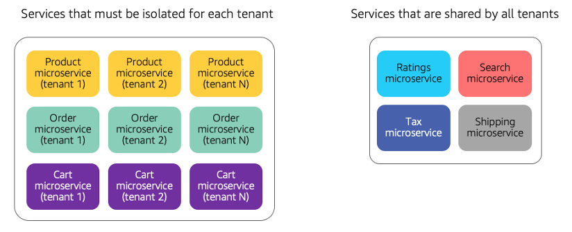
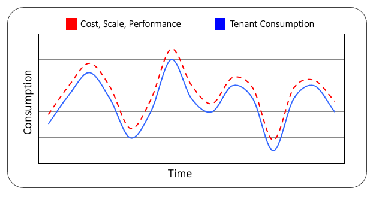

# Selection

| SaaS PERF 1: How do you prevent one tenant from adversely impacting the experience of another tenant?                                 |
| ------------------------------------------------------------------------------------------------------------------------------------- | -------------------------------------------------------------------------------------------------------------------------------------------------------------------------------------------------------------------------------------------------------------------------------------------------------------------------------------------------------------------------------------------------------------------------------------------------------------------------------------------------------------------------------------------------------------------------------------------------------------------------------------------------------------------------------------------------------------------------------------------------------------------------------------------------------------------------------------------------------------------------------------------------------------------------------------------------------------------------------------------------------------------------------------------------------------------------------------------------------------------------------------------------------------------------------------------------------------------------------------------------------------------------------------------------------------------------------------------------------------------------------------------------------------------------------------------------------------------------------------------------------------------------------------------------------------------------------------------------------------------------------------------------------------------------------------------------------------------------------------------------------------------------------------------------------------------------------------------------------------------------------------------------------------------------------------------------------------------------------------------------------------------------------------------------------------------------------------------------------------------------------------------------------------------------------------------------------------------------------------------------------------------------------------------------------------------------------------------------------------------------------------------------------------------------------------------------------------------------------------------------------------------------------------------------------------------------------------------------------------------------------------------------------------------------------------------------------------------------------------------------------------------------------------------------------------------------------------------------------------------------------------------------------------------------------------------------------------------------------------------------------------------------------------------------------------------------------------------------------------------------------------------------------------------------------------------------------------------------------------------------------------------------------------------------------------------------------------------------------------------------------------------------------------------------------------------------------------------------------------------------------------------------------------------------------------------------------------------------------------------------------------------------------------------------------------------------------------------------------------------------------------------------------------------------------------------------------------------------------------------------------------------------------------------------------------------------------------------------------------------------------------------------------------------------------------------------------------------------------------------------------------------------------------------------------------------------------------------------------------------------------------------------------------------------------------------------------------------------------------------------------------------------------------------------------------------------------------------------------------------------------------------------------------------------------------------------------------------------------------------------------------------------------------------------------------------------------------------------------------------------------------------------------------------------------------------------------------- |
|                                                                                                                                       | In a multi-tenant environment, tenants might have profiles and use cases that impose significantly different loads on your system. New tenants with new workload profiles might also be continually added to the system. These factors can make it very challenging for SaaS companies to build an architecture that can meet the rapidly evolving performance requirements each of these tenants. Handling and managing these variations in tenant load is key to the performance profile of a SaaS environment. A SaaS architecture must be able to successfully detect these tenant consumption trends and apply strategies that can scale effectively to meet tenant demands or restrict the activity of individual tenants. There are a variety of strategies that can be used to manage these scenarios where a tenant might be placing a disproportionate load on your system. This can be achieved through isolation of high-demand resources, introduction of scaling strategies, or the application of throttling policies. In the simplest and most extreme case, you might consider creating tenant-specific deployments for parts of your application. The diagram in Figure 22 illustrates one way that you might decompose your system to address performance challenges.  _Figure 22: Addressing performance with siloed services_ In this example, you’ll notice that we have two distinct deployment footprints (some in a silo model and some in a pool model). On the left side of the diagram, you’ll see that separate instances of Product, Order, and Cart microservices have been deployed for each tenant. Meanwhile, on the right side of the diagram, you’ll see a collection of microservices that are shared by all tenants. The basic idea behind the approach is to carve out specific services that are seen as critical to the performance profile of our application. By separating them out, your system can ensure that the load of any one tenant won’t impact the performance of other tenants (for this set of services). This strategy can increase costs and decrease the operational agility of your environment, but still represents a valid way to target performance areas. This same approach may also be applied to address compliance and isolation requirements. You might, for example, deploy an order management microservice for each tenant to limit any ability for one tenant to adversely impact another tenant’s order processing experience. This adds operational complexity and reduces cost efficiency, but can be used as a brute force way to selectively target cross-tenant performance issues for key areas of your application. Ideally, you should try to address these performance requirements through constructs that can address tenant load issues without absorbing the overhead and cost of separately deployed services. Here you would focus on creating a scaling profile that allows your shared infrastructure to effectively respond to shifts in tenant load and activity. A container-based architecture, such as Amazon EKS or Amazon ECS, could be configured to scale your services based on tenant demand without requiring any significant over-provisioning of resources. The ability for containers to scale rapidly enhances your system’s ability to respond effectively to spikey tenant loads. Combining the scaling speed of containers with the cost profile of AWS Fargate often represents a solid blend of elasticity, operational agility, and cost efficiency that can help organizations address the spikey loads of tenants without over-provisioning environments. A serverless SaaS architecture built with AWS Lambda could also be a good fit for addressing the spikey tenant loads. The managed nature of AWS Lambda allows your application’s services to scale rapidly to address spikes in tenant load. There might be concurrency and cold start factors you’d need to factor into this approach. However, it can represent an effective strategy for limiting cross-tenant performance impacts. While a responsive scaling strategy can help with this problem, you might want to put other measures in place to simply prevent tenants from imposing loads that would have cross-tenant impacts. In these scenarios, you might choose to detect and constrain the activity of the tenants by setting limits (potentially by tier) that would apply throttling to control the level of load the place on your system. This would be achieved by introducing throttling policies that would examine the load of tenants, identify and activity that exceeds limits, and throttle their experience. |
| SaaS PERF 2: How are you ensuring that the consumption of infrastructure resources aligns with the activity and workloads of tenants? |
| ---                                                                                                                                   |
|                                                                                                                                       | The business model of SaaS companies often relies heavily on a strategy that allows them to align the costs of their infrastructure with the actual activity of their tenants. Since the load and makeup of the tenants in a SaaS system is continually changing, you need an architecture strategy that can effectively scale the consumption of resources in a pattern a pattern that very much mirrors these real-time, unpredictable patterns of consumption that are part of the SaaS experience. The graph in Figure 23 provides a hypothetical example of an environment that has aligned infrastructure consumption and tenant activity. Here the blue solid line represents the actual activity trends of tenants spanning a window of time. The red dashed line represents the actual infrastructure that’s being provisioned to address the load of tenants.  _Figure 23: Aligning tenant activity and consumption_ Our strategy here, in an ideal environment, would be to keep the gap between the red a blue line as small as possible. You’ll always have some margin for error here where you have some cushion to ensure that you’re not impacting the availability or performance of the system. At the same time, you want to be able to deliver just enough infrastructure to support the _current_ performance needs of your tenants. The key challenge here is that the load shown in this diagram is often unpredictable. While there may be some general trends, your architecture and scaling strategies can’t assume that the load today will be the same tomorrow or even in the next hour. The simplest approach to aligning consumption with activity is to use AWS services that provide a serverless experience. The classic example of this would be AWS Lambda. With AWS Lambda, you can build a model where servers and scaling policies are no longer your responsibility. With serverless, your SaaS application will only incur those charges that are directly correlated with tenant consumption. If there’s no load on your SaaS system, there will be no AWS Lambda costs. AWS Fargate also enables a container-based version of this this serverless mindset. By using Fargate with Amazon EKS or Amazon ECS, you only pay for the container compute costs that are actually consumed by your application. This ability to use a serverless model extends beyond compute constructs. For example, the storage pieces of your solution can rely on serverless technology as well. Amazon Aurora Serverless allows you to store relational data without needing to size the instances that are running your database. Instead, Amazon Aurora Serverless will size your environment based on actual load and only charge for what your application consumes. Any model that lets you move away from a need to create scaling policies is going to streamline your operational and cost experience. Instead of continually chasing the elusive perfect automatic scaling configuration, you can focus more of your time and energy on the features and functions of your application. This also enables the business to grow and accept new tenants without being concerned about unexpected jumps in its AWS bill. For scenarios where serverless may not be an option, you’ll need to fall back to traditional scaling strategies. In these scenarios, you’ll need to capture and publish tenant consumption metrics and define scaling policies based on these metrics.                                                                                                                                                                                                                                                                                                                                                                                                                                                                                                                                                                                                                                                                                                                                                                                                                                                                                                                                                                                                                                                                                                                                                                                                                 |
