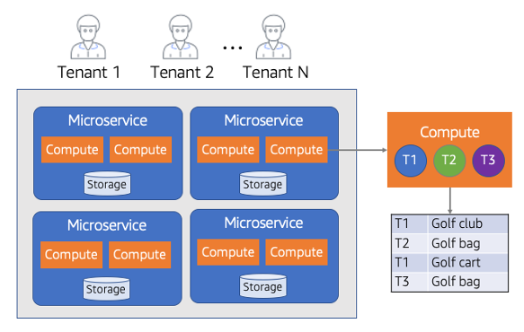

# Pool isolation

You can see how the silo model of isolation maps very nicely for many SaaS
companies. Many companies that are moving to SaaS are seeking out the efficiency,
agility, and cost benefits of being able to have their tenants share some or all of
their underlying infrastructure. This shared infrastructure approach, which is referred
to as a pool model, adds a level of complexity to the isolation story. The diagram in
Figure 17 provides an illustration of the challenge associated with implementing
isolation in a pooled model.

_Figure 17: Pool isolation model_

In this model, you’ll notice that our tenants are consuming infrastructure that is
shared by all tenants. This enables the resources to scale in direct proportion to the
actual load being imposed by the tenants. The right side of the diagram narrows in on
the compute aspect of one of the services, highlighting the fact that tenants 1-N might
all be running side-by-side within your shared compute at any given time. The storage in
this example is also shared and is represented as a table indexed by individual tenant
identifiers.

This model can work well for SaaS providers, however, it has the potential to
complicate the overall isolation story. With shared resources, implementing isolation is
not as clear and typical networking and IAM constructs cannot be relied upon to create
boundaries between tenants.

The key here is that—even though this is a more challenging environment to
isolate—you cannot use this as a rationale to relax the isolation requirements of your
environment. The shared model increases the chance for cross-tenant access and, as such,
it represents an area that requires you to be especially diligent about ensuring that
resources are isolated.

As we dig deeper into the pool isolation model, you’ll see how this architectural
footprint introduces a unique blend of challenges—each of which requires its own type of
isolation constructs to successfully isolate a tenant’s resources.

## Pool model pros and cons

While having everything shared can enable a lot of efficiency and optimization, it
also requires SaaS providers to weigh some of the tradeoffs that come with adopting this
model. In many cases, the pros and cons of the pool model end up surfacing as the
inverse of pros and cons we covered for the silo model. These are the key pros and cons
that are typically associated with the pool isolation model.

### Pros

- **Agility** – When you move your tenants into a shared
  infrastructure model, you can leverage the natural efficiencies and simplicity that
  help streamline the agility of your SaaS offering. At its core, the pool model is
  all about enabling SaaS providers to manage, scale, and operate all of their tenants
  with one unified experience. Centralizing and standardizing the experience is
  foundational to enabling SaaS providers to more easily manage and apply changes to
  all tenants without having to perform one-off tasks on a tenant-by-tenant basis.
  This operational efficiency is key to the overall agility footprint of your SaaS
  environment.
- **Cost efficiency** – Many companies are drawn to SaaS
  for its cost efficiency. A big part of this cost efficiency is commonly associated
  with the pool model of isolation. In a pooled environment, your system will scale
  based on the actual load and activity of all of your tenants. If all the tenants are
  offline, your infrastructure costs should be minimal. The key concept here is that
  pooled environments can adjust to tenant load dynamically and enable you to better
  align tenant activity with resource consumption.
- **Simplified management and operations** – The pool
  model of isolation gives you one view into all the tenants in a system. You can
  manage, update, and deploy all of your tenants through a single experience that
  touches all your tenants in the system. This makes most aspects of the management
  and operations footprint simpler.
- **Innovation** – The agility that is enabled by the
  pooled isolation model also tends to be core to enabling SaaS providers to innovate
  at a faster pace. The more you move away from distributed management and the
  complexity of the silo model, the more you’re free to focus on the features and
  functions of your product.

### Cons

- **Noisy neighbor** – The more resources are shared, the
  more chances there are for one tenant to impact the experience of another. For
  example, any activity from one tenant that puts a heavy load on the system has the
  potential to impact other tenants. A good multi-tenant architecture and design will
  try to limit these impacts, but there’s always some chance of a noisy neighbor
  condition impacting one or more of your tenants in a pooled isolation model.
- **Tenant cost tracking** – In a silo model, it’s much
  easier to attribute consumption of a resource to a specific tenant. However, in a
  pooled model, the attribution of resources consumption becomes more challenging.
  Each SaaS provider should look for ways to instrument their systems and surface the
  granular data needed to effectively associate consumption with individual tenants.
- **Increased scope of impact** – Sharing all resources
  shared also introduces some operational risk. In the silo model, when one tenant has
  a failure, the impact of that failure could likely be limited to that one tenant.
  However, in a pooled environment, an outage will likely impact all the tenants in
  your system, which can have a significant impact on your business. This usually
  requires an even deeper commitment to building a resilient environment that can
  identify, surface, and gracefully recover from failures.
- **Compliance pushback** – While there are measures you
  can take to isolate your tenants in a pool model, the notion of sharing
  infrastructure can create situations where you may be unwilling to run in this
  model. This is especially true in environments with compliance or regulatory rules
  for a domain impose strict constraints on the accessibility and isolation of
  resources. Even in these cases, though, this might mean some portion of the system
  will need to be siloed.
