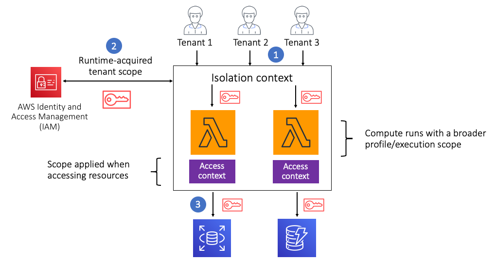

# Preventing cross tenant access

Each SaaS architecture must also consider how it will prevent
tenants from accessing the resources of another tenant. Some
wonder about the need to isolate tenants with AWS Lambda since,
by design, only one tenant can ever be running a Lambda function
at a given moment in time. While this is true, our isolation
must also consider ensuring that a tenant running a function is
not accessing other resources that might belong to another
tenant.

For SaaS providers, there are two basic approaches to
implementing isolation in a serverless SaaS environment. This
first option follows the silo pattern, deploying a separate set
of Lambda functions for each tenant. With this model, you’ll
define an execution role for each tenant and deploy separate
functions for each tenant with their execution role. This
execution role will define which resources are accessible to a
given tenant. You might, for example, deploy a collection of
premium tier tenants in this model. However, this can be
difficult to manage and may come up against account limits
(depending on how many tenants your system supports).

The other option here aligns more with the pool model. Here,
functions are deployed with an execution role that has a scope
that’s broad enough to accepts calls from all tenants. In this
mode, you must apply isolation scoping at runtime in the
implementation of your multi-tenant functions. The diagram in
Figure 2 provides an example of how this would be
addressed.

_Figure 2: Isolation in a serverless environment_

In this example, you’ll see that we have three tenants accessing
a set of Lambda functions. Because these functions are being
shared, they are deployed with an execution role that covers all
tenants. Within the implementation of these functions, our code
will use the context of the current tenant (supplied via a JWT)
to acquire a new set of tenant-scoped credentials from AWS
Security Token Service (AWS STS). Once we have these
credentials, they can be used to access resources with tenant
context. In this example, we’re using these scoped credentials
to access storage.

It’s important to note that this model does push part of the
isolation model into the code of your Lambda functions. There
are techniques (function wrappers, for example) that can
introduce this concept outside the view of developers. The
details of acquiring these credentials can also be moved to a
Lambda layer to make this a more seamless, centrally managed
construct.
