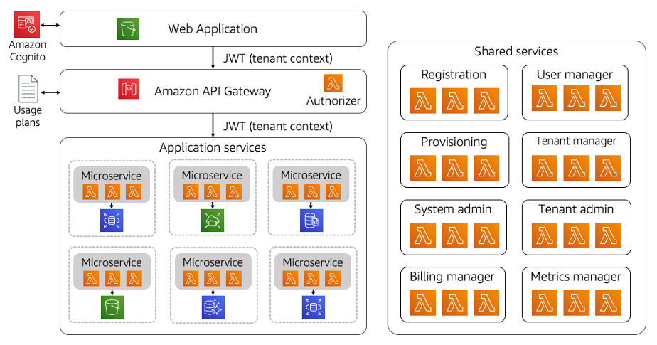

# Serverless SaaS

The move to a SaaS delivery model is accompanied by a desire to
maximize cost and operational efficiency. This can be especially
challenging in a multi-tenant environment where the activity of
tenants can be difficult to predict. Finding a mix of scaling
strategies that align tenant activity with the actual consumption
of resources can be elusive. The strategy that works today might
not work tomorrow.

These attributes make SaaS a compelling fit for a serverless
model. By removing the notion of servers from your SaaS
architecture, organizations are able to rely on managed services
to scale and deliver the precise amount of resources your
application consumes. This simplifies the architecture and
operational footprint of your application, removing the need to
continually chase and manage scaling policies. This also reduces
the operational overhead and complexity, pushing more of
operational responsibility to managed services.

AWS offers a range of services that can be used to implement a
serverless SaaS solution. The diagram in Figure 1 provides an
example of a serverless architecture.

_Figure 1: Serverless SaaS architecture_

Here you’ll see that the moving parts of a Serverless SaaS
architecture aren’t all that different than a classic serverless
web application architecture. On the left of this diagram, you see
that we have our web application hosted and served from an Amazon S3 bucket (presumably using one of the modern client frameworks
like React, Angular, etc.).

In this architecture, the application is leveraging Amazon Cognito
as our SaaS identity provider. The authentication experience here
yields a token that includes our SaaS context that is conveyed via
a JSON Web Token (JWT). This token is then injected into our
interactions with all downstream application services.

The interaction with our serverless application microservices is
orchestrated by the Amazon API Gateway. The gateway plays multiple
roles here. It validates incoming tenant tokens (via a Lambda
authorizer), it maps each tenant’s requests to microservices, and
it can be used to manage the SLAs of different tenant tiers (via
usage plans).

You’ll also see that we’ve represented a series of microservices
here that are placeholders for the various services that would
implement the multi-tenant IP of your SaaS application. Each
microservice here is composed from one or more Lambda functions
that implement the contract of your microservice. In alignment
with microservices best practices, these services also encapsulate
the data that they manage. These services rely on the incoming JWT
token to acquire and apply tenant context wherever it is needed.

We’ve also shown storage here for each microservice. To conform to
microservice best practices, each microservice owns the resources
that it manages. A database, for example, cannot be shared by two
microservices. SaaS also adds a wrinkle here, since the
multi-tenant representation of data can change on a
service-by-service basis. One service may have separate databases
for each tenant (silo) while another might comingle the data in
the same table (pool). The storage choices you make here are meant
to be driven by compliance, noisy neighbor, isolation, and
performance considerations.

Finally, on the right-hand side of this diagram, you’ll see a
series of shared services. These services deliver all the
functionality that is shared by all of the tenants that are
running in the left-hand side of the diagram. These services
represent common services that are typically built as separate
microservices that are needed to onboard, manage, and operate
tenants.

More information on general serverless well-architected best
practices can be found in the
[Serverless
Applications Lens whitepaper](../serverless-applications-lens/welcome.md "../serverless-applications-lens/welcome.md").
