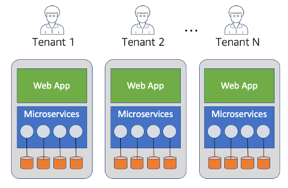

# Silo isolation

While SaaS providers are often focused on the value of sharing
resources, there are still scenarios where a SaaS provider
might choose to have some (or all) of their tenants deployed
in a model where each tenant is running a fully siloed stack
of resources. Some would say that this full-stack model does
not represent a SaaS environment. However, if you’ve
surrounded these separate stacks with shared identity,
onboarding, metering, metrics, deployment, analytics, and
operations, then this is a valid variant of SaaS that trades
economies of scale and operational efficiency for compliance,
business, or domain considerations. With this approach,
isolation is an end-to-end construct that spans an entire
customer stack. The diagram in Figure 16 provides a conceptual
view of this view of isolation.

_Figure 16: Silo isolation model_

This diagram highlights the basic footprint of the siloed
deployment model. The technologies that are used to run these
stacks are mostly irrelevant here. This could be a monolith,
it could be serverless, or it could be any mix of the various
application architecture models. The key concept is to take
whatever stack the tenant has and surround it with some
construct to encapsulate all the moving parts of that stack.
This becomes the boundary for isolation. As long as you can
prevent a tenant from escaping their fully encapsulated
environment, you’ve achieved the isolation.

Generally, this model of isolation is much simpler to enforce.
There are often well-defined constructs that will enable you
to implement a robust isolation model. While this model
presents some real challenges to the cost and agility goals of
a SaaS environment, it can be appealing to those that have
very strict isolation requirements.

## Silo model pros and cons

Each SaaS environment and business domain has its own unique
set of requirements that might make silo a fit. However, if
you’re leaning in this direction, you’ll definitely want to
factor in some of the challenges and overhead associated with
the silo model. These are some of the pros and cons that you
need to consider if you are exploring a silo model for your
SaaS solution:

### Pros

- **Supporting challenging compliance models** – Some
  SaaS providers are selling into regulated environments that impose strict isolation
  requirements. The silo model provides these ISVs with an option that enables them to
  offer to some or all of their tenants the option of being deployed in a dedicated
  model.
- **No noisy neighbor concerns** – While all SaaS
  providers should be attempting to limit the impacts of noisy neighbor conditions,
  some customers will still express reservations about the potential of having their
  workloads impacted by the activity of other tenants using the system. The silo model
  addresses this concern by offering a dedicated environment with no potential for
  noisy neighbor scenarios.
- **Tenant cost tracking** – SaaS providers are often
  highly focused on understanding how each tenant is impacting their infrastructure
  costs. Calculating a cost-per-tenant can be challenging in some SaaS models.
  However, the coarse-grained nature of the silo model provides you with a simpler way
  to capture and associate infrastructure costs with each tenant.
- **Reduced scope of impact** – The silo model generally
  reduces your exposure when there might be some outage or event that surfaces in your
  SaaS solution. Since each SaaS provider is running in its own environment, any
  failures that occur within a given tenant’s environment will likely be constrained
  to that environment. While one tenant may experience an outage, the error cannot
  cascade through the remaining tenants that are using your system.

### Cons

- **Scaling issues** – There are limits on the number of
  accounts that can be provisioned. This limit might prevent you from selecting the
  account-based model. There are also general concerns about how a rapidly growing
  number of accounts might undermine the management and operational experience of your
  SaaS environment. For example, having 20 siloed accounts for each of your tenants
  might be manageable. However, if you have a thousand tenants, that number would
  likely begin to impact operational efficiency and agility.
- **Cost** – With every tenant running in its own
  environment, much of the cost efficiency that is traditionally associated with SaaS
  solutions is not realized. Even if these environments scale dynamically, you’ll
  likely have periods of the day when you’ll have idle resources that are going
  unconsumed. While this is a completely acceptable model, it undermines the ability
  of your organization to achieve the economies of scale and margin benefits that are
  essential to the SaaS model.
- **Agility** – The move to SaaS is often directly
  motivated by a desire to innovate at a faster pace. This means adopting a model that
  enables the organization to respond and react to market dynamics at a rapid pace. A
  key part of this is being able to unify the customer experience and quickly deploy
  new features and capabilities. While there are measures you can take with the silo
  model to try to limit its impact on agility, the highly decentralized nature of the
  silo model adds complexity that impacts your ability to easily manage, operate, and
  support your tenants.
- **Onboarding automation** – SaaS environments place a
  premium on automating the introduction of new tenants. Whether these tenants are
  being onboarded in a self-service model or using an internally managed provisioning
  process, you will still need to automate onboarding. And, when you have separate
  siloes for each tenant, this often becomes a much more heavyweight process. The
  provisioning of a new tenant will require the provisioning of new infrastructure
  and, potentially, the configuration of new account limits. These added moving parts
  introduce overhead that introduces additional dimensions of complexity into the
  overall onboarding automation, enabling you to focus less time on your customers.
- **Decentralized management and monitoring** – The goal
  with SaaS is to have a single pane of glass that enables you to manage and monitor
  all tenant activity. This requirement is especially important when you have siloed
  tenant environments. The challenge here is that you must now aggregate the data from
  a more decentralized tenant footprint. While there are mechanisms that will enable
  you to create an aggregate view of your tenants, the effort and energy needed to
  build and manage this experience is more complex in a siloed model.
