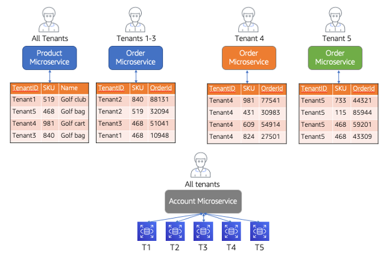

# Targeted isolation

It’s important to note that the isolation choices in your system can be quite
granular. Each microservice of your system and each resource those services touch has
the option of being configured with a different model of isolation. Let’s look at some
sample microservices to better understand how you might vary the isolation model across
a varying microservices. The diagram in Figure 20 provides a view of microservices that
use both the silo and pool models of isolation.

In this diagram, you’ll see a system that has implemented three different
microservices: product, order, and account. The deployment and storage models of each of
these microservices highlights how isolation (for security or noisy neighbor) could land
in a SaaS environment.

Let’s review the isolation model for each of these services. The Product
microservice at the top right was deployed in a complete pooled model where both the
compute and the storage are shared for all tenants. The table here reflects that tenants
all land here as separate items that are indexed in the same table. The assumption is
that the data will be isolated with policies that can restrict access to tenant items in
this table. The Order microservice is only for tenants 1 through 3 and also implemented
in a pooled model. The only difference here is that it’s supporting a subset of tenants.
Essentially, any tenant that doesn’t get a dedicated (silo) deployment of the Order
microservice would be running in this pooled deployment (think of it as tenants 1..N
with the exception of the few that get pulled out as silo microservices).

For the purposes of this discussion, let’s focus on the siloed services which are
represented by the dedicated _order_ microservices (top right) and
the Account microservice (bottom). You’ll notice that we’ve deployed standalone
instances of the Order microservice for tenants 4 and 5. The idea here is that these
tenants had some requirements for the order processing (compliance, noisy neighbor,
etc.) that required this service to be deployed in a silo model. Here the compute and
storage are both dedicated entirely to each of these tenants.

Finally, at the bottom is the Account microservice which represents a silo model
but only at the storage level. The compute of the microservice is shared by all tenants
but each tenant has a dedicated _database_ that holds its account
data. In this scenario, the isolation concern is focused exclusively on separating the
data. The compute is still enabled to be shared.

_Figure 20: Targeted isolation_

This model shows how the silo discussion becomes much more granular. Security,
noisy neighbor, and a variety of factors will determine how and when you might adopt a
silo isolation model for your services. The key takeaway here is that the silo model is
not an all-or-nothing decision. You can think about applying the silo model to specific
components of your application and only absorb this model’s challenges where it’s
actually needed, such as when a potential customer demands its use. In this case, a more
detailed discussion with the customer, you find out that there are only a few specific
areas of storage and processing that are of concern. Doing so will enable you to get the
efficiencies of the pool model for those parts of the system that do not require silo
isolation and also give you the flexibility to offer a tiered structure to support a mix of
both silo and pool models for individual services.
