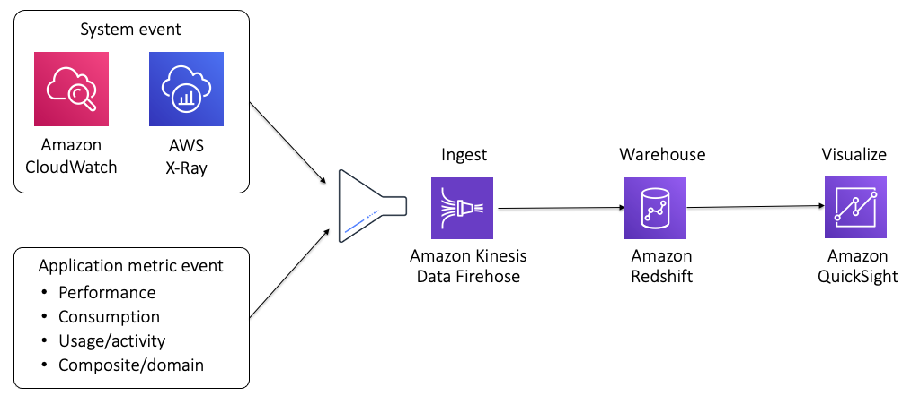

# Tenant insights

As companies move into a multi-tenant model, it becomes
increasingly challenging to capture and surface insights into how
tenants are using your application. This is especially true with
the resources of your SaaS environment that are shared by tenants.

At the same time, with all your tenants potentially running in one
shared environment, the ability to have a clear view into tenant
activity and consumption is essential to building a robust SaaS
offering. Knowing what features of the product tenants are using,
knowing how tenants are pushing the architecture of your
environment, and having visibility into how different tiers of
tenants are scaling are among the insights that SaaS companies
need to be able to effectively operate a healthy SaaS business.

The scope of SaaS metrics is intentionally broad. This is because
metrics are consumed in multiple contexts by different roles
within a SaaS organization. This means you need to be thinking
beyond the infrastructure health. SaaS metrics often include
business agility, feature consumption, microservice activity,
scaling trends, and so on. The idea is to capture and correlate
tenant and tier usage trends with application and consumption
activity.

You can imagine having various dashboards for the different roles
that would consume this data. A product manager, for example,
might want insights into feature-oriented metrics. Meanwhile, an
operations person might be using this data to assess the health
and consumption trends of individual tenants and tiers.

_Figure 11: Ingest and visualize SaaS metrics_

The architecture for capturing and surfacing this data is
relatively straightforward. It includes all the mechanisms needed
to convey, publish, ingest, aggregate, and visualize these SaaS
metrics. The diagram in Figure 11 provides a view of an
architecture that could be used to building your SaaS metrics
environment on AWS.

The sources of the metric data you’ll want to capture could be
somewhat diverse. As the diagram suggests, your solution might
need to capture some of the metrics from native AWS sources
(CloudWatch, for example). However, a significant portion of this
data will come from the code that you instrument into your SaaS
application. It’s here that you’ll want to invest in publishing
metrics that best capture the insights that can maximize the
business and operational value of your domain’s data.

The data from these sources is typically represented with a common
schema that can represent the different types of consumption in
your application (counts, durations, features, etc.). In this
example, this data is ingested with Amazon Data Firehose,
which publishes the data to Amazon Redshift. Finally, Amazon Quick Suite is used to build the different dashboards that are used
across the organizations to view the trends of tenants and tiers.
