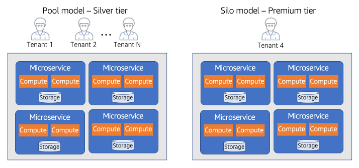

# Tier-based isolation

While most of our discussion of isolation focuses on the mechanics of preventing
cross-tenant access, there are also scenarios where the tiering of your offering might
influence your isolation strategy. In this case, it’s less about how you’re isolating
tenants and more about how you might package and offer different flavors of isolation to
different tenants with different profiles. Still, this is another consideration that
could determine which models of isolation you’ll need to support to address the full
spectrum of customers you want to engage. The diagram in Figure 19 provides an example
of how isolation might vary across tiers.

The below example uses a mix of silo and pool isolation models that have been
offered up as tiers to the tenants. Tenants in the Silver tier are running in the pooled
environment. While these tenants are running in a shared infrastructure model, they
still fully expect that their resources will be protected from any cross-tenant access.
The tenant on the right has required that a completely dedicated (silo) environment be
offered. To support this, the SaaS provider has created a Premium tier model that
enables tenants to run in this dedicated model likely at a substantially higher price
point.

While SaaS providers generally try to limit offering a silo model to their
customers, many SaaS businesses have this notion of a private pricing where these
tenants offer to pay a premium to be deployed in this model. In fact, SaaS companies
will not publish this as an option or identify it as a tier to limit the number of
customers that chose this option. If too many of your tenants fall into this model,
you’ll begin to fall back to a fully siloed model and inherit many of the challenges
that are outlined previously.

_Figure 19: Tier-based isolation_

To limit the impact of these one-off environments, SaaS providers will often
require these premium customers to run the same version of the product that is deployed
to the pooled environment. This enables the ISV to continue to manage and operate both
environments through a single pane of glass. Essentially, the silo environment becomes a
clone of the pooled environment that happens to be supporting one tenant.
