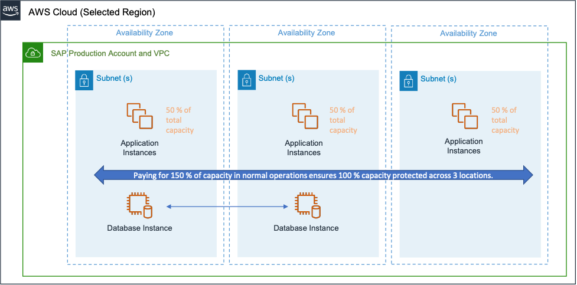

# Best Practice 17.2 – Evaluate the cost

characteristics of your SAP application architecture pattern

As you develop the architecture of your SAP landscape, consider the cost of the number
of infrastructure components in addition to their size and location. By establishing the
business requirements of the solution, acknowledging risk, and finding opportunities to
optimize, you can realize significant cost savings

**Suggestion 17.2.1 – Review your selected SAP installation
patterns**

For each SAP application, define a deployment pattern, such as standalone,
distributed, or high availability (HA). Select the architectural pattern that best
balances the cost and reliability characteristics to meet your business requirements. A
useful approach is to quantify the cost of an outage to your business and work backwards
from that. Balance the risk of an individual failure impacting availability against the
cost of reducing that risk.

Additionally, consider whether your architecture has the flexibility for right sizing.
There can be cost savings with operating system licensing, storage, and managing multiple
application servers on a single host. For the application tier, instance sizes are
available with fine granularity for CPU and memory, with near linear pricing in the
supported instance families. Deploying multiple smaller instance sizes can provide more
options for instance reuse and workload-based scaling.

Evaluate logical groupings and consider the effect of combining components, systems
(SIDs), or landscapes. Would these activities increase operational complexity and decrease
reliability?

- AWS Documentation: [Architecture Guidance for Availability and Reliability of SAP on AWS](../../../sap/latest/general/architecture-guidance-of-sap-on-aws.md "../../../sap/latest/general/architecture-guidance-of-sap-on-aws.md")
- SAP Lens [Reliability]: [Reliability design
  principles](reliability.md "reliability.md")
- AWS Well-Architected Framework [Reliability]: [Reliability Pillar](../reliability-pillar/welcome.md "../reliability-pillar/welcome.md")

**Suggestion 17.2.2 – Evaluate exceptions for the use of multitenancy or
hosting multiple databases in a single host**

For most databases, size each system independently and take advantage of flexible
instance sizing to match requirements for those systems. In some cases, it might make
sense to deviate from that recommendation in the interest of cost. For example:

- When a HANA-based component requires less memory than the smallest EC2 instance
  size available, consider the use of [SAP HANA Multitenant Database Containers](https://help.sap.com/viewer/6b94445c94ae495c83a19646e7c3fd56/2.0.05/en-US/623afd167e6b48bf956ebb7f2142f058.html "https://help.sap.com/viewer/6b94445c94ae495c83a19646e7c3fd56/2.0.05/en-US/623afd167e6b48bf956ebb7f2142f058.html"). Hosting with other components
  allows for efficient use of the compute resources.
- Core-based database licensing models for relational databases, including Oracle
  and SQL Server
- Applications that are, or can be, tightly coupled for uptime requirements and
  version dependencies. This includes management tools (for example Solution Manager and
  SAP HANA Cockpit) and some SAP NetWeaver Gateway Deployment options (Fiori and
  ECC).

**Suggestion 17.2.3 – Evaluate the use of the single host installation
pattern for systems that do not require resiliency and scalability**

For individual applications or environments, you should consider the advantages of a
single host model. This can help save operating system costs, storage duplication,
software license costs, and managed service costs. Common architectural options,
particularly for non-production landscapes, include:

- Co-hosting database, application, and SAP central services
- Separate database (to minimize database licensing). Refer to [Cost Optimization]:
  [Best Practice 18.3 - Evaluate licensing impact
  and optimization options](best-practice-18-3.md "best-practice-18-3.md").
- Combined application and SAP Central Services

**Suggestion 17.2.4 – Choose the most cost-effective Region that meets
your requirements**

The primary drivers for SAP Region selection are proximity, data residency, and
service availability. For deployments where a choice exists, be aware that each AWS
Region offers pricing based on local market conditions. AWS service pricing is therefore
different in each Region. Review any price differences and their potential impact.

**Suggestion 17.2.5 – Use architectures that can be scaled in the
event of a failure**

Recovery mechanisms and the elasticity of the cloud allow for a design where redundant
resources do not need to be active and at 100% capacity. If your business requirements
allow for a more flexible RTO or RPO, consider the following.

For the database:

- If your recovery point objectives allow, consider a secondary or standby database
  node that does not require equivalent compute capacity to apply changes from the
  primary. With an awareness on the recovery time impact, consider the cost advantages
  of deploying a smaller or shared instance for your secondary, and scale up only when
  required. Use of a smaller instance maintains the 1:1 relationship between primary and
  secondary system instances. A shared instance architecture pools the secondary
  database with a non-replicated system database onto a single instance. In the event of
  a failure, the non-replicated system must be stopped before a takeover can occur. This
  will increase the RTO.
- If using a smaller instance for the secondary SAP HANA database, turn off memory
  preload to accommodate a smaller memory footprint on the standby and reduce cost. SAP
  estimates the memory requirements in the help document for [Secondary System Usage](https://help.sap.com/viewer/4e9b18c116aa42fc84c7dbfd02111aba/2.0.05/en-US/9d62b8108063497f9d6aab08902b2e04.html "https://help.sap.com/viewer/4e9b18c116aa42fc84c7dbfd02111aba/2.0.05/en-US/9d62b8108063497f9d6aab08902b2e04.html").
  - SUSE Documentation: [SAP HANA System Replication Scale-Up - Cost Optimized Scenario | SUSE](https://documentation.suse.com/sbp/all/html/SLES4SAP-hana-sr-guide-CostOpt-12/index.html "https://documentation.suse.com/sbp/all/html/SLES4SAP-hana-sr-guide-CostOpt-12/index.html")

- If your recovery time objective and resiliency requirements allow, consider data
  and log backup approaches that use Multi-AZ storage (such as Amazon FSx, Amazon EFS,
  or Amazon S3). These approaches allow for geographic protection of data without
  requiring redundant secondary resources. In the event of failure, secondary resources
  can be created on demand and quickly restored from cross-location backups and log
  storage.
  - SAP on AWS Blog: [How to use snapshots to create an automated recovery procedure for SAP ASE
    databases](https://aws.amazon.com/blogs/awsforsap/how-to-use-snapshots-to-create-an-automated-recovery-procedure-for-sap-ase-databases/ "https://aws.amazon.com/blogs/awsforsap/how-to-use-snapshots-to-create-an-automated-recovery-procedure-for-sap-ase-databases/")
    For the application:

- [AWS instance recovery](../../../AWSEC2/latest/UserGuide/ec2-instance-recover.md "../../../AWSEC2/latest/UserGuide/ec2-instance-recover.md") uses a CloudWatch alarm to monitor an Amazon EC2
  instance. It automatically recovers the instance if it becomes impaired due to an
  underlying hardware failure. Evaluate if the failure scenarios covered provide
  sufficient protection.
- For scenarios in which an application server needs to be quickly recreated,
  options include EC2 instances that are provisioned but not running, templated AMIs,
  storage replication using common staging servers, or infrastructure as code
  (IaC).

**Suggestion 17.2.6 – Consider the cost of minimum compute capacity
during a failure**

Distributing SAP components across Availability Zones can reduce the costs incurred
for capacity reservations in the event of failure. By distributing components across
Availability Zones, you avoid the need for excess capacity because you already have part
of your workload geographically spread. This minimizes the scope of impact in the event of
an AZ failure.

For example, if 100% capacity is an availability requirement for failure scenarios
including the loss of an Availability Zone, instead of provisioning 200% capacity across
two Availability Zones, provision 150% capacity across three.

_Example of a three Availability Zone architecture with 150% of capacity
in normal operations_
**Suggestion 17.2.7 – Evaluate the use of storage-only based recovery
options**

In general on AWS, we recommend database replication over storage replication to
ensure protection from the broadest range of failure scenarios. For the application layer
or for less critical instances, a DR solution that uses storage replication without the
need for compute can reduce costs. It also minimizes the complexity associated with
managing change.

- AWS Documentation: [AWS Elastic Disaster Recovery -
  Amazon Web Services](https://aws.amazon.com/disaster-recovery/ "https://aws.amazon.com/disaster-recovery/")
- AWS Documentation: [Creating backup copies across Regions - AWS Backup](../../../aws-backup/latest/devguide/cross-region-backup.md "../../../aws-backup/latest/devguide/cross-region-backup.md")

**Suggestion 17.2.8 – Understand networking-related costs**

SAP customers often require a secure connection between their on-premises network and
Amazon VPC. Using an appropriately sized Direct Connect, a VPN connection, or both, it is
possible to meet performance and reliability requirements while minimizing cost.

Data transfer costs will be impacted by Region, VPC, and Availability Zone design.
Evaluate how the distribution and replication of your SAP components can be optimized
without compromising reliability.

For example, if two systems that transfer large amounts of data are in separate
locations, consider the impact on data transfer costs.

- AWS Documentation: [EC2 On-Demand Instance Pricing – Amazon Web Services](https://aws.amazon.com/ec2/pricing/on-demand/ "https://aws.amazon.com/ec2/pricing/on-demand/")
- AWS Documentation: [Architecture Patterns - General SAP Guides](../../../sap/latest/general/arch-guide-architecture-patterns.md "../../../sap/latest/general/arch-guide-architecture-patterns.md")
  Further guidance can be found in the Cost Pillar of the Well-Architected Framework
  Review [Plan for Data Transfer - Cost Optimization Pillar](../cost-optimization-pillar/plan-for-data-transfer.md "../cost-optimization-pillar/plan-for-data-transfer.md").
