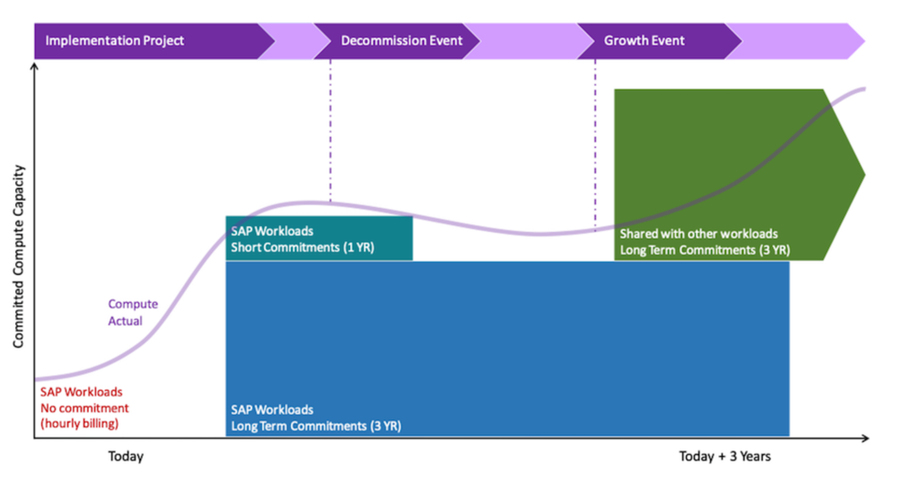

# Best Practice 20.2 – Establish a

multi-year planned cost model taking advantage of different pricing approaches

Establish a multi-year plan of your capacity requirements to ensure that you are
taking full advantage of pricing models to maximize any discounts available from AWS.
Baseline and track your costs. Cloud pricing models provide flexibility that allows you to
elastically match your infrastructure to changing business requirements. Before making
commitments to long-term Savings Plans or Reserved Instances, understand and plan your
expected SAP system usage over at least a 3-year horizon. Use testing, SAP Quick Sizer
outputs, and growth forecasts to inform a commitment plan and take advantage of the
maximum discounts for your workload.

**Suggestion 20.2.1 – Establish a capacity estimate with understanding
of your key business events**

SAP workloads are generally stable, with known usage patterns and hours of operation.
Establish a well understood steady state capacity baseline for your SAP systems. This can
be done through performance testing and monitoring your production environment during the
initial weeks of your deployment.

Extend your steady state capacity estimate to at least a three-year horizon,
considering the following:

- Major business events, such as mergers, acquisitions, and divestment
- Regulation change that might affect data storage requirements or business process
  frequency
- Data growth due to normal business operations (particularly important for
  in-memory databases like SAP HANA as data affects compute sizing in addition to
  storage sizing)
- Major system upgrades, system replacement, or decommissioning

**Suggestion 20.2.2 – Evaluate whether 1-year or 3-year commitments
are appropriate**

Evaluate how much of your SAP workload could take advantage of three-year committed
compute and maximize available discounts by using your capacity estimate. Consider the
following:

- Can you consider a three-year commitment for all compute needs of your SAP
  workload?
- Can you consider a three-year commitment for a subset of your needs which you are
  confident will not change? For example, SAP primary application servers or database
  primaries.
- Is your SAP workload part of a broader AWS Organization which could use excess
  compute commitments when changes in your SAP capacity requirements reduce the need for
  compute at a future point in time?
- Is your SAP workload part of a broader AWS Organization and could share compute
  commitments for non-production environments which do not need to be operating
  24/7?
- For medium term capacity changes, does the benefit of committing to a 3-year
  compute plan out-weigh any excess or unused capacity wastage (for example, the
  break-even point versus a shorter-term commitment is in month 20)?
- Can you consider shorter term commitment (one year) for applications likely to be
  affected by major business changes or replacement in the short term?
- Are currency fluctuations a concern you need to consider? AWS pricing (with the
  exception of AWS China) is in US dollars (USD). If a fixed exchange rate is
  desirable, you might want to consider All Upfront pricing models, if possible.
  Establish a plan to match workload capacity requirements with commitment duration to
  maximize discount.

_Example timeline of planning SAP on AWS compute
commitments_

**Suggestion 20.2.3 – Evaluate whether fixing compute types for
greater discounts is appropriate**

SAP workloads generally only use a limited set of AWS compute types and thus you
should consider whether committing to specific compute families or specific instance types
is appropriate for your workload to maximize discount. The two highest discount pricing
approaches for compute are EC2 Instance Savings Plans and Standard Reserved
Instances.

Consider the following:

- Identify frequently used compute types in your landscape and consider purchasing
  specific EC2 instance Savings Plans or Standard Reserved Instances for these. For
  example, if you are using `m5.xlarge` for your application servers across
  multiple SAP applications. This is a good candidate for an EC2 specific savings plan
  or Standard Reserved Instance as it is highly likely that you will always be using
  this commitment.
- Identify compute components which are highly likely to change EC2 families due to
  growth workloads or business events. Consider purchasing more generic compute savings
  plans or Convertible Reserved Instances for these items. For example, if you have an
  SAP HANA database which needs to move between an EC2 `r5` and
  `x1e` compute family due to a size increase after only 6 months. This is
  a good candidate for a short-term Convertible Reserved Instance or compute savings
  plan.
- Identify break-even points for general compute vs. specific compute pricing and
  take this into account when choosing your commitment type. For example, it might be
  cheaper to purchase a Standard Reserved Instance for three years rather than choose a
  3-year Convertible Reserved Instance if your sizing change is in year 3. You might
  also consider selling the residual Reserved Instance value on the AWS Reserved
  Instance Marketplace.
- Before changing instance types, identify use of AWS Marketplace seller private
  offer or annual subscription software. This will avoid incurring additional software
  costs. Both plans offer savings by allowing you to commit to running software products
  on an Amazon EC2 Instance for specified duration. For example, the purchase of an
  annual subscription for software to run on an `r4.xlarge` instance. You
  decided to change the instance type to `r5.xlarge` . The annual
  subscription is no longer linked to the instance but is still active. This results in
  additional on-demand pricing for the software on the `r5.xlarge` . Consider
  waiting for the annual subscription to expire before changing the instance size.

**Suggestion 20.2.4 – Evaluate whether Savings Plans, Reserved
Instances, or both are more appropriate**

Choose a mixture of both Savings Plans and Reserved Instances, to obtain benefits from
the different models, if appropriate for your SAP workload. Determine your commitment
periods and compute requirements holistically and then select your pricing model.

Further information on the differences between Savings Plans and Reserved Instances
can be found in [Cost Optimization]: [Best Practice 18.1

- Understand the payment and commitment options available for Amazon EC2](best-practice-18-1.md "best-practice-18-1.md") and in
  [Compute Savings Plans and Reserved Instances](../../../savingsplans/latest/userguide/what-is-savings-plans.md#sp-ris "../../../savingsplans/latest/userguide/what-is-savings-plans.md#sp-ris").

Consider [Reliability]: [Best Practice 10.2 -
Select an architecture suitable for your availability and capacity requirements](best-practice-10-2.md "best-practice-10-2.md").
It discusses the capacity reservation differences and tradeoffs between Savings Plans and
Reserved Instances.

**Suggestion 20.2.5 – Convert your capacity plan into a cost model for
budgeting and tracking purposes**

Convert your Savings Plans, Reserved Instance choices, and on-demand budget into a
cost plan that estimates your AWS spend for your SAP landscape over at least three
years. Combine your compute estimate with other AWS costs to finalize your SAP workload
cost model for budgeting and tracking purposes.

When estimating your SAP costs, remember to include the following:

- Compute-attached storage costs (such as Amazon EBS volumes)
- Shared file storage costs (such as Amazon EFS, and Amazon FSx)
- Backup storage costs (such as Amazon S3, and Amazon S3 Glacier)
- Network and VPC costs (such as Elastic Load Balancers, NAT gateways, Transit
  Gateways, Network outbound costs, Direct Connect, and VPN)
- Management and governance service costs (such as CloudWatch detailed metrics,
  AWS CloudTrail, and AWS Config)
- Security service costs (such as AWS WAF, Amazon GuardDuty, and AWS
  Shield)
- AWS Support Costs (Business or higher)
- Consider enterprise discount programs or volume discounts that you might be
  eligible for (speak to your AWS account manager for further details)
- Currency: Be aware that AWS prices are in US dollars (USD). You can choose a
  billing currency and your bills will be computed in USD and converted to your
  preferred currency at a competitive exchange rate
