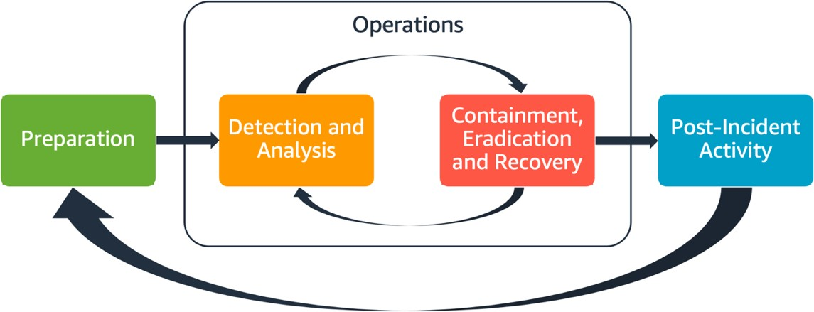

# Aspects of AWS incident response

All AWS users within an organization should have a basic
understanding of security incident response processes, and
security staff should understand how to respond to security issues.
Education, training, and experience are vital to a successful
cloud incident response program and are ideally implemented well
in advance of having to handle a possible security incident. The
foundation of a successful incident response program in the cloud
is _Preparation_,
_Operations_, and _Post-incident
activity_.

To understand each of these aspects, consider the following
descriptions:

- **Preparation**: Prepare your
  incident response team to detect and respond to incidents within
  AWS by enabling detective controls and verifying appropriate
  access to the necessary tools and cloud services. Additionally,
  prepare the necessary playbooks, both manual and automated, to
  verify reliable and consistent responses.
- **Operations**: Operate on
  security events and potential incidents following NIST’s phases
  of incident response: detect, analyze, contain, eradicate, and
  recover.
- **Post-incident activity**:
  Iterate on the outcome of your security events and simulations
  to improve the efficacy of your response, increase value derived
  from response and investigation, and further reduce risk. You
  have to learn from incidents and have strong ownership of
  improvement activities.

The following diagram shows the flow of these aspects, aligning
with the previously mentioned NIST incident response lifecycle,
but with operations encompassing detection and analysis with
containment, eradication, and recovery.

_Aspects of AWS incident response_
