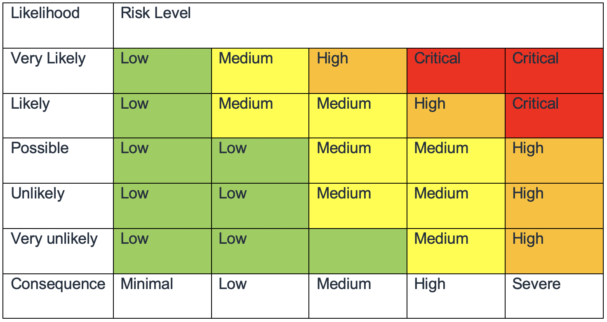

# Governance

Security governance, as a subset of the overall approach, is meant to support
business objectives by defining policies and control objectives to help manage risk. Achieve
risk management by following a layered approach to security control objectives–each layer
builds upon the previous one. Understanding the AWS Shared Responsibility Model is your
foundational layer. This knowledge provides clarity on what you are responsible for on the
customer side and what you inherit from AWS. A beneficial resource is [AWS Artifact](https://aws.amazon.com/artifact/ "https://aws.amazon.com/artifact/"), which gives you on-demand
access to AWS’ security and compliance reports and select online agreements.

Meet most of your control objectives at the next layer. This is where the
platform-wide capability lives. For example, this layer includes the AWS account vending
process, integration with an identity provider such as AWS IAM Identity Center, and the
common detective controls. Some of the output of the platform governance process is here
too. When you want to start using a new AWS service, update service control policies (SCPs)
in the AWS Organizations service to provide the guardrails for initial use of the service.
You can use other SCPs to implement common security control objectives, often referred to as
security invariants. These are control objectives or configuration that you apply to
multiple accounts, organization units, or the whole AWS organization. Typical examples are
limiting the Regions that infrastructure runs in or preventing the deactivation of detective
controls. This middle layer also contains codified policies such as config rules or checks
in pipelines.

The top layer is where the product teams meet control objectives.
This is because the implementation is done in the applications that the product teams
control. This could be implementing input validation in an application or ensuring that
identity passes between microservices correctly. Even though the product team owns the
configuration, they can still inherit some capability from the middle
layer.

Wherever you implement the control, the goal is the same: manage risk. A
range of risk management frameworks apply to specific industries, regions, or technologies.
Your main objective: highlight the risk based on likelihood and consequence. This is the
_inherent risk_. You can then define a control objective
that reduces either the likelihood, consequence, or both. Then, with a control in place, you
can see what the resulting risk is likely to be. This is the _residual risk_. Control objectives can apply to one or many workloads. The
following diagram shows a typical risk matrix. The likelihood is based on frequency of
previous occurrences and the consequence is based on the financial, reputational and time
cost of the event.

_Figure 2: Risk level likelihood matrix_
