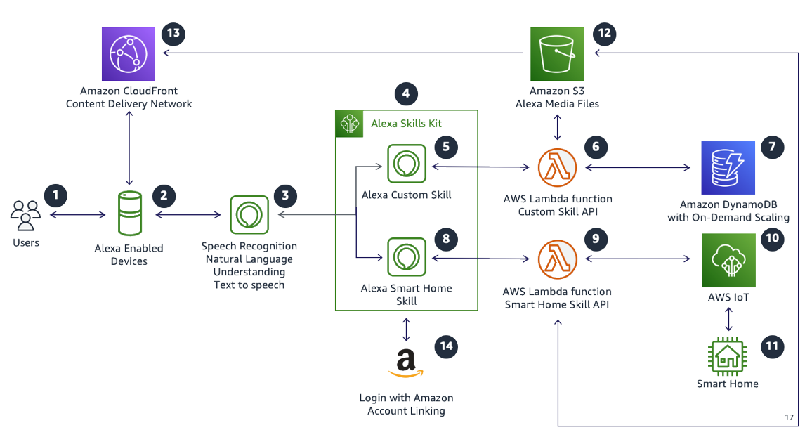

# Alexa skills

The Alexa Skills Kit gives developers the ability to extend Alexa's capabilities by building natural and engaging voice and visual experiences. Successful skills are habit-forming, where users routinely come back because it offers something unique, it provides value in new, novel, and frictionless ways.

The biggest cause of frustration from users is when the skill doesn’t behave as expected. It’s
essential to start by designing a voice interaction model and working backwards since some
users may say too little, too much, or possibly something unexpected. The voice design process
involves creating, scripting, and planning for expected as well as unexpected
utterances.

_Figure 2: Alexa Skill example design script_

With a basic script in mind, you can use the following techniques before start building a
skill:

- **Outline the shortest route to completion.**
  - The shortest route to completion is generally when the user gives all information
    and slots at once, an account is already linked if relevant, and other prerequisites
    are satisfied in a single invocation of the skill.

- **Outline alternate paths and decision trees.**
  - Often, what the user says doesn’t include all information necessary to complete
    the request. In the flow, identify alternate pathways and user decisions.

- **Outline behind-the-scenes decisions the system logic will have to
  make.**
  - Identify behind-the-scenes system decisions, for example with new or returning
    users. A background system check might change the flow a user follows.

- **Outline how the skill will help the user.**
  - Include clear directions in the help for what users can do with the skill. Based
    on the complexity of the skill, the help might provide one simple response or many
    responses.

- **Outline the account linking process, if present.**
  - Determine the information that is required for account linking. You also need to
    identify how the skill will respond when account linking hasn’t been completed.

## Characteristics

- You want to create a complete serverless architecture without managing any
  instances or servers.
- You want your content to be decoupled from your skill as much as possible.
- You are looking to provide engaging voice experiences exposed as an API to optimize
  development across wide-ranging Alexa devices, Regions, and languages.
- You want elasticity that scales up and down to meet the demands of users and
  handles unexpected usage patterns.

## Reference architecture

_Figure 3: Reference architecture for an Alexa Skill_

1. **Alexa users** interact with Alexa skills by speaking
   to Alexa-enabled devices using voice as the primary method of interaction.
2. **Alexa-enabled devices** listen for a wake word and
   activate as soon as one is recognized. Supported wake words are Alexa, Computer, and
   Echo.
3. The **Alexa Service** performs common Speech Language
   Understanding (SLU) processing on behalf of your Alexa Skill, including Automated Speech
   Recognition (ASR), Natural Language Understanding (NLU), and Text to Speech (TTS)
   conversion.
4. **Alexa Skills Kit (ASK)** is a collection of
   self-service APIs, tools, documentation, and code examples that make it fast and easy
   for you to add skills to Alexa. ASK is a trusted AWS Lambda trigger, allowing for
   seamless integration.
5. **Alexa Custom Skill** gives you control over the user
   experience, allowing you to build a custom interaction model. It is the most flexible
   type of skill, but also the most complex.
6. A **Lambda function** using the Alexa Skills Kit,
   allowing you to seamlessly build skills avoiding unneeded complexity. Using it you can
   process different types of requests sent from the Alexa Service and build speech
   responses.
7. A **DynamoDB Database** can provide a NoSQL data store.
   Using DynamoDB’s on-demand scaling mechanism offers simple pay-per-request pricing for read
   and write requests so that you only pay for what you use, and you do not need to worry
   about forecasting read and write throughput. DynamoDB is commonly used by Alexa skills to
   persist user state and sessions.
8. **Alexa Smart Home Skill** allows you to control
   devices such as lights, thermostats, and smart TVs using the Smart Home API. Smart Home
   skills are simpler to build than custom skills since they don’t give you control over
   the interaction model.
9. A **Lambda function** is used to respond to device
   discovery and control requests from the Alexa Service. Developers use it to control a
   wide-ranging number of devices including entertainment devices, cameras, lighting,
   thermostats, locks, and many more.
10. **AWS IoT** allows developers to securely connect their
    devices to AWS and control interaction between their Alexa skill and their devices.
11. An Alexa-enabled **Smart Home** can have an unlimited
    number of IoT connected devices receiving and responding and to directives from an Alexa
    Skill.
12. **Amazon S3** stores your skills static assets including images,
    content, and media. Its contents are securely served using CloudFront.
13. **Amazon CloudFront Content Delivery Network (CDN)** provides a CDN
    that serves content faster to geographically distributed mobile users and includes
    security mechanisms to static assets in Amazon S3.
14. **Account Linking** is needed when your skill must
    authenticate with another system. This action associates the Alexa user with a specific
    user in the other system.

## Configuration notes

- Validate Smart Home request and response payloads by validating against the JSON
  schema for all possible Alexa Smart Home messages sent by a skill to Alexa.
- Ensure that your Lambda function timeout is less than eight seconds and can handle
  requests within that timeframe. (The Alexa Service timeout is eight seconds.)
- Follow [best practices](../../../amazondynamodb/latest/developerguide/BestPractices.md "../../../amazondynamodb/latest/developerguide/BestPractices.md")
  when creating your DynamoDB tables. Use on-demand tables when you are not certain how much
  read or write capacity you need. You can use provisioned capacity with automatic scaling
  enabled if you know read and write capacity and do not expect large spikes in traffic.
  For Skills that are heavy on reads, DynamoDB Accelerator(DAX) can greatly improve response times.
- Account linking can provide user information that may be stored in an external
  system. Use that information to provide contextual and personalized experience for your
  user. Alexa has [guidelines on Account Linking](https://developer.amazon.com/blogs/alexa/post/0fbd9756-6ea0-43d5-b213-873ede1b0595/tips-for-successfully-adding-account-linking-to-your-alexa-skill "https://developer.amazon.com/blogs/alexa/post/0fbd9756-6ea0-43d5-b213-873ede1b0595/tips-for-successfully-adding-account-linking-to-your-alexa-skill") to provide frictionless experiences.
- Use the skill beta testing tool to collect early feedback on skill development, and
  for skills versioning, to reduce impact on skills that are already live.
- Use ASK CLI to automate skill development and deployment.
