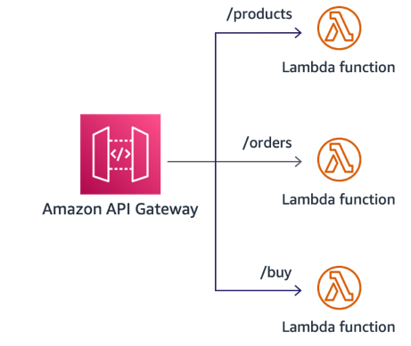
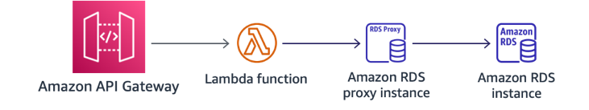

# AWS Lambda

Set your AWS Lambda function timeout a few seconds higher than the
average execution to account for any transient issues in downstream services used in the
communication path. This also applies when working with Step Functions activities, tasks, and
Amazon SQS message visibility. Choosing a default memory setting and timeout in AWS Lambda may have an
undesired effect in performance, cost, and operational procedures.

Setting the timeout much higher than the average execution may cause functions to
execute for longer upon code malfunction, resulting in higher costs and possibly reaching
concurrency limits depending on how such functions are invoked. Setting a timeout that
equals one successful function execution may trigger a serverless application to abruptly
halt an execution if a transient networking issue or abnormality in downstream services
occur. Setting a timeout without performing load testing and, more importantly, without
considering upstream services, may result in errors whenever any part reaches its timeout
first.

Follow [best
practices](../../../lambda/latest/dg/best-practices.md "../../../lambda/latest/dg/best-practices.md") for working with Lambda functions such as container reuse, minimizing
deployment package size to its runtime necessities, and minimizing the complexity of your
dependencies including frameworks that may not be optimized for fast startup. The latency
99th percentile (P99) should always be taken into account, as one may not impact the
application SLA agreed to with other teams.

AWS Lambda Extensions count towards the deployment package size limit of your function.
They also can impact the performance of your function because they share function resources
such as CPU, memory, and storage. Account for the additional resources used when adding
Lambda extensions through [Lambda layers](../../../lambda/latest/dg/configuration-layers.md "../../../lambda/latest/dg/configuration-layers.md") or [functions deployed as container images](https://aws.amazon.com/blogs/compute/working-with-lambda-layers-and-extensions-in-container-images/ "https://aws.amazon.com/blogs/compute/working-with-lambda-layers-and-extensions-in-container-images/"). If your extension performs
compute-intensive operations, you may see your function's execution duration
increase.

Serverless applications may begin modeling monolithic applications, represented by a
single AWS Lambda function performing multiple tasks. Serverless applications may adopt this
monolithic approach as an easier way to get started, or developers may follow existing
development practices and paradigms, or simple applications may grow more complex over time.
As you optimize your serverless application, this monolithic approach may be less performant
due to the bundle of dependencies for everything that is not used on every execution path.
Consider breaking down your serverless application into microservices and remove unused
dependencies from these discrete functions. You will also gain performance in adapting new
features and opting for code optimized for the function use-case or integration.

Take advantage of Amazon API Gateway native routing functionality instead of using the routing of
web frameworks, which are well suited for web servers. Web frameworks inside the Lambda
function increases the size of the deployment package.

_Figure 26: Amazon API Gateway simplified routing architecture_

After a Lambda function has executed, AWS Lambda maintains the execution context for some
arbitrary time in anticipation of another Lambda function invocation. That allows you to use
the global scope for one-off expensive operations, for example establishing a database
connection or any initialization logic. In subsequent invocations, you can verify whether it’s
still valid and reuse the existing connection.

Consider connection pooling with [Amazon RDS
Proxy](https://aws.amazon.com/rds/proxy/ "https://aws.amazon.com/rds/proxy/") for your Lambda functions that interact using SQL calls with your database
instance. Amazon RDS Proxy handles the connection pooling necessary for scaling simultaneous
connections created by concurrent AWS Lambda functions. This allows for reuse of existing
connections, rather than creating new connections for every function invocation.

_Figure 27: Amazon RDS Proxy allows you to efficiently scale to many more
connections from your serverless application_
