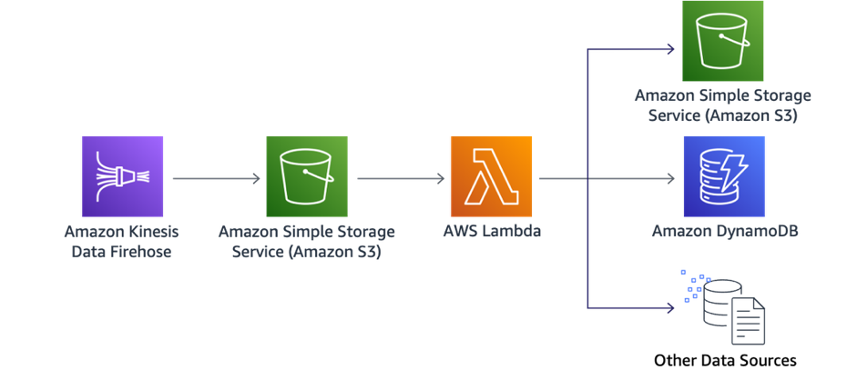
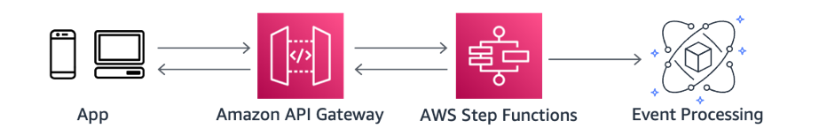
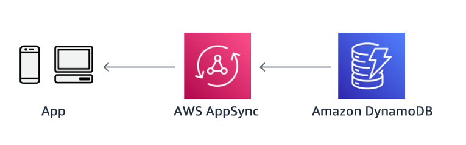
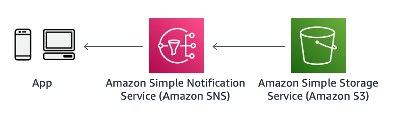
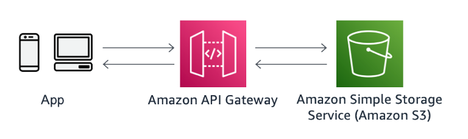

# AWS Step Functions

AWS Step Functions monitor the Amazon CloudWatch metric [ExecutionThrottled](../../../step-functions/latest/dg/procedure-cw-metrics.md#cloudwatch-step-functions-execution-metrics "../../../step-functions/latest/dg/procedure-cw-metrics.md#cloudwatch-step-functions-execution-metrics") which reports throttling on state transition, the number of
`StateEntered` events, and retries that have been throttled. Use this metric to
determine if a quota increase for a Standard Workflow is required.

If an Express Workflow execution runs for more than the 5-minute maximum, it will fail
with a `States.Timeout` error and emit a `ExecutionsTimedOut` CloudWatch
metric. Make use of [timeouts](../../../step-functions/latest/dg/sfn-stuck-execution.md "../../../step-functions/latest/dg/sfn-stuck-execution.md") in your task to
avoid an execution stuck waiting for a response. Specify a reasonable
`TimeoutSeconds` when you create the task. If you are receiving `States.Timeout`
errors, consider breaking the workflow into multiple workflow executions, revising your task
code or creating a Standard Workflow.

## Asynchronous Transactions

Because your customers expect more modern and interactive user
interfaces, you can no longer sustain complex workflows using synchronous transactions. The
more service interaction you need, the more you end up chaining calls that may end up
increasing the risk on service stability as well as response time.

Modern UI frameworks, such
as Angular.js, VueJS, and React, asynchronous transactions, and cloud native workflows provide
a sustainable approach to meet customer demand, as well as helping you decouple components and
focus on process and business domains instead.

These asynchronous transactions (or often times
described as an event-driven architecture) kick off downstream subsequent choreographed events
in the cloud instead of constraining clients to lock-and-wait (I/O blocking) for a response.
Asynchronous workflows handle a variety of use cases including, but not limited to: data
Ingestion, ETL operations, and order or request fulfillment.

In these use-cases, data is
processed as it arrives, and is retrieved as it changes. We outline best practices for two
common asynchronous workflows where you can learn a few optimization patterns for integration
and async processing.

## Serverless Data Processing

In a serverless data processing workflow, data is ingested from
clients into Kinesis (using the Kinesis agent, SDK, or API), and arrives in Amazon S3.

New objects kick
off a Lambda function that is automatically executed. This function is commonly used to
transform or partition data for further processing and possibly stored in other destinations
such as DynamoDB, or another S3 bucket where data is in its final format.

As you may have
different transformations for different data types, we recommend granularly splitting the
transformations into different Lambda functions for optimal performance. With this approach,
you have the flexibility to run data transformation in parallel and gain speed as well as
cost.

_Figure 28: Asynchronous data ingestion_

Firehose offers native [data transformations](../../../firehose/latest/dev/record-format-conversion.md "../../../firehose/latest/dev/record-format-conversion.md")
that can be used as an alternative to Lambda, where no additional logic is necessary for
transforming records in Apache Log or System logs to CSV, JSON, JSON to Parquet, or
ORC.

A Kinesis data stream is a set of [shards](../../../streams/latest/dev/key-concepts.md#shard "../../../streams/latest/dev/key-concepts.md#shard"), each shard contains a
sequence of data records. Lambda reads records from the data stream and invokes your
function [synchronously](../../../lambda/latest/dg/invocation-sync.md "../../../lambda/latest/dg/invocation-sync.md") with an event that contains stream records. Lambda reads records
in batches and invokes your function to process records from the batch. Each batch
contains records from a single shard or data stream.

To minimize latency and maximize read throughput of processing data from a Kinesis data
stream, build your consumer with the [enhanced fan-out](../../../kinesis/latest/dev/enhanced-consumers.md "../../../kinesis/latest/dev/enhanced-consumers.md") feature. This
throughput is dedicated, which means that consumers that use enhanced fan-out don't have
to contend with other consumers that are receiving data from the stream.

Avoid invoking your function with a small number of records. You can configure the
event source to buffer records for up to five minutes by configuring a [CreateEventSourceMapping](../../../lambda/latest/dg/API_CreateEventSourceMapping.md#API_CreateEventSourceMapping_RequestSyntax "../../../lambda/latest/dg/API_CreateEventSourceMapping.md#API_CreateEventSourceMapping_RequestSyntax")
_batch window_ (`MaximumBatchingWindowInSeconds`). Lambda continues to
read records from the stream until it has gathered a full batch, or until the batch window
expires.

Configure the [CreateEventSourceMapping](../../../lambda/latest/dg/API_CreateEventSourceMapping.md#API_CreateEventSourceMapping_RequestSyntax "../../../lambda/latest/dg/API_CreateEventSourceMapping.md#API_CreateEventSourceMapping_RequestSyntax")
_batch size_ (`BatchSize`) to control the maximum number of records that can
be sent to your function with each invoke. A larger batch size can often more efficiently
absorb the invoke overhead across a larger set of records, increasing your throughput. Avoid
stalled shards by configuring the event source mapping to retry with a smaller batch size,
limit the number of retries, or discard records that are too old. To retain discarded events,
configure the event source mapping to send details about failed batches to an Amazon SQS queue or Amazon SNS
topic.

Increase your Kinesis stream processing throughput using the [CreateEventSourceMapping](../../../lambda/latest/dg/API_CreateEventSourceMapping.md#API_CreateEventSourceMapping_RequestSyntax "../../../lambda/latest/dg/API_CreateEventSourceMapping.md#API_CreateEventSourceMapping_RequestSyntax") `ParallelizationFactor` setting to increase concurrency by
processing multiple batches from each shard in parallel. Lambda can process up to 10 batches in
each shard simultaneously keeping in-order processing at the partition-key level. Increase the
number of shards to directly increase the number of maximum concurrent Lambda function
invocations.

Use the Lambda emitted [IteratorAge](../../../lambda/latest/dg/with-kinesis.md#events-kinesis-metrics "../../../lambda/latest/dg/with-kinesis.md#events-kinesis-metrics")
metric to estimate the latency between when a record is added and when the function
processes it.

## Serverless Event Submission with Status

Updates

Suppose you have an ecommerce site and a customer submits an
order that kicks off an inventory deduction and shipment process; or an enterprise application
that submits a large query that may take minutes to respond.

The processes required to complete this common transaction may require multiple service
calls that may take a couple of minutes to complete. Within those calls, you want to
safeguard against potential failures by adding retries and exponential backoffs, However,
that can cause a less than ideal user experience for whoever is waiting for the
transaction to complete.

For long and complex workflows similar
to this, you can integrate API Gateway or AWS AppSync with Step Functions that upon new authorized
requests will start this business workflow. Step Functions responds immediately with an
execution ID to the caller (Mobile App, SDK, web service).

For legacy systems, you can use the execution ID to poll Step Functions for the business workflow
status via another REST API. With WebSockets, whether you’re using REST or GraphQL, you
can receive business workflow status in real-time by providing updates in every step of
the workflow.

_Figure 29: Asynchronous workflow with Step Functions state
machines_

Another common scenario is integrating API Gateway directly with Amazon SQS or Kinesis as a scaling layer.
A Lambda function would only be necessary if additional business information or a custom
request ID format is expected from the caller.

_Figure 30: Asynchronous workflow using a queue as a scaling
layer_

In this second example, Amazon SQS serves multiple purposes:

1. Storing the request record durably is important because the client can confidently
   proceed throughout the workflow knowing that the request will eventually be processed.
2. Upon a burst of events that may temporarily overwhelm the backend, the request can be
   polled for processing when resources become available.

Compared to the first example without a queue, Step Functions Standard Workflow is storing
the data durably without the need for a queue or state-tracking data sources. In both
examples, the best practice is to pursue an asynchronous workflow after the client submits the
request and avoiding the resulting response as blocking code if completion can take several
minutes.

With WebSockets, AWS AppSync provides this capability out of the box with GraphQL
subscriptions. With subscriptions, an authorized client could listen for data mutations
they’re interested in. This is ideal for data that is streaming, or that may yield more
than a single response.

With AWS AppSync, as status updates change in DynamoDB, clients can automatically subscribe and
receive updates as they occur and it’s the perfect pattern for when data drives the user
interface. With AWS AppSync you power your application with the right data, from one or more
data sources with a single network request using GraphQL. GraphQL works at the application
layer and provides a type system for defining schemas. These schemas serve as
specifications to define how operations should be performed on the data and how the data
should be structured when retrieved.

_Figure 31: Asynchronous updates via WebSockets with AWS AppSync and
GraphQL_

Web Hooks can be implemented with Amazon SNS Topic HTTP subscriptions. Consumers can host an
HTTP endpoint that Amazon SNS will call back through a POST method upon an event (for example,
a data file arriving in Amazon S3). This pattern is ideal when the clients are configurable,
such as another microservice, which could host an endpoint. Alternatively, [Step Functions supports callbacks](../../../step-functions/latest/dg/callback-task-sample-sqs.md "../../../step-functions/latest/dg/callback-task-sample-sqs.md") where a state machine will block until it receives
a response for a given task.

_Figure 32: Asynchronous notification via Webhook with Amazon SNS_

Lastly, polling could be costly from both a cost- and resource-perspective due to multiple
clients constantly polling an API for status. If polling is the only option due to
environment constraints, it’s a best practice to establish SLAs with the clients to limit
the number of empty polls.

_Figure 33: Client polling for updates on transaction recently
made_

For example, if a large data warehouse query takes an average of two minutes for a
response, the client should poll the API after two minutes with exponential backoff if the
data is not available. There are two common patterns to ensure that clients aren’t polling
more frequently than expected: Throttling and Timestamp, for when is safe to poll
again.

For timestamps, the system being polled can return an extra field with a timestamp or
time period showing when it is safe for the consumer to poll once again. This approach
follows an optimistic scenario where the consumer will respect and use this wisely, and in
the event of abuse you can also employ throttling for a more complete
implementation.
