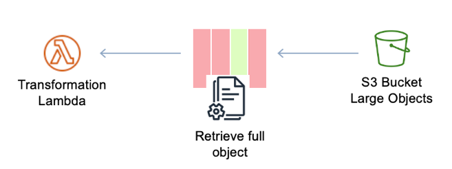
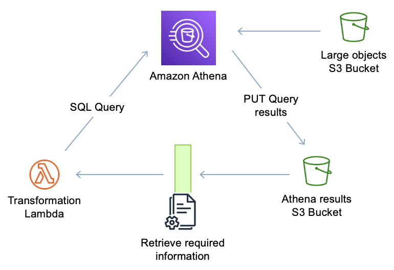

# Code optimization

As covered in the performance pillar, optimizing your serverless application can
effectively improve the value it produces per execution.

The use of global variables to maintain connections to your data stores or other
services and resources will increase performance and reduce execution time, which also
reduces the cost. Moreover consider connection pooling with [Amazon RDS Proxy](https://aws.amazon.com/rds/proxy/ "https://aws.amazon.com/rds/proxy/") for your Lambda functions that interact using SQL
calls with your relational database instance. Please refer to the documentation for the
database engines that are supported and also find more information, at the Serverless
performance pillar section.

An example where the use of managed service features can improve the value per
execution is retrieving and filtering objects from Amazon S3, since fetching large objects from
Amazon S3 requires higher memory for Lambda functions.

_Figure 46: Lambda function retrieving full S3 object_

The previous diagram shows that when retrieving large objects from Amazon S3, we might
increase the memory consumption of the Lambda, increase the execution (so the function can
transform, iterate, or collect required data) and, in some cases, only part of this
information is needed.

This is represented with three columns in red (data not required) and one column in
green (data required). Using Athena SQL queries to gather granular information needed for
your execution reduces the retrieval time and object size upon which to perform
transformations.

_Figure 47: Lambda with Athena object retrieval_

The next diagram shows that by querying Athena to get the specific data, we reduce the
size of the object retrieved and, as an extra benefit, we can reuse that content since Athena
saves its query results in an S3 bucket and invokes the Lambda invocation as the results land
in Amazon S3 asynchronously.

A similar approach could be using S3 Select, which enables applications to retrieve
only a subset of data from an object by using simple SQL expressions. As in the previous
example with Athena, retrieving a smaller object from Amazon S3 reduces execution time and the
memory used by the Lambda function.

_Table: Lambda performance statistics using Amazon S3 vs S3 Select_

| _200 seconds_
| _95 seconds_ |
| --- | --- |
| `# Download and process all keys for key in src_keys: response = s3_client.get_object(Bucket=src_bucket, Key=key) contents = response['Body'].read() **for line in contents.split('\n')[:-1]:** line_count +=1 try: **data = line.split(',')** **srcIp = data[0][:8]** …` | `# Select IP Address and Keys for key in src_keys: response = s3_client.select_object_content (Bucket=src_bucket, Key=key, expression = **SELECT SUBSTR(obj.\_1, 1, 8), obj.\_2 FROM s3object as obj)** contents = response['Body'].read() for line in contents: line_count +=1 try: …` |
