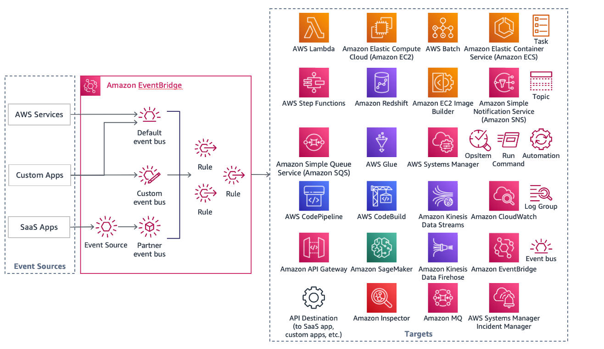

# Event-driven architectures

Event-driven architectures are becoming a popular and preferable way of building large
distributed microservice-based applications. This approach helps you build scalable,
resilient, agile and cost-effective solutions.

Using AWS serverless services to implement event-driven approach will allow you to build scalable, fault tolerant applications.
You can use messaging services like Amazon SQS for reliable and durable communication between microservices. For fan out of the events you can use Amazon SNS topics.
If you need event filtering and routing you can utilize Amazon EventBridge.

Typical use cases for event-driven architectures:

- Communication between microservices
- Integration with third-party SaaS applications
- Cross-account and cross region data replication
- Parallel event processing, fanout

## Reference architecture

Every event-driven architecture consists of three main parts:

- Event sources
- Event routers
- Event destinations

The most common event sources could be other AWS services, your microservices or
applications, or third-party SaaS offerings. For routing those events, you can create rules
matching specific parts of the event and provide destinations of where to send them. You
describe the rules and destinations with the help of Amazon EventBridge.

_Figure 7: Reference architecture for EventBridge deployment_

When you are building event-driven microservices applications, it's important to agree
on the data contract for the event producers and consumers. This will help to validate the
events and automatically generate bindings for the used programming language. Amazon EventBridge
allows you to use schemas in OpenAPI 3 and JSONSchema Draft4 formats.

As all the event-driven applications are distributed it is important to use tracing to
understand and observe service dependencies and diagnose any bottlenecks and issues in the
application. To use tracing, you can enable integration between EventBridge and AWS X-Ray.

## Configuration notes

EventBridge can introduce additional latency to the application. If latency is a concern, consider
using Amazon SNS and Amazon SQS for event filtering and routing.
