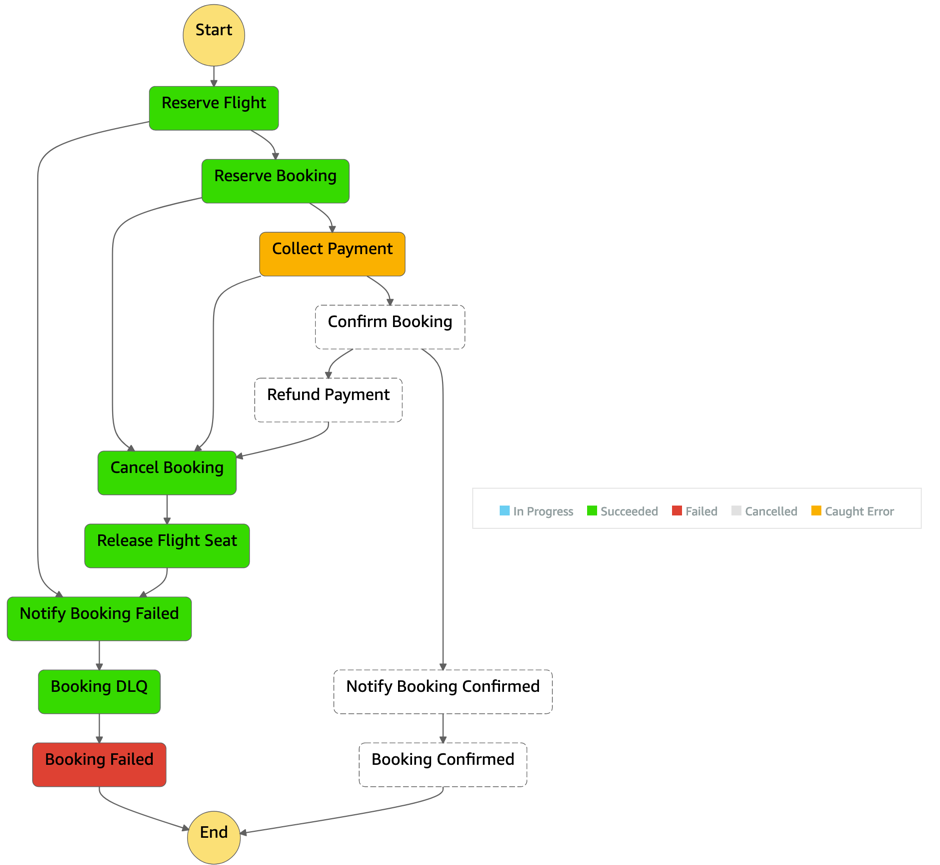
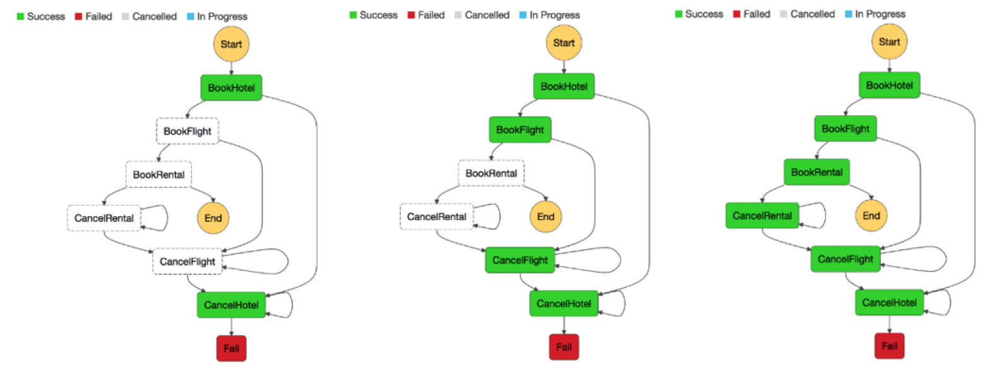

# Failure management

Certain parts of a serverless application are dictated by asynchronous calls to various
components in an event-driven fashion, such as by pub/sub and other patterns. When
asynchronous calls fail, they should be captured and retried whenever possible. Otherwise,
data loss can occur, resulting in a degraded customer experience.

Use a dead-letter queue mechanism to retain, investigate, and retry failed
transactions.

- [AWS Lambda](https://aws.amazon.com/lambda/ "https://aws.amazon.com/lambda/")
  allows failed transactions to be sent to a dedicated [Amazon SQS](https://aws.amazon.com/sqs/ "https://aws.amazon.com/sqs/") dead-letter queue on a per function basis.
- [Amazon Kinesis Data Streams](https://aws.amazon.com/kinesis/ "https://aws.amazon.com/kinesis/") and [Amazon DynamoDB Streams](https://aws.amazon.com/dynamodb/ "https://aws.amazon.com/dynamodb/") retry the entire batch of items. Repeated errors block processing of
  the affected shard until the error is resolved or the items expire.
- Within [AWS Lambda](https://aws.amazon.com/lambda/ "https://aws.amazon.com/lambda/"), you can configure
  **Maximum Retry Attempts**, **Maximum
  Record Age** and **Destination on Failure** to
  respectively control retry while processing data records, and effectively remove
  poison-pill messages from the batch by sending its metadata to an [Amazon SQS](https://aws.amazon.com/sqs/ "https://aws.amazon.com/sqs/") dead-letter queue for further analysis.

AWS SDKs provide back-off and retry mechanisms by default when talking to other AWS
services that are sufficient in most cases. However, [review and tune
them](https://aws.amazon.com/premiumsupport/knowledge-center/lambda-function-retry-timeout-sdk/ "https://aws.amazon.com/premiumsupport/knowledge-center/lambda-function-retry-timeout-sdk/") to suit your needs, especially `HTTP keepalive`,
`connection`, and `socket timeouts`. Whenever possible, use Step Functions to
minimize the amount of custom try/catch, back-off, and retry logic within your Serverless
applications. For example, you can use a Step Functions integration to save failed state runs and
their state into a DLQ. For more information on costs trade-offs, see the [cost optimization](cost-optimization.md "cost-optimization.md") pillar section.

_Figure 20: Step Functions state machine with DLQ step_

Partial failures can occur in non-atomic operations, such as `PutRecords`
(Kinesis) and `BatchWriteItem` (DynamoDB), since they return successful if at least one
record has been ingested successfully. Always inspect the response when using such
operations, and programmatically deal with partial failures. When consuming from Kinesis or
DynamoDB Streams use Lambda error handling controls, such as **maximum record
age**, **maximum retry attempts**, **DLQ on failure**, and **Bisect batch on function
error**, to build additional resiliency into your application. For synchronous
parts that are transaction-based and depend on certain guarantees and requirements, rolling
back failed transactions as described by the [Saga pattern](http://theburningmonk.com/2017/07/applying-the-saga-pattern-with-aws-lambda-and-step-functions/ "http://theburningmonk.com/2017/07/applying-the-saga-pattern-with-aws-lambda-and-step-functions/") also can be achieved by using Step Functions state machines, which
will decouple and simplify the logic of your application.

_Figure 21: Step Functions state machine Saga pattern_

Choose the Step Functions type based on your workload. For short-running synchronous and
asynchronous high-volume workloads, use Step Functions - Sync Express. If you need to automate long-running
workflows and want to have additional durability and audit go with Step Functions Standard.
