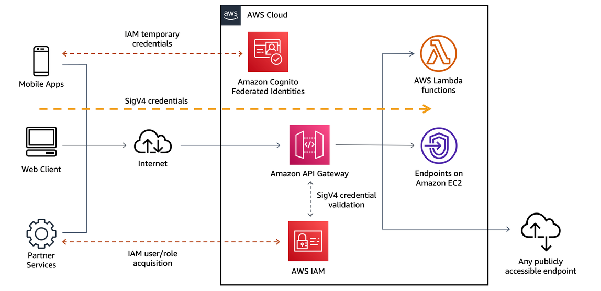
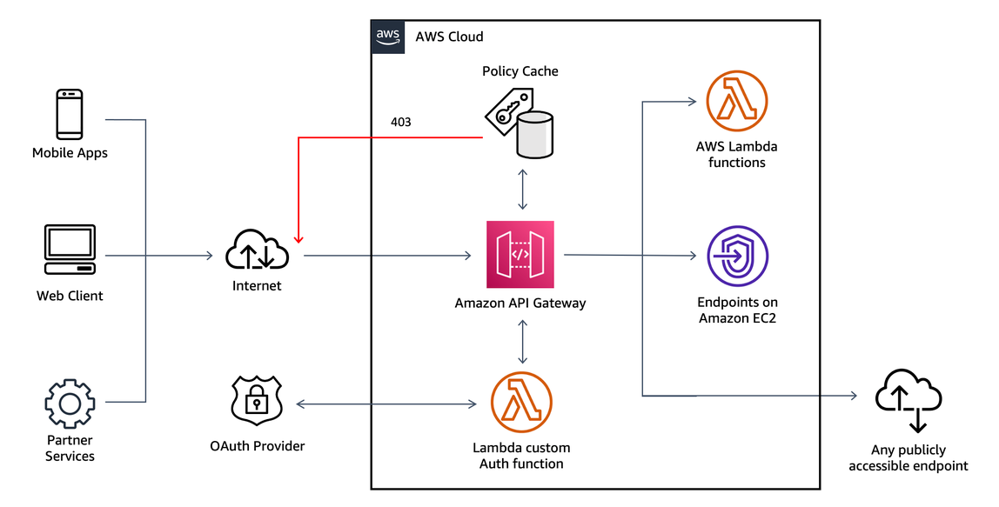
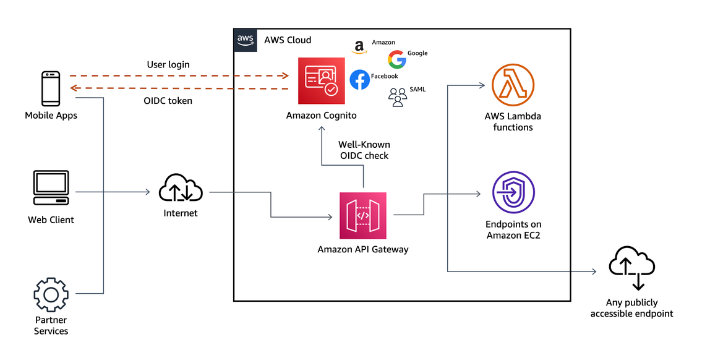
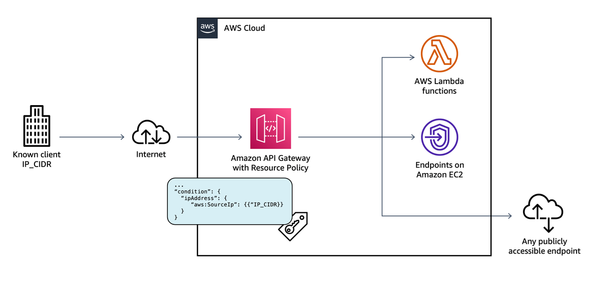
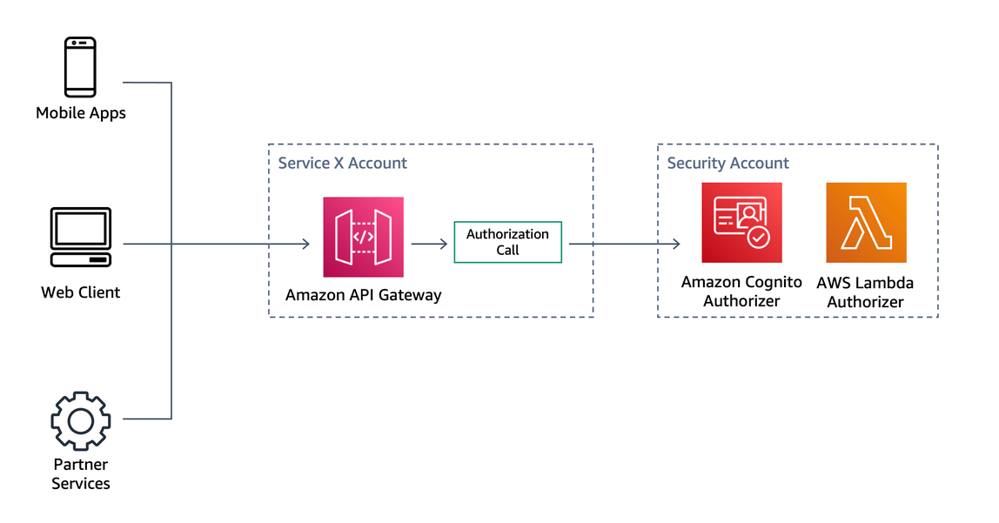

# Identity and access management

| SEC 1: How do you control access to your serverless API? |
| -------------------------------------------------------- |
|                                                          |

APIs are often targeted by attackers because of the operations that they can perform
and the valuable data they can obtain. There are various security best practices to
defend against these attacks.

From an authentication and authorization perspective, there are currently five
mechanisms to authorize an API call within API Gateway:

- AWS_IAM authorization
- Amazon Cognito user pools
- API Gateway Lambda authorizer
- Resource policies
- Mutual TLS authentication
  It is important to understand if, and how, any of these mechanisms are implemented.
  For consumers who are currently located within your AWS environment or have the means
  to retrieve AWS Identity and Access Management (IAM) temporary credentials to access your environment, you can
  use AWS_IAM authorization and add least-privileged permissions to the respective
  IAM role to securely invoke your API.

The following diagram illustrates using AWS_IAM authorization in this
context:

_Figure 13: AWS_IAM authorization_

To add granularity into your IAM authorization you can implement tag-based access
control, which allows for better API-level control on the resources and actions.

If you have an existing Identity Provider (IdP), you can use an API Gateway Lambda
authorizer to invoke a Lambda function to authenticate or validate a given user against
your IdP. You can use a Lambda authorizer for custom validation logic based on identity
metadata.

A Lambda authorizer can send additional information derived from a bearer token or
request context values to your backend service. For example, the authorizer can return a
map containing user IDs, user names, and scope. By using Lambda authorizers, your backend
does not need to map authorization tokens to user-centric data, allowing you to limit
the exposure of such information to just the authorization function.

_Figure 14: API Gateway Lambda authorizer_

If you don’t have an IdP, you can leverage Amazon Cognito user pools to either provide built-in user
management or integrate with external identity providers, such as Facebook, Twitter,
Google+, and Amazon.

This is commonly seen in the mobile backend scenario, where users authenticate by
using existing accounts in social media platforms to register or sign in with their
email address or username. This approach also provides granular authorization through
[OAuth Scopes](../../../apigateway/latest/developerguide/apigateway-enable-cognito-user-pool.md "../../../apigateway/latest/developerguide/apigateway-enable-cognito-user-pool.md").

_Figure 15: Amazon Cognito user pools_

API Gateway API Keys is not a security mechanism and should not be used for authorization
unless it’s a public API. It should be used primarily to track a consumer’s usage across
your API and could be used in addition to the authorizers previously mentioned in this
section.

When using Lambda authorizers, we strictly advise against passing credentials or any
sort of sensitive data through query string parameters or headers, otherwise you may
open your system up to abuse.

Amazon API Gateway resource policies are JSON policy documents that can be attached to an API
to control whether a specified AWS Principal can invoke the API.

This mechanism allows you to restrict API invocations by:

- Users from a specified AWS account, or any AWS IAM identity.
- Specified source IP address ranges or CIDR blocks.
- Specified virtual private clouds (VPCs) or VPC endpoints (in any account).
  With resource policies, you can restrict common scenarios, such as only
  allowing requests coming from known clients with a specific IP range or from
  another AWS account. If you plan to restrict requests coming from private IP
  addresses, it’s recommended to use API Gateway private endpoints instead.

_Figure 16: Amazon API Gateway Resource Policy based on IP
CIDR_

With private endpoints, API Gateway will restrict access to services and resources inside
your VPC, or those connected through Direct Connect to your own data centers. To control
access to the VPC Endpoint you can add VPC endpoint policies so that you can grant or
deny the access to a particular APIs for the traffic going in your internal network.
Combining private endpoints, endpoint policies, and resource policies, an API can be
limited to specific resource invocations within a specific private IP range from a
specific VPC endpoint. This combination is mostly used on internal microservices where
they may be in the same account, or another account. If you are using API Gateway as a main
endpoint to your backend HTTP(s) services you can enable client-side SSL certificates so
that the backend services can authenticate and verify requests from API Gateway. When it comes
to large deployments and multiple AWS accounts, organizations can use cross-account
Lambda authorizers in API Gateway to reduce maintenance and centralize security practices. For
example, API Gateway has the ability to use Amazon Cognito user pools in a separate account. Lambda authorizers
can also be created and managed in a separate account and then re-used across multiple
APIs managed by API Gateway. Both scenarios are common for deployments with multiple
microservices that need to standardize authorization practices across APIs.

_Figure 17: API Gateway cross-account authorizers_

For cases like Internet of Things (IoT) or application-to-application authentication,
you can configure a mutual TLS (mTLS) authentication. In this scenario, the client
should present its certificate to verify its identity when accessing API Gateway endpoint. You
can also combine mTLS with Lambda authorizers for a more granular authorization
mechanism.

You can use AWS WAF to add protection of your APIs on the application network
layer. You can use managed rule groups to protect your APIs against well known attacks
like SQL injection and cross-site scripting (XSS), or if you have additional
requirements you can also create your own rule groups.

| SEC 2: How are you managing the security boundaries of your serverless application? |
| -------------------------------------------------------------------------------------- |
|                                                                                        |

With Lambda functions, it’s recommended that you follow least-privileged access and
only allow the access needed to perform a given operation. Attaching a role with more
permissions than necessary can open up your systems for abuse.

With the security context, having smaller functions that perform scoped activities
contribute to a more well-architected serverless application. Regarding IAM roles,
sharing an IAM role within more than one Lambda function will likely violate
least-privileged access.
