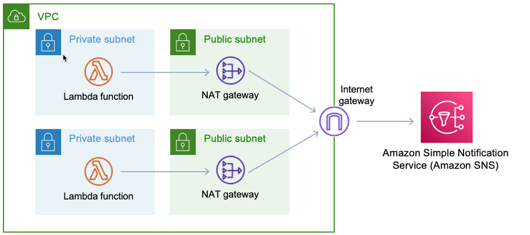
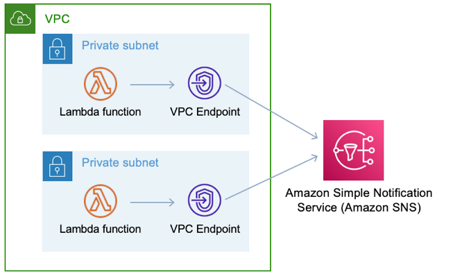

# Leverage VPC endpoints

If you use Amazon Virtual Private Cloud (Amazon VPC) to host your AWS resources, you can establish a
connection between your VPC and serverless services like AWS Lambda and AWS Step Functions. You can
use this connection to invoke your Serverless resources without crossing the public
internet.

To establish a private connection between your VPC and serverless resources, you can
create an interface VPC endpoint. Interface endpoints are powered by AWS PrivateLink, which
enables you to privately access APIs without needing an internet gateway or NAT device
within your architecture.

Leveraging VPC endpoints will most likely contribute to cost savings if you are
leveraging NAT and Internet gateways for the sole purpose of accessing Serverless APIs from
AWS resources that do not have access to the internet. The cost optimisation is achieved
from the fact that interface endpoints are more cost effective VPC structures compared to
NAT and Internet gateways.

The example diagrams below show two different patterns of Lambda functions accessing the
Amazon SNS service. In the first diagram, there are two NAT Gateways in two AZs for high
availability and an Internet Gateway. In the second diagram, there are interface endpoints
in two AZs. The second pattern is more cost effective than the first one because interface
endpoints are more cost effective than using NAT and Internet Gateways combined.

_Figure 34: Lambda function accessing Amazon SNS via NAT and Internet
Gateways_

_Figure 35: Lambda function accessing Amazon SNS via interface
endpoints_
