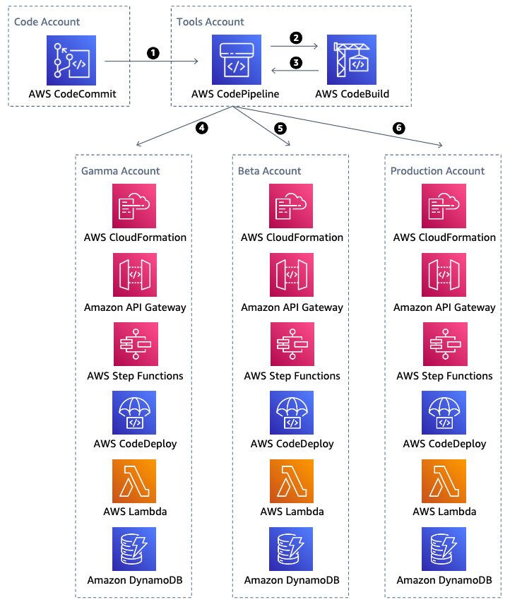
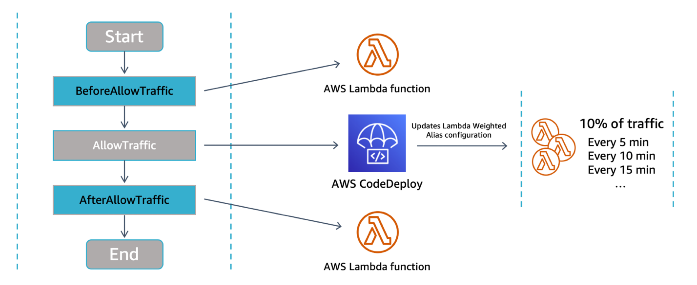

# Deploying

Use infrastructure as code and version control to enable tracking of changes and
releases. Isolate development and production stages in separate environments. This reduces
errors caused by manual processes and helps increase levels of control to help you gain
confidence that your workload operates as intended.

Use a serverless framework to model, prototype, build, package, and deploy serverless
applications, such as AWS Serverless Application Model or Serverless Framework. With infrastructure as code (IaC)
and a framework, you can add parameters to your serverless application and its
dependencies to ease deployment across isolated stages and across AWS accounts.

Infrastructure frameworks like AWS Cloud Development Kit (AWS CDK) and Terraform play important roles when
managing AWS resources. Serverless-specific tools like AWS SAM and the Serverless
Framework bring unique features to speed day-to-day development and are purpose-built to
minimize the code, test, and deploy loop.

Create separate stages or environments using CI/CD pipelines (for example, Gamma, Dev,
and Prod). A CI/CD pipeline can create the following resources in a beta AWS account:
`OrderAPIBeta`, `OrderServiceBeta`,
`OrderStateMachineBeta`, `OrderBucketBeta`, and
`OrderTableBeta`. Similar, yet separate, resources can be created across
different environments which might reside in separate AWS accounts.

_Figure 11: CI/CD pipeline for multiple accounts_

When deploying to production, favor safe deployments over all-at-once systems as new
changes will gradually shift over time towards the end user in a canary or linear
deployment. Use CodeDeploy hooks (`BeforeAllowTraffic`,
`AfterAllowTraffic`) and alarms to gain more control over deployment validation,
rollback, and any customization you may need for your application.

You can also combine the use of synthetic traffic, custom metrics, and alerts as part
of a rollout deployment. These help you proactively detect errors with new changes that
otherwise would have impacted your customer experience.

_Figure 12: AWS CodeDeploy Lambda deployment and hooks_
