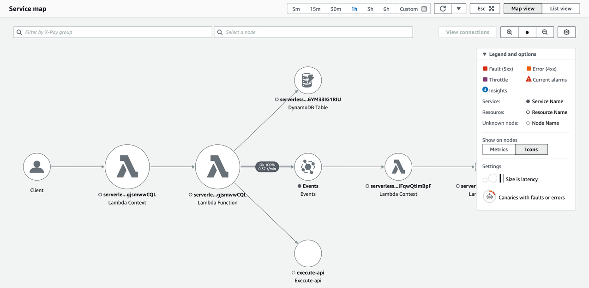
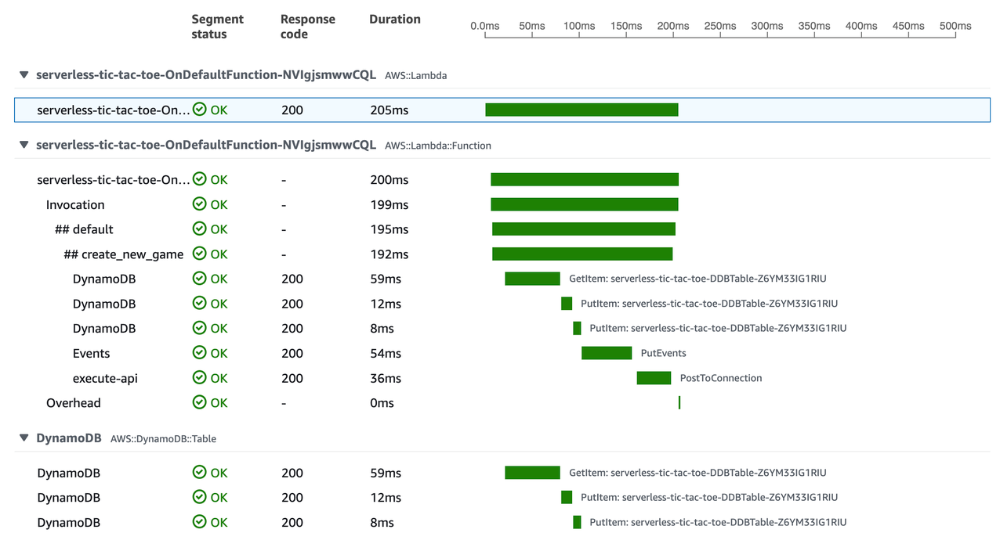

# Distributed tracing

Similar to non-serverless applications, anomalies can occur at larger scale in
distributed systems. Due to the nature of serverless architectures, it’s fundamental to have
distributed tracing.

Making changes to your serverless application entails many of the same principles of
deployment, change, and release management used in traditional workloads. However, there are
subtle changes in how you use existing tools to accomplish these principles.

Active tracing with AWS X-Ray should be enabled to provide distributed tracing
capabilities as well as to enable visual service maps for faster troubleshooting. X-Ray
helps you identify performance degradation and quickly understand anomalies, including
latency distributions.

_Figure 9: AWS X-Ray Service Map visualizing a workload using AWS Lambda,
Amazon DynamoDB and Amazon EventBridge_

Service Maps are helpful to understand integration points that need attention and
resiliency practices. For integration calls, retries, backoffs, and possibly circuit
breakers are necessary to prevent faults from propagating to downstream services.

Another example is networking anomalies. You should not rely on default timeouts and
retry settings. Instead, tune them to fail fast if a socket read/write timeout happens
where the default can be seconds, if not minutes, in certain clients.

X-Ray also provides two powerful features that can improve the efficiency on
identifying anomalies within applications: annotations and subsegments.

_Subsegments_ are helpful to understand how application logic is
constructed and what external dependencies it has to talk to.
_Annotations_ are key-value pairs with string, number, or Boolean
values that are automatically indexed by AWS X-Ray.

Combined, subsegments and annotations can help you quickly identify performance
statistics on specific operations and business transactions. Examples are a database query
duration, or the durations of a supporting function which parses an image.

_Figure 10: AWS X-Ray Trace with subsegments beginning with ##_
