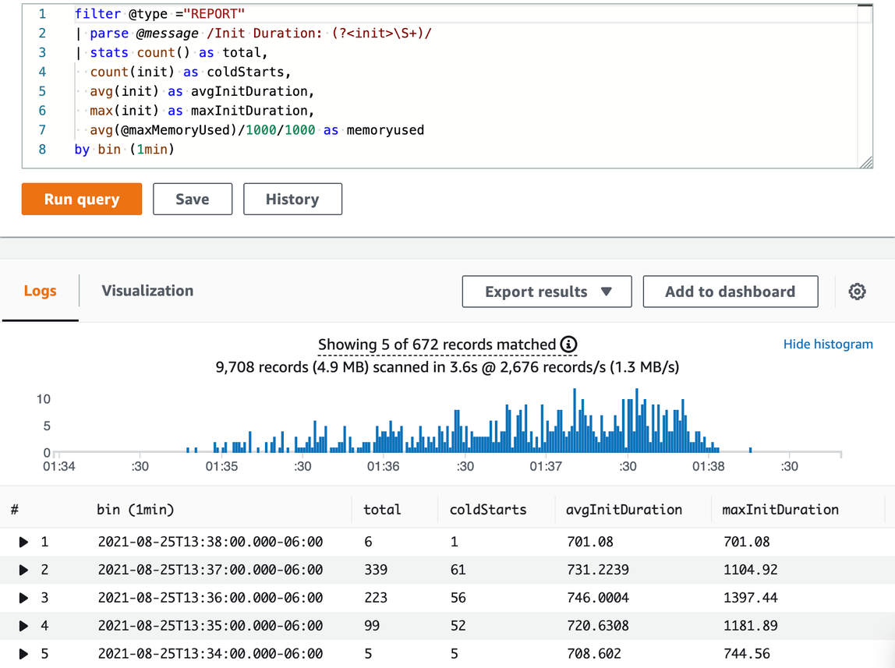

# Centralized and structured logging

Standardize your application logging to emit operational information about
transactions, correlation identifiers, request identifiers across components, and business
outcomes using structured logging. Unstructured logging using `print` or
`console.log` statements is unfavorable as they are difficult to interpret
and analyze programmatically, hard to add contextual information to, and inconsistent.
Structured logging libraries are advantageous because of configurable logging levels, API
consistency and common output formats, among other things. Use logging utilities from
Lambda Powertools to further simplify and enhance application logging.

JSON is a ubiquitous format which is often used as an output format and supported across
logging services. CloudWatch Logs Insights automatically discovers values in JSON which makes
querying and filtering simple. Judicious event logging from your application provides the
ability to answer arbitrary questions about the state of your workload such as user
behavior, state of your system and anomalous events, among other things. CloudWatch Logs Insights
also facilitates finding Lambda performance data from default log events.



_Figure 8: CloudWatch Logs Insights query to find statistics on cold
starts_

Consistently logging of correlation IDs and passing them to downstream systems allows
tracing and tracking of individual requests or invocations. As your system grows and more
logging is ingested, consider using appropriate logging levels and a sampling mechanism to
log a small percentage of logs in DEBUG mode. Log level configuration should be passed to
downstream systems for consistent tracing in a microservice architecture.

The Lambda Logs API can be used to send Lambda logs to locations other than CloudWatch. A
number of partner solutions provide Lambda layers which use the Lambda Logs API and make
integration with their systems easier. The recommendations and guidance here applies
uniformly regardless of log destination.

The following is an example of a structured logging using JSON as the output:

```
{
    "timestamp":"2019-11-26 18:17:33,774",
    "level":"INFO",
    "location":"cancel.cancel_booking:45",
    "service":"booking",
    "lambda_function_name":"test",
    "lambda_function_memory_size":"128",
    "lambda_function_arn":"arn:aws:lambda:eu-west-1:12345678910:function:test",
    "lambda_request_id":"52fdfc07-2182-154f-163f-5f0f9a621d72",
    "cold_start": "true",
    "message": {
        "operation":"update_item",
        "details:": {
            "Attributes": {
                "status":"CANCELLED"
            },
            "ResponseMetadata": {
                "RequestId":"G7S3SCFDEMEINPG6AOC6CL5IDNVV4KQNSO5AEMVJF66Q9ASUAAJG",
                "HTTPStatusCode":200,
                "HTTPHeaders": {
                    "server":"Server",
                    "date":"Thu, 26 Nov 2019 18:17:33 GMT",
                    "content-type":"application/x-amz-json-1.0",
                    "content-length":"43",
                    "connection":"keep-alive",
                    "x-amzn-requestid":"G7S3SCFDEMEINPG6AOC6CL5IDNVV4KQNSO5AEMVJF66Q9ASUAAJG",
                    "x-amz-crc32":"1848747586"
                },
                "RetryAttempts":0
            }
        }
    }
}


```
