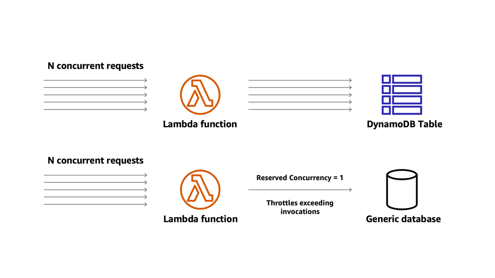
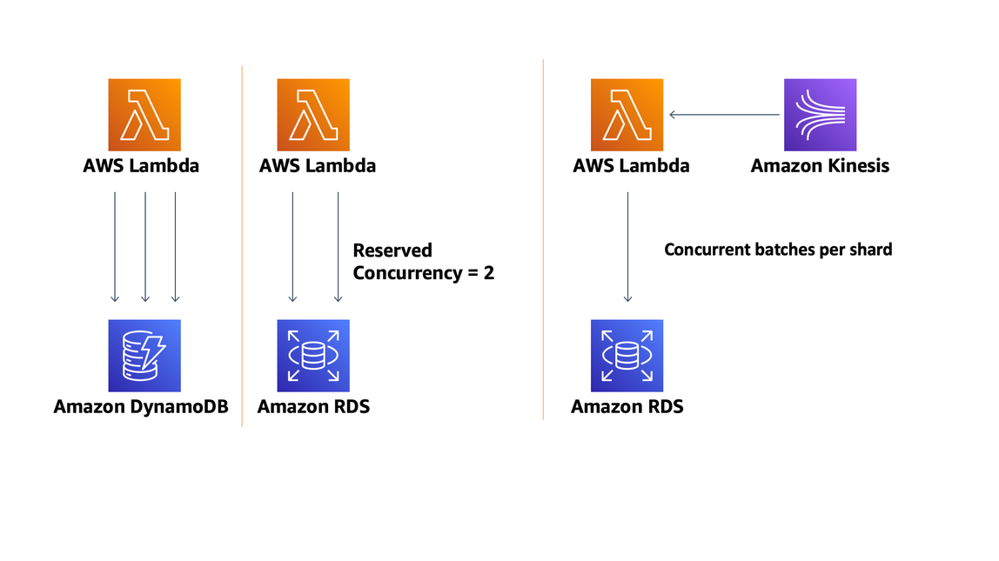

# Foundations

| REL 1: How are you regulating inbound request rates? |
| ---------------------------------------------------- |
|                                                      |

## Throttling

In a microservices architecture, API consumers may be in separate teams or even outside
the organization. This creates a vulnerability due to unknown access patterns, as well as
the risk of consumer credentials being compromised. The service API can potentially be
affected if the number of requests exceeds what the processing logic or backend can handle.

Additionally, events that trigger new transactions, such as an update in a database row or
new objects being added to an S3 bucket as part of the API, will trigger additional executions
throughout a Serverless application. Throttling should be enabled at the API level to enforce
access patterns established by a service contract. Defining a request access pattern strategy
is fundamental to establishing how a consumer should use a service, whether that is at the
resource or global level.

Returning the appropriate HTTP status codes within your API (such as a 429 for throttling)
helps consumers plan for throttled access by implementing back-off and retries
accordingly.

For more granular throttling and metering usage, issuing API keys to consumers with usage
plans in addition to global throttling enables API Gateway to enforce quota and access patterns in
unexpected behavior. API keys also simplify the process for administrators to cut off access
if an individual consumer is making suspicious requests.

A common way to capture API keys is through a developer portal. This provides you, as the
service provider, with additional metadata associated with the consumers and requests. You
may capture the application, contact information, and business area or purpose, and store
this data in a durable data store, such as DynamoDB. This gives you additional validation of
your consumers and provides traceability of logging with identities, so that you can contact
consumers for breaking change upgrades or issues.

As discussed in the security pillar, API keys are not a security mechanism to authorize
requests, and, therefore, should only be used with one of the available authorization options
available within API Gateway.

Concurrency controls are sometimes necessary to protect specific workloads against service
failure as they may not scale as rapidly as Lambda. [Concurrency controls](../../../lambda/latest/dg/concurrent-executions.md "../../../lambda/latest/dg/concurrent-executions.md") enable you to
control the allocation of how many concurrent invocations of a particular Lambda function are
set at the individual Lambda function level.

Lambda invocations that exceed the concurrency set of an individual function will be
throttled by the AWS Lambda service and the result will vary depending on their event source.
Synchronous invocations return an HTTP 429 error, Asynchronous invocations will be queued
and retried, while Stream-based event sources will retry up to their record expiration time.

_Figure 18: AWS Lambda concurrency controls_

Controlling concurrency is particularly useful for the following scenarios:

- Sensitive backend or integrated systems that may have scaling limitations: In
  situations when your Lambda functions call some legacy or sensitive backend, they may put
  too much pressure on the downstream services since functions may scale too fast and
  produce many concurrent requests. It is a good idea to limit the concurrency of your
  functions so that you can control the amount of requests they produce.
- Protecting against recursive invocations: You may introduce a recursive call of your
  Lambda functions accidentally. One of the most common cases is when using S3 - Lambda - S3
  pattern reading, and then writing into the same S3 bucket. Limiting concurrency will let
  you decrease the implications of such recursive calls and help you detect and fix them
  earlier.
- Database Connection Pool restrictions, such as a relational database, which may impose
  concurrent limits: Many RDBMS have restrictions on the number of opened connections.
  Limiting concurrency of the Lambda functions will allow you to limit the number of opened
  connections. If using Amazon RDS databases consider using [Amazon RDS Proxy](https://aws.amazon.com/rds/proxy/ "https://aws.amazon.com/rds/proxy/") as a connection pooling mechanism.
- Critical Path Services: Ensure that high priority Lambda functions, such as
  authorization, do not run out of concurrency due to runaway invocations from low
  priority functions (for example, backend asynchronous processes). Since Lambda
  concurrency quotas are applied per account and Region, it's possible for one function to
  consume concurrency such that other functions are throttled.
- Ability to disable Lambda function (`concurrency = 0`) in the event of
  anomalies: In case of failures, setting concurrency to zero will help you to immediately
  stop new invocations of your Lambda functions.
- Limiting desired execution concurrency to protect against Distributed Denial of
  Service (DDoS) attacks: Usually the protection against DDoS is done at the API Gateway level,
  but it is also a good idea to introduce an additional guard rail on the function level.

Concurrency controls for Lambda functions also limit its ability to scale beyond the
concurrency set and draws from your account reserved concurrency pool. For asynchronous
processing, use Kinesis Data Streams to effectively control concurrency with a single shard as
opposed to Lambda function concurrency control. This gives you the flexibility to increase the
number of shards or the parallelization factor to increase concurrency of your Lambda function.

_Figure 19: Concurrency controls for synchronous and asynchronous
requests_

| REL 2: How are you building resiliency into your serverless application? |
| ------------------------------------------------------------------------ |
|                                                                          |

## Best practices

- Manage transaction, partial, and intermittent failures: Transaction failures might
  occur when components are under high load. Partial failures can occur during batch
  processing, while intermittent failures might occur due to network or other transient
  issues.
- Manage duplicate and unwanted events: Duplicate events can occur when a request is
  retried, multiple consumers process the same message from a queue or stream, or when a
  request is sent twice at different time intervals with the same parameters. Design your
  applications to process multiple identical requests to have the same effect as making a
  single request. Events not adhering to your schema should be discarded.
- Orchestrate long-running transactions: Long-running transactions can be processed by
  one or multiple components. Favor state machines for long-running transaction instead of
  handling them within application code in a single component or multiple synchronous
  dependency call chains.
- Consider scaling patterns at burst rates: In addition to your baseline performance,
  consider evaluating how your workload handles initial burst rates that may be expected
  or unexpected peaks.

## Asynchronous calls and events

Asynchronous calls reduce the latency on HTTP responses. Multiple synchronous calls, as
well as long-running wait cycles, may result in timeouts and _locked_ code that prevents retry logic.

Event-driven architectures enable streamlining asynchronous initiations of code, thus
limiting consumer wait cycles. These architectures are commonly implemented asynchronously
using queues, streams, pub/sub, Webhooks, state machines, and event rule managers across
multiple components that perform a business functionality.

User experience is decoupled with asynchronous calls. Instead of blocking the entire
experience until the overall execution is completed, frontend systems receive a reference or
job ID as part of their initial request and they subscribe for real-time changes, or in
legacy systems use an additional API to poll its status. This decoupling allows the frontend
to be more efficient by using event loops, parallel, or concurrency techniques while making
such requests and lazily loading parts of the application when a response is partially or
completely available.

The frontend becomes a key element in asynchronous calls as it becomes more robust with
custom retries and caching. It can halt an in-flight request if no response has been
received within an acceptable SLA, whether it's caused by an anomaly, transient condition,
networking, or degraded environments.

Alternatively, when synchronous calls are necessary, it’s recommended at a minimum to
ensure that the total run time doesn’t exceed the API Gateway or AWS AppSync maximum timeout. Use an
external service (for example, AWS Step Functions) to coordinate business transactions across
multiple services, to control states, and handle error handling that occurs along the
request lifecycle.
