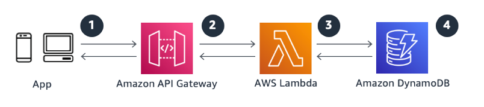

# RESTful microservices

When building a microservice, think about how a business context can be delivered as a
reusable service for your consumers. The specific implementation will be tailored to
individual use cases, but there are several common themes across microservices to ensure that
your implementation is secure, resilient, and constructed to give the best experience for your
customers.

Building serverless microservices on AWS enables you to not only take advantage of the
serverless capabilities themselves, but also to use other AWS services and features, as well
as the ecosystem of AWS and AWS Partner Network (APN) tools. Serverless technologies are built on top
of fault-tolerant infrastructure, enabling you to build reliable services for your
mission-critical workloads. The ecosystem of tooling enables you to streamline the build,
automate tasks, orchestrate dependencies, and monitor and govern your microservices. Lastly,
AWS serverless tools are pay-as-you-go, enabling you to grow the service with your business
and keep your costs down during entry phases and non-peak times.

## Characteristics

- You want a secure, easy-to-operate framework that is simple
  to replicate and has high levels of resiliency and
  availability.
- You want to log utilization and access patterns to
  continually improve your backend to support customer usage.
- You are seeking to use managed services as much as possible for your platforms,
  which reduces the heavy lifting associated with managing common platforms, including
  security and scalability.

## Reference architecture

_Figure 1: Reference architecture for RESTful microservices_

1. **Customers** leverage your microservices by making HTTP
   API calls. Ideally, your consumers should have a tightly bound service contract to your
   API to achieve consistent expectations of service levels and change control.
2. **Amazon API Gateway** hosts RESTful HTTP requests and responses to
   customers. In this scenario, API Gateway provides built-in authorization, throttling,
   security, fault tolerance, request and response mapping, and performance optimizations.
3. **AWS Lambda** contains the business logic to process
   incoming API calls and use DynamoDB as a persistent storage.
4. **Amazon DynamoDB** persistently stores microservices data and
   scales based on demand. Since microservices are often designed to do one thing well, a
   schemaless NoSQL data store is regularly incorporated.

## Configuration notes

- Use API Gateway logging to understand visibility of microservices consumer access
  behaviors. This information is visible in Amazon CloudWatch Logs and can be quickly viewed through
  Log Pivots, analyzed in CloudWatch Logs Insights or fed into other searchable engines such as OpenSearch Service
  or Amazon S3 (with Amazon Athena). The information delivered gives key visibility, such as:
  - Understanding common customer locations, which may change geographically based
    on the proximity of your backend.
  - Understanding how customer input requests may have an impact on how you
    partition your database.
  - Understanding the semantics of abnormal behavior, which can be a security
    flag.
  - Understanding errors, latency, and cache hits or misses to optimize
    configuration.

- This model provides a framework that is easy to deploy and maintain, and a secure
  environment that will scale as your needs grow.
