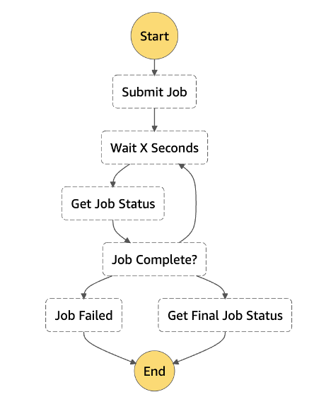
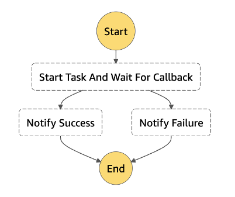
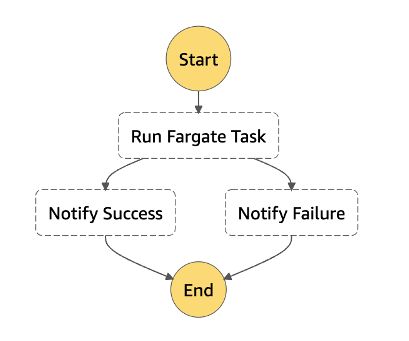
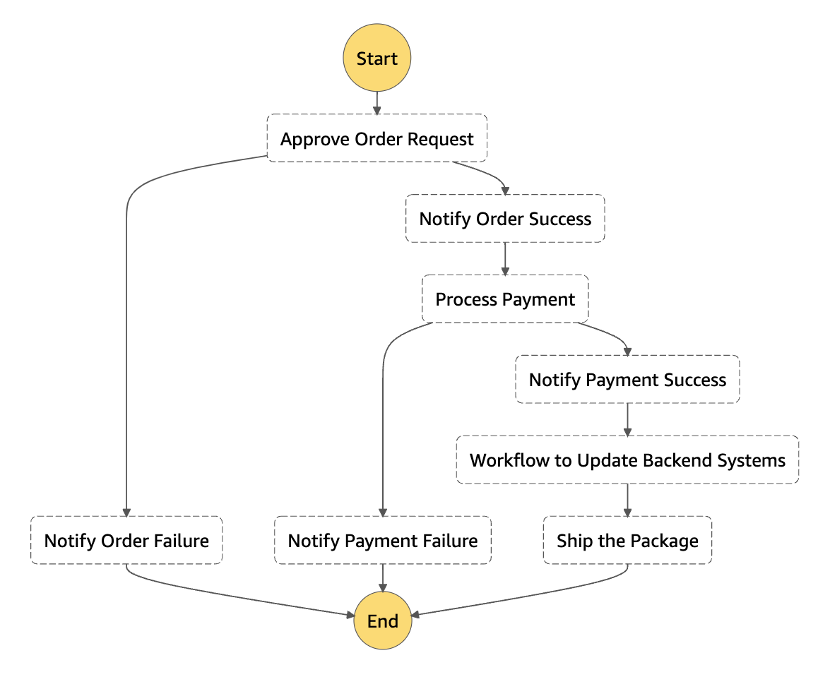

# AWS Step Functions Express Workflows

When you are creating a workflow with AWS Step Functions you will be given two options for the
type of workflow that you want to create: Standard or Express.

Standard Workflows are ideal for long-running, durable, and auditable workflows.
Standard Workflows can support an execution start rate of over 2K executions per second.
They can run for up to a year and you can retrieve the full execution history using the
[Step Functions
API](../../../step-functions/latest/apireference.md "../../../step-functions/latest/apireference.md"). Standard Workflows employ an exactly-once execution model, where your tasks
and states are never started more than once unless you have specified the **Retry** behavior in your state machine. This makes them suited to
orchestrating non-idempotent actions, such as starting an Amazon EMR cluster or processing
payments. Standard Workflow executions are billed according to the number of state
transitions processed.

Because the Standard Workflows pricing is based on state transitions, try to avoid the
pattern of managing an asynchronous job by using a polling loop and prefer instead to use
Callbacks or the .sync Service integration where possible. Using Callbacks or the .sync
Service integration will most likely reduce the number of state transitions and cost. With
the .sync Service integration in particular, you can have Step Functions wait for a request
to complete before progressing to the next state. This is applicable for integrated services
such as AWS Batch and Amazon ECS.

See diagrams below that describe each scenario:

_Figure 36: Job Poller_

_Figure 37: Wait for Callback_

For example, pausing the workflow until a callback is received from an external
service.

_Figure 38: Using the .sync Service Integration and waiting for a Fargate
task completion_

Express Workflows are ideal for high-volume, event-processing workloads such as IoT
data ingestion, streaming data processing and transformation, and mobile application
backends. Express Workflows can support an execution start rate of over 100K executions per
second. They can run for up to five minutes. Express Workflows can run either synchronously
or asynchronously and employ an at-most-once or at-least-once workflow execution model,
respectively. This means that there is a possibility that an execution might be run more
than once.

Ensure your Express Workflow state machine logic is idempotent and that it will not be
affected adversely by multiple concurrent executions of the same input.

Good examples of using Express Workflows is orchestrating idempotent actions, such as
transforming input data and storing with `PUT` in Amazon DynamoDB. Express Workflow
executions are billed by the number of executions, the duration of execution, and the memory
consumed. There are also cases where combining a Standard and an Express Workflow might
offer a good combination of cost optimization and functionality. An example of a combining
Standard and Express workflows is shown in the diagram below. More specifically, in the
diagram below, the **Approve Order Request** state might be
implemented by integrating with a service like Amazon SQS, and the workflow can be paused while
waiting for a manual approval. This type of state would be good fit for a Standard Workflow.
Whereas for the **Workflow to Update Backend Systems** state
implementation you can start an execution of an Express Workflow to handle backend updates.
Express Workflows can be fast and cost-effective for steps where checkpointing is not
required.

_Figure 39: Express and Standard Workflows combined_

In summary, deciding between Express and Standard Workflows largely depends your use
case. Consider using Express Workflows for a high throughput system, as Express Workflows
will probably be more cost-efficient compared to Standard Workflows for the same level of
throughput. In order to be able to determine which type of workflow is best for you,
consider the differences in execution semantics between Standard and Express Workflows on
top of cost.
