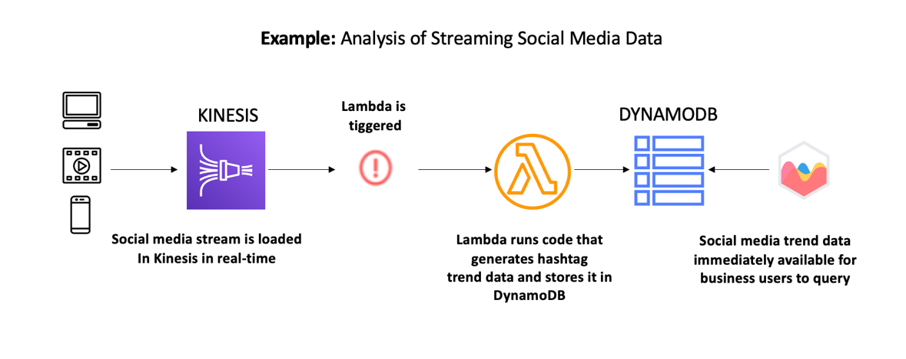

# Streaming processing

Ingesting and processing real-time streaming data requires scalability and low latency to support a variety of applications such as activity tracking, transaction order processing, click-stream analysis, data cleansing, metrics generation, log filtering, indexing, social media analysis, and IoT device data telemetry and metering. These applications are often spiky and process thousands of events per second.

Using AWS Lambda and Amazon Kinesis, you can build a serverless stream process that automatically scales without provisioning or managing servers. Data processed by AWS Lambda can be stored in DynamoDB and analyzed later.

## Characteristics

- You want to create a complete serverless architecture without managing any instance
  or server for processing streaming data.
- You want to use the Amazon Kinesis Producer Library (KPL) to take care of data ingestion
  from a data producer-perspective.

## Reference architecture

Here we are presenting a scenario for common stream processing, which is a reference
architecture for analyzing social media data:

_Figure 5: Reference architecture for stream processing_

1. **Data producers** use the Amazon Kinesis Producer Library (KPL)
   to send social media streaming data to a Kinesis stream. Amazon Kinesis Agent and custom data
   producers that leverage the Kinesis API can also be used.
2. An **Amazon Kinesis stream** collects, processes, and analyzes
   real-time streaming data produced by data producers. Data ingested into the stream can
   be processed by a consumer, which, in this case, is Lambda.
3. **AWS Lambda** acts as a consumer of the stream that
   receives an array of the ingested data as a single event or invocation. Further
   processing is carried out by the Lambda function. The transformed data is then stored in
   a persistent storage, which, in this case, is DynamoDB.
4. **Amazon DynamoDB** provides a fast and flexible NoSQL database
   service including triggers that can integrate with AWS Lambda to make such data available
   elsewhere.
5. **Business users** can use a reporting interface on top of
   DynamoDB to gather insights out of social media trend data.

## Configuration notes

- Consider reviewing the [Streaming Data Solutions whitepaper](https://d1.awsstatic.com/whitepapers/whitepaper-streaming-data-solutions-on-aws-with-amazon-kinesis.pdf "https://d1.awsstatic.com/whitepapers/whitepaper-streaming-data-solutions-on-aws-with-amazon-kinesis.pdf")
  for batch processing, analytics on streams, and other useful patterns.
- Consider using Firehose over Lambda when ingested data needs to be continuously loaded
  into Amazon S3, Amazon Redshift, or Amazon OpenSearch Service.
- Consider using Managed Service for Apache Flink over Lambda when standard SQL or Apache Flink could be used to
  query streaming data, and load only its results into Amazon S3, Amazon Redshift, OpenSearch Service, or Kinesis Data Streams.
- Use Lambda [maximum retry attempts, maximum record age, bisect batch on function error, and
  on-failure destination error controls](https://aws.amazon.com/blogs/compute/new-aws-lambda-controls-for-stream-processing-and-asynchronous-invocations/ "https://aws.amazon.com/blogs/compute/new-aws-lambda-controls-for-stream-processing-and-asynchronous-invocations/") to build more resilient stream
  processing applications. In addition consider using [Lambda’s custom checkpoint feature](https://aws.amazon.com/blogs/compute/optimizing-batch-processing-with-custom-checkpoints-in-aws-lambda/ "https://aws.amazon.com/blogs/compute/optimizing-batch-processing-with-custom-checkpoints-in-aws-lambda/"), where you can have more precise control
  over how you choose to process batches containing failed messages.
- [Duplicated
  records](../../../streams/latest/dev/kinesis-record-processor-duplicates.md "../../../streams/latest/dev/kinesis-record-processor-duplicates.md") may occur, and you must use both retries and idempotency within your
  application for both consumers and producers.
- Follow best practices for [AWS Lambda stream-based invocation](../../../lambda/latest/dg/best-practices.md#stream-events "../../../lambda/latest/dg/best-practices.md#stream-events") since that covers the effects
  on batch size, concurrency per shard, and monitoring stream processing in more detail.
- When not using KPL, make certain to take into account partial failures for
  non-atomic operations, such as `PutRecords`, since the Kinesis API returns both successfully
  and unsuccessfully processed [records](../../../kinesis/latest/APIReference/API_PutRecords.md "../../../kinesis/latest/APIReference/API_PutRecords.md") upon ingestion time.
- If you are using Kinesis Data Streams in **provision capacity
  mode**, follow [best practices](../../../streams/latest/dev/kinesis-record-processor-scaling.md "../../../streams/latest/dev/kinesis-record-processor-scaling.md") when re-sharding Kinesis Data Streams to
  accommodate a higher ingestion rate. Concurrency for stream processing is dictated by
  the number of shards and by the [parallelization factor](https://aws.amazon.com/blogs/compute/new-aws-lambda-scaling-controls-for-kinesis-and-dynamodb-event-sources/ "https://aws.amazon.com/blogs/compute/new-aws-lambda-scaling-controls-for-kinesis-and-dynamodb-event-sources/"). Therefore, adjust it according to your throughput
  requirements.
- Consider using [filtering event
  sources](https://aws.amazon.com/blogs/compute/filtering-event-sources-for-aws-lambda-functions/ "https://aws.amazon.com/blogs/compute/filtering-event-sources-for-aws-lambda-functions/") for AWS Lambda functions. Event filtering helps reduce requests made to
  your Lambda functions, may simplify code, and can reduce overall cost. At the time of
  writing, event filtering is only natively supported in CloudFormation and not in AWS CDK.
  If you are using AWS CDK you can still support Lambda Event filtering by using [Escape Hatches](../../../cdk/v2/guide/cfn_layer.md "../../../cdk/v2/guide/cfn_layer.md") to
  extend some functionality not directly available in CDK constructs.
- Consider using [tumbling windows](https://aws.amazon.com/blogs/compute/using-aws-lambda-for-streaming-analytics/ "https://aws.amazon.com/blogs/compute/using-aws-lambda-for-streaming-analytics/")
  for AWS Lambda functions when you need to continuously calculate aggregates over a time
  period, such as 30-second averages. This feature allows you to do these types of
  aggregates without implementing a temporary datastore or using complicated streaming
  analytics frameworks.
