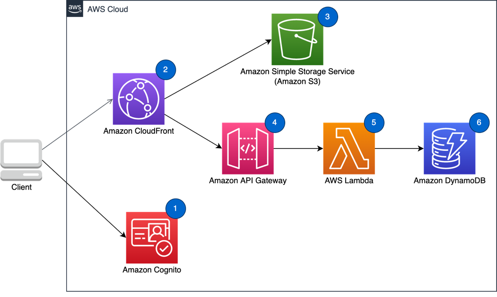

# Web application

Web applications often have demanding requirements to ensure a consistent, secure, and reliable user experience. Workloads which need to scale to thousands or millions of users require provisioning infrastructure for peak loads or sophisticated auto-scaling mechanisms, when available. On-premises workloads require significant capital expenditures and long lead times for capacity provisioning.

By taking a serverless-first approach on AWS you free yourself from the burden of managing servers, perfecting auto-scaling policies or paying for idle resources. Serverless workloads on AWS can provide the same, or better, security, reliability or performance when compared with server-based workloads.

## Characteristics

- You want a scalable, resilient, and highly-available web application that can go
  global in minutes.
- You are seeking to reduce operational overhead by using managed services.
- You want to optimize your costs based on user demand and usage, instead of paying for
  idle resources.
- You want to create a framework that is easy to set up and operate, and that you can
  extend with limited impact later.

## Reference architecture

_Figure 6: Reference architecture for a web application_

1. **Amazon Cognito user pools** provides user management and identity provider
   features for your web application. Tokens issued by Amazon Cognito are used to authenticate users
   when making request to Amazon API Gateway.
2. **Amazon CloudFront** provides a better user experience by
   accelerating content delivery of static assets and calls to your backend compute layer.
   CloudFront brings content closer to clients using AWS’s global Points of Presence (PoPs).
   CloudFront can also cache API calls to reduce calls to compute backends while also providing
   optimal network routing for non-cacheable API calls.
3. **Amazon S3** hosts web application static assets such as HTML,
   CSS, JavaScript and images. Content is securely served through CloudFront.
4. **Amazon API Gateway** serves as the secure HTTPS endpoint. Web
   applications make REST API calls to a public HTTPS endpoint using either a custom domain
   name or a unique API Gateway-provided domain.
5. An **AWS Lambda** function provides create, read, update,
   and delete (CRUD) operations on top of DynamoDB for your web application.
6. **Amazon DynamoDB** can provide a NoSQL data store which
   elastically scales with your web application.

## Configuration notes

- Follow best practices for deploying your serverless web application frontend on
  AWS. More information can be found in the operational excellence pillar.
- For single-page web applications you can use AWS Amplify Hosting to manage atomic
  deployments, cache expiration and custom domains.
- Refer to the security pillar for recommendations on authentication and
  authorization.
- Refer to the [RESTful Microservices scenario](restful-microservices.md "restful-microservices.md") for
  recommendations on web application backend.
- For web applications that offer personalized services, you can use API Gateway [usage
  plans](../../../apigateway/latest/developerguide/api-gateway-api-usage-plans.md "../../../apigateway/latest/developerguide/api-gateway-api-usage-plans.md"). You can use Amazon Cognito user pools to scope users to specific resources or
  functionality. For example, a premium user may have higher throughput for API calls,
  access to additional APIs and additional storage.
- Refer to the [Mobile Backend scenario](mobile-backend.md "mobile-backend.md") if your
  application uses search capabilities that are not covered in this scenario.
