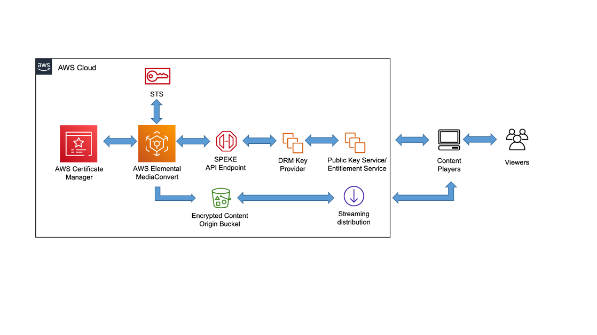

# Data protection

| SM_SEC6: How do you protect content at-rest and in-transit to prevent unauthorized distribution?            |
| -------------------------------------------------------------------------------------------------------------- |
| **SM_SBP12 – Collaborate with business and legal stakeholders to align on content protection requirements** |
| **SM_SBP13 – Select a content protection scheme that meets business objectives**                            |

The Well-Architected Framework covers best practices for any
workload when protecting data in transit and at rest, but when
you serve copyrighted materials or high-value content, you
should also consider the technologies available to protect these
works from unlawful access, replication, and re-distribution. In
general, practices that protect valuable digital assets are
referred to as Content Protection or Digital Rights Management
(DRM). There are varying degrees of complexity and systems
involved in Content Protection, but these components are common
to most implementations:

- **Key Provider** — Manages
  customer master keys and content keys.
- **Encryptor** — Encrypts
  media. This is often an encoder or an origin responsible for
  packaging.
- **Authentication Service** —
  Manages subscriber access and generates temporary access
  tokens requests to content and keys.
- **Client** — Authenticates
  viewer, retrieves content from an origin, keys from a key
  provider, decrypts, and renders media.

In practice, there are two common content protection schemes —
Clear Key Content Encryption and DRM systems. Both systems use
AES-128 to encrypt the content, but differ in how keys are
managed and delivered.  If you’ve licensed content from a third
party, you might be commercially obligated to implement a DRM
system. This is true of most film and television content. Always
implement the solution that is in alignment with your business
and legal requirements.

**Clear key content encryption and
tokenized access**

A clear key implementation is common for applications that don’t
require _Hollywood-grade_ DRM systems, but
want a pragmatic content protection scheme that makes it
difficult for outright theft or improper sharing of content by
paying users. By encrypting content with AES-128 encryption, we
can control who can decrypt the content through key access
policies. When combined with techniques like OAID and tokenized,
temporary, access URLs, you can control who can retrieve the
decryption keys and for how long the content endpoint will
service requests for encrypted content. This method is called
_clear key_ because the content key is
eventually _in the clear_ within the
user-space of the client and could theoretically be accessed by
an unauthorized user. Though, with tokenized content endpoints,
having the key does not necessarily mean that an unauthorized
user would have access to retrieve and decrypt the content. 

On AWS, clear key encryption can be accomplished by generating
an AWS KMS key and then using the API to create data keys that
can be used by an encryptor (typically an encoder or packager)
to apply encryption to the content. These data keys are then
stored in a scalable persistence layer like
**Amazon S3** or
**Amazon DynamoDB.** Data key
access can be granted to your audience through a combination of
**Amazon Cognito** and
**Amazon IAM** policies for user
authentication and authorization. Delivery of these keys should
always be over an encrypted transport with tokenization. 

**DRM systems**

Organizations working in the media and entertainment industry or
with high-value content, might have strict content protection
objectives for content keys, content decryption, or both to be
run only within hardware modules or trusted execution
environments (TEEs) that exist outside of the user-space on the
client. These organizations might also have requirements to
facilitate key revocation, offline playback, single-use keys, or
multi-key encryption levels for the same asset. These complex
organizational objectives can be achieved through the
implementation of a DRM system, such as Apple FairPlay, Google
Widevine, or Microsoft PlayReady. 

While DRM systems add an additional layer of key protection and
business control to your content protection, implementation of
DRM varies by playback device. Though the industry is making
strides to simplify DRM implementations, in practice, it’s
common to see multiple DRM systems implemented to achieve device
compatibility across playback devices—increasing cost and
complexity.

With the **AWS Media Services**,
DRM systems are integrated into media processing and origination
though the Secure Packager and Encoder Key Exchange or SPEKE.
SPEKE provides an open standard proxy interface for any key
provider to exchange key material and metadata. You can
implement your own key service or use one of many DRM system
providers that are part of the AWS Partner Network (APN). 

_Secure Packager and Encoder Key Exchange (SPEKE)
architecture_

No number of content protection schemes can ever fully protect
content from being exploited by an attacker and, in fact,
complex schemes can even increase the risk of problems for your
paying viewers. Commit time to determine the appropriate content
protection schemes for your specific content balancing cost with
content value. Be sure to balance cost of additional resources
on software licensing or operational burden versus the business
value of the content being protected.

| **Clear Key Content Encryption and Tokenized Access**                                                                           | **Digital Rights Management (DRM) System**                                                                                                                                     |
| ---------------------------------------------------------------------------------------------------------------------------------- | --------------------------------------------------------------------------------------------------------------------------------------------------------------------------------- |
| (PRO) Supported by all browsers through EME and mobile players                                                                  | (CON) Support varies by device and browser, often requiring multi-DRM approach and increased costs                                                                             |
| (PRO) Encryption implementation can be done with standards-based, open sources tools and most encoding and packaging systems | (CON) Encryption implementation varies by DRM system provider and may require A commercial agreement to implement                                                           |
| (PRO) Simple backend implementation                                                                                                | (PRO) Decryption key is only transferred to a protected space in device memory or in browser memory (EME) TEE                                                                  |
| (CON) Decryption key is supplied to player \*in the clear • at some point in the playback                                    | (PRO) Support application of complex business rules. For example • offline playback, revocation, single-use tokens, multi-key encryption to enforce separate policies |

_Comparison of clear key and DRM systems for content
protection_

**Player integrity**

Take proper measures to prevent discovery of the controls put in
place to prevent usage of a tampered player or unauthorized
access to your media assets and distribution system. When you
choose to create your own media player, you should determine
which platforms will help you check the integrity of your
software packages.

Many platforms, such as FireOS, Android, iOS, macOS, and
Microsoft Windows, provide the capability for developers to sign
their application packages as part of the process of uploading
them to the platform’s software or app store. The purpose of
signing application packages is to verify that the package has
not been tampered with or compromised between the time you
uploaded your application and when the package has been
installed on a client device. It’s important to note that
although signature checks provide clear assurances that your
player has not been tampered with since you signed it, it does
not prevent the tampering or reverse engineering of your
player.  Some platforms strictly forbid installation of software
packages outside the platform’s software store, minimizing the
risk of loading a compromised player.

The certificates that are used to sign your media player should
be protected with limited access, ideally only within an
automated build pipeline that’s out of reach of any human
operator, and should never be shared outside your organization.
Use a private certificate authority, such as AWS Certificate
Manager Private Certificate Authority (ACM Private CA), that
provides strict access control to authorized issuers that will
perform issuance of signing certificates.  The pipeline that
will build and sign your media player package should strictly
control the process such that only authorized code will be built
and signed.
