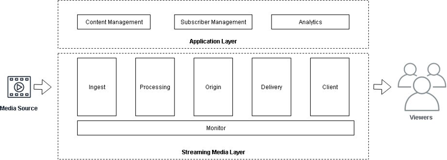

# Definitions

**Streaming media** is the delivery
of audio and video data in the form of small fragments files over a
network — typically the internet. As an alternative to a file
download, streaming has emerged as the most common method of
delivering media to audiences as it optimizes both network bandwidth
and local device storage. Common applications of streaming media
include:

- **Media and Entertainment** —
  Direct-to-consumer platforms, user-generated content, sports
  and gaming
- **Enterprise Marketing and
  Communications** —Town halls, product announcements,
  corporate training
- **Retail Advertising**
  —Promotional materials, influencer engagement, celebrity
  endorsements
- **Education** —E-learning,
  webinars, virtual classroom
- **Healthcare and Fitness** —
  Fitness coaching

You need a considerable amount of infrastructure to process and
deliver content to an audience. To cope with unpredictable spikes in
demand, such as a live large sporting event, content gone viral, or
the acquisition of an asset library, organizations have become
accustomed to purchasing more hardware than necessary. These
investments strand capital in underutilized infrastructure that
could instead be used to develop new features or create new content.

AWS helps customers avoid these large capital expenditures by
providing pay-as-you-go resources for streaming media. When you use
AWS Media Services, you pay for only the minutes of content
processed or the bytes delivered. As your audience grows, you can
quickly scale out ingest, processing, origination, and delivery
components near viewers to improve quality of service with an
expanding global footprint of AWS geographic Regions and hundreds of
points-of-presence connected with a fully redundant, high throughput
network backbone.

AWS provides over 200 cloud infrastructure services and a network of
thousands of AWS Partners to power your streaming media experiences.
In this section, we define two conceptual layers and several
components that you will find in any streaming media workload
regardless of specific implementation. The examples throughout this
paper feature AWS Media Services, but the concepts should apply to
any streaming media workload.

_Streaming media conceptual components_
