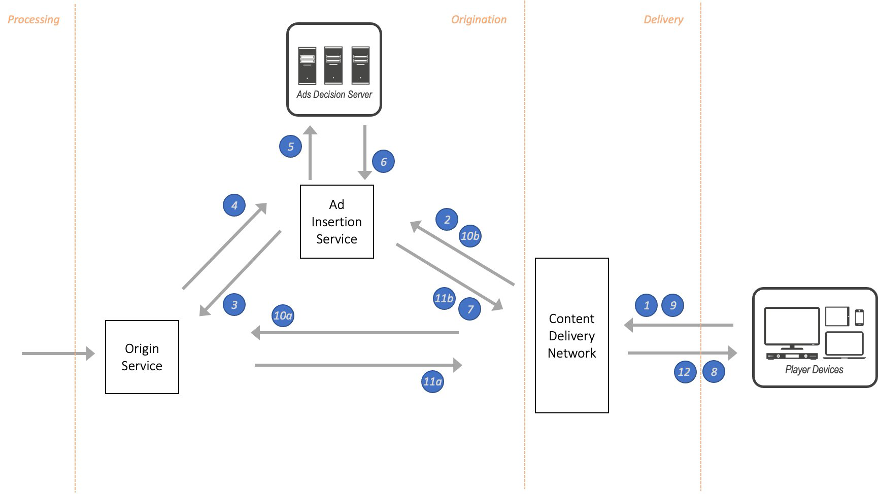

# Scenario: Ad supported content monetization

Advertising supported monetization is achieved by either inserting
or replacing advertisements in the content. Targeted and
personalized advertisements lead to higher engagement and maximize
the return on investment for advertisers. With a well-designed ad
insertion service, you can deliver a streaming media experience to
millions of concurrent viewers across a range of multiscreen
devices with personalized ad content, creating a seamless
broadcast-like experience.

Tracking ad impressions is an important part of ad insertion and
is accomplished through the client beaconing of quartile views as
it plays ad segments. Capturing beaconing data directly from the
players in this way reduces the effects of ad blocking software
and adheres to established advertising open standards. Accurately
measuring ad impressions and viewing behavior across web, iOS,
Android, and other connected viewing devices, helps more
effectively measure the revenue impact of every ad delivered. 

Ad insertions can be achieved either at the client-side or
server-side. Traditional client-side ad insertion requires working
with various player SDKs across multiple platforms to maintain ad
logic for different ad formats and content variations. In
addition, ad blockers (software preventing online advertising from
being displayed) are easily able to detect client-side ad
insertion and can limit the impressions. 

On the other hand, server-side video ad insertion (SSAI) is a
method in which video ads are integrated into the stream at the
origin. With SSAI, there is no need for the client to switch
between content and the advertisement. Buffering and session
initialization delay before and after the insertion of the ad are
eliminated, providing a higher quality viewing experience.
Compared to client-side ad insertion, SSAI typically improves the
ad experience and impressions and provides an opportunity to
personalize advertisements. 

A common approach to SSAI is shown in the following figure. In
this architecture, we reflect cloud services for the origin
server, ad insertion service, and the content delivery network.
These cloud-native services are highly available, natively
redundant, and ensure that the customer experience is not
compromised in the event of host-level failure.

_Server-side ad insertion architecture_

1. Device requests content manifest to begin playback session.
2. The CDN forwards the request for a personalized manifest to
   the ad insertion service (AIS).
3. The AIS consolidates requests for the manifest from all
   players and forwards only one request to the origin.
4. The origin responds back with the content manifest, optionally
   including ad markers.
5. If the manifest has ad markers, the ad insertion service makes
   a call to the ads decision server (ADS) to get a list of
   personalized ads to insert for the playback session.
6. The ADS returns a Video Ad Serving Template (VAST) response
   with a list of personalized ads.
7. The AIS inserts the ads and returns a personalized manifest
   back to the CDN.
8. The CDN returns the personalized manifest to the player.
9. The personalized manifest points the player to content
   segments and ad segments.
10. 1. If the segment is a main content segment, the CDN passes that
       request to the origin.
    2. If the segment is an ad segment, the request for the segment
       is routed to the AIS.
11. 1. The origin returns the content segment.
    2. The AIS returns the ad segment.
12. CDN serves the segment to the player.

## Considerations

- Use the same AWS Region for both the ad insertion service
  and the origin server.
- Use a CDN to cache content and ad segments. However,
  personalized manifest responses must
  _not_ be cached or shared between
  viewers. For more information, refer to
  [CDN
  Best Practices](../../../mediatailor/latest/ug/cdn-bp.md "../../../mediatailor/latest/ug/cdn-bp.md").
- Select the ad insertion service that supports inserting
  ads into all the desired streaming protocols, such as,
  HLS, DASH, and MSS. AWS Elemental MediaTailor supports ad
  insertions to HLS and DASH streaming formats.
- Target an ad insertion latency that’s less than the
  segment length to minimize playback rebuffering.
- Design your client to handle a mix of encrypted and
  unencrypted content during playback. Content is usually
  encrypted while ad segments aren’t.
- To maintain consistent video quality between main content
  and ad segments, ensure that the ad insertion service
  processes advertisements to match the bitrate, frame rate,
  and resolution of the main content.
- Refer to
  [This
  is My Architecture video](https://aws.amazon.com/blogs/media/this-is-my-architecture-advertising-analytics-at-scale-for-live-events-featuring-amazon-prime-video/ "https://aws.amazon.com/blogs/media/this-is-my-architecture-advertising-analytics-at-scale-for-live-events-featuring-amazon-prime-video/") to learn how Amazon Prime
  Video scales ad measurement and tracking at scale on AWS.

With these definitions, design principles, and scenarios in
mind, let’s move on to pillar-specific guidance that you can use
to evaluate and continuously improve your streaming media
workloads.
