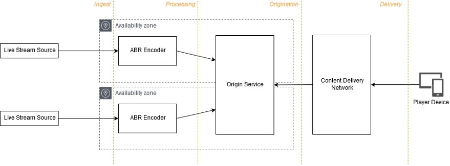

# Scenario: Live streaming

Live video streaming is core to many exciting events, news, and
interactive experiences. It is used extensively in social media,
sporting events, corporate streaming, e-sports, broadcast TV, as
well as IoT and security camera applications. Due to the real-time
nature of live content, special considerations must be taken when
architecting live streaming solutions. As with other streaming
media workflows, the fundamental architecture components include
ingest, processing, origination, and delivery.

One of the unique challenges of live video streaming is that the
value of the content being streamed decreases exponentially as
time passes from the _live_ point. For example,
many people might want to watch a sporting event live, but the
number of viewers who watch the event hours or days after it takes
place tends to decrease as time goes on. Distributors only have
one chance to get a live event right, and do not have the luxury
of asking viewers to come back later when issues are resolved. As
such, it is critically important to ensure that live streaming
workflows are optimized for reliability and performance. 

The cloud is uniquely suited to handling these challenges, with
its regional diversity, availability, and elastic scalability. By
decoupling the various services involved in live streaming,
reliable and performant workflows can be built that are cost
effective and where the various architecture components can scale
elastically to handle variations in demand or in live stream
counts. It also allows flexibility to include value added
services, such as machine learning technologies to perform actions
such as automated closed caption/subtitle generation or content
tagging/indexing. This type of redundancy, scalability, and
developer flexibility is not possible with monolithic on-premises
live streaming applications. The following diagram illustrates a
sample live streaming workflow using redundant sources and a
Multi-AZ architecture:

_Live streaming architecture_

## Considerations

- **Amazon Interactive Video Service
  (Amazon IVS)** is a managed live streaming
  service that manages low-latency interactive live streams
  on your behalf. Consider using Amazon IVS if you don’t
  want to manage your own live streaming service.
- Ingest your video content in the AWS Region that is
  closest to the source of the stream.
- Where subsecond latency is required (that is, video
  conference-like applications) protocols such as WebRTC
  should be considered. However, these solutions do not
  scale as effectively for _one-to-many_
  distribution as they require stateful connections with
  backend origin services. Amazon Kinesis Video Streams and
  Amazon Chime SDK can both be used to implement WebRTC into
  your applications.
- Use a reliable ingest protocol such as Zixi, SRT, RIST,
  RTP-FEC, or RTMP as these are designed to improve
  reliability over unmanaged networks, such as the internet.
- Consider source ingest within at least two AWS
  Availability Zones from diverse network paths.
- To reduce delivery and storage costs, explore compression
  technologies such as
  [AWS Quality-Defined Variable Bitrate (QVBR)](https://aws.amazon.com/media/tech/quality-defined-variable-bitrate-qvbr/ "https://aws.amazon.com/media/tech/quality-defined-variable-bitrate-qvbr/") that
  provide streams at lower bitrates but equivalent video
  quality.
- Use an origin server specifically designed and optimized
  to support the latency and data consistency models
  required for live streaming.
- Origin hosts can scale to serve streams to tens or even
  hundreds of viewers, but it is always recommended to use a
  CDN such as Amazon CloudFront to scale live stream
  delivery beyond a handful of viewers.
- Refer to
  the [Live
  Streaming on AWS](https://aws.amazon.com/solutions/implementations/live-streaming-on-aws/ "https://aws.amazon.com/solutions/implementations/live-streaming-on-aws/") solutions implementation for a
  well-architected reference architecture for live
  streaming.
