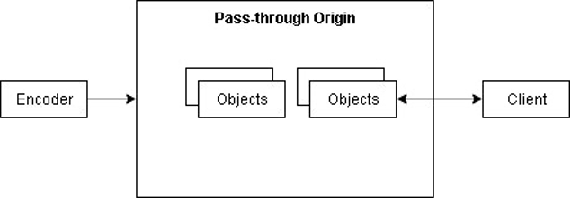
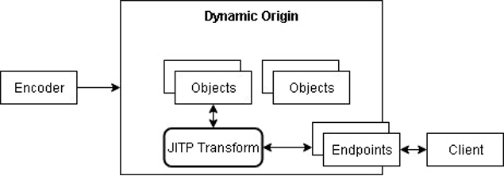

# Selection

| SM_PERF1: How do you optimize media delivery through media origination and processing?        |
| --------------------------------------------------------------------------------------------- | -------------------------------------------------------------------------------------------------------------------------------------------------------------------------------------------------------------------------------------------------------------------------------------------------------------------------------------------------------------------------------------------------------------------------------------------------------------------------------------------------------------------------------------------------------------------------------------------------------------------------------------------------------------------------------------------------------------------------------------------------------------------------------------------------------------------------------------------------------------------------------------------------------------------------------------------------------------------------------------------------------------------------------------------------------------------------------------------------------------------------------------------------------------------------------------------------------------------------------------------------------------------------------------------------------------------------------------------------------------------------------------------------------------------------------------------------------------------------------------------------------------------------------------------------------------------------------------------------------------------------------------------------------------------------------------------------------------------------------------------------------------------------------------------------------------------------------------------------------------------------------------------------------------------------------------------------------------------------------------------------------------------------------------------------------------------------------------------------------------------------------------------------------------------------------------------------------------------------------------------------------------------------------------------------------------------------------------------------------------------------------------------------------------------------------------------------------------------------------------------------------------------------------------------------------------------------------------------------------------------------------------------------------------------------------------------------------------------------------------------------------------------------------------------------------------------------------------------------------------------------------------------------------------------------------------------------------------------------------------------------------------------------------------------------------------------------------------------------------------------------------------------------------------------------------------------------------------------------------------------------------------------------------------------------------------------------------------------------------------------------------------------------------------------------------------------------------------------------------------------------------------------------------------------------------------------------------------------------------------------------------------------------------------------------------------------------------------------------------------------------------------------------------------------------------------------------------------------------------------------------------------------------------------------- |
| **SM_PBP1 – Select an appropriate origin technology for your workload**                       | There are two origin approaches that can be used to optimize performance of your workload — pass-through and dynamic. Pass-through origin servers are high-performance HTTP servers that are adequately scaled to respond to requests for content segments from viewers or CDNs. Encoders PUT pre-encoded, pre-packaged, and pre-encrypted content to the origin server. Pass-through origin servers, like AWS Elemental MediaStore or Amazon S3, offer limited media processing functionality like repackaging, but offer high performance and low cost. When using a pass-through origin, the media processing layer is responsible for the media codec and transport protocol formatting. For example, the encoder configuration for HLS segment size will directly impact the end-to-end latency of a live stream. To support multi-protocol environments like MPEG DASH and Apple HLS with a single set of processed media on a passthrough origin, the industry is moving toward the Common Media Application Format (CMAF). We encourage you to use this format if you are planning to use a pass-through origin (if your player devices support it) as it reduces storage costs, improves CDN cache efficiency, and can decrease latency through chunked-transfer-encoding.   _Comparing pass-through origin to dynamic origin_ With a dynamic origin, content is PUT to the origin by an encoder in a single format and dynamically formatted as requested by viewers. This process, often referred to as just-in-time packaging (JITP), provides additional flexibility as content endpoints can be customized to support business objectives without modifying the content produced by the encoder. This is especially powerful for multi-protocol or multi-DRM workflows that address a fractured device ecosystem with variable requirements. Additional features enabled by dynamic origin services like AWS Elemental MediaPackage include look-back, start-over, and live-to-VOD recording. Note that because dynamic origins require an internal buffer to process content just-in-time, you will trade off live stream latency when compared to pass-through origins. Dynamic origins provide you with the flexibility to customize endpoints to support your target devices. For example, you can create an endpoint optimized for connected television experiences that accounts for in-home network connections and large screens by creating a rendition set with high-resolution content and large segment sizes. Alternatively, using the same content, you could create an endpoint optimized for mobile networks, screens, and interactivity with shorter segment sizes and additional low-resolution options. The decision to use a pass-through origin or a dynamic origin depends on your unique business requirements. In general, use a pass-through origin if you have a limited number of client compatibility requirements, a desire for the lowest possible live latency, and value simplicity over flexibility. If you have a diverse client ecosystem and require advanced origin features like live-to-VOD recording, you should use a dynamic origin.                                                                                                                                                                                                                                                                                                                                                                                                                                                            |
| SM_PERF2: Hw do you approach media source contribution?                                       |
| ---                                                                                           |
| **SM_PBP2 – Begin with the highest-quality sources that you can reasonably acquire**          |
| **SM_PBP3 – Use specialized media transport and acceleration protocols**                      |
| **SM_PBP4 – Use private network connectivity between your content provider and media ingest** | There are two ingest patterns for video applications, _real-time_ and *file-based*. Real-time workloads often include a business requirement for reliability and low latency, while file-based transfers for mezzanine files or archive workloads generally prioritize efficiency of data movement. **Real-time contribution** It’s difficult to consistently deliver live video content to large audiences quickly, reliably, and cost-effectively. Getting a live source from an event site, often called a _contribution feed_, is the first inflection point when deciding trade-offs that will eventually impact end users. In all cases, use of an efficient codec (for example, HEVC) for signal contribution allows for optimum bandwidth utilization and improved quality at lower cost. Any impact to the network during the live contribution of media can quickly degrade and disrupt video distribution to end users**. AWS Direct Connect**, in a [maximum resiliency configuration](https://aws.amazon.com/directconnect/resiliency-recommendation/ "https://aws.amazon.com/directconnect/resiliency-recommendation/"), is recommended for services requiring a dedicated, sustained connection to AWS (that is, high visibility live events) as it provides a consistent network experience when compared to internet transport. For first-mile connectivity at remote live events that are subject to unmanaged networks for delivering live media, we strongly recommend using a combination of mediums, such as bonded-cellular, satellite uplink, and multiple ISPs connecting to the AWS network. Many applications use TCP-based protocols like RTMP to deliver contribution feeds, but these protocols are inefficient and can introduce unnecessary latency. We recommend a UDP-based reliable transport protocol like RTP, Reliable Internet Stream Transport (RIST), or Secure Reliable Transport (SRT) for real-time contribution. These protocols are optimized for low-latency, efficient video transport, and include tunable error correction schemes like Automatic Repeat Request (ARQ) and Forward Error Correction (FEC). In general, ARQ-based protocols are preferred for unmanaged, public networks where loss is non-deterministic and FEC is useful for semi-managed networks where loss is deterministic. **File-based contribution** Asset management, archive, video-on-demand, and many other media workloads manage large file transfers. AWS provides a portfolio of services designed for these specific needs. These are our general recommendations:  • As with live workloads, sustained file upload architectures should use AWS Direct Connect.  • Always use **Amazon S3 Multipart Upload** when uploading content to **Amazon S3**.  • When uploading content from a location geographically distant from an AWS Region, use **Amazon S3 Transfer Acceleration** to leverage CloudFront edge PoPs for connectivity into AWS.  • When upload duration is expected to exceed more than one week, use **AWS Snowball Edge.**  • For hybrid architectures where on-premises infrastructure requires **Amazon S3** access as NFS mounts or a virtual tape library interface to Amazon Glacier, use **AWS Storage Gateway** and **AWS File Gateway.** Due to the large file sizes of mezzanine quality media assets, video workloads should employ tiered storage balancing performance and cost. S3 Lifecycle policies can be used to programmatically move infrequently accessed S3 assets to Amazon S3 IA or Amazon Glacier, however, this applies only to object storage and is a one-way function. Consider designing an intelligent filer service to restore source assets into the appropriate storage service (block, file, or object) when required by a processing job. If asset references exist use these manifests to optimize restores. |
