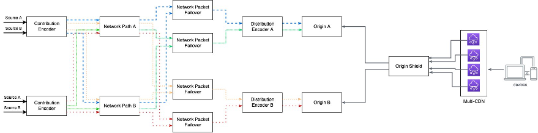

# Workload architecture

| SM_REL1: How does your streaming infrastructure withstand failures in ingest, processing, origination, or delivery components?                                     |
| --------------------------------------------------------------------------------------------------------------------------------------------------------------------- |
| **SM_RBP1 – Document all workload dependencies and expected viewer experience in the event of component failure**                                                  |
| **SM_RBP2 – Design live streaming ingest architecture to withstand source failure by ingesting redundant video signals that take diverse network paths to AWS** |
| **SM_RBP3 – Design live streaming workflow to withstand individual processing and origination failures by implementing redundant video pipelines**              |

Closely examine both hard and soft service dependencies to ensure that failure
conditions are well understood. Engage directly with service partners to understand failure
conditions *before* issues arise. If problems do occur, notify the end
user and protect their experience by offering alternate content. Use postmortems to learn
from experiences and develop action plans. 

Examples of hard dependencies in a streaming media workload include:

- Signal contribution path (Live)
- Media processing (Live)
- Media origin
- Digital rights management (DRM) and authentication

Examples of soft dependencies in a streaming media workload
include:

- Content management systems
- Ad insertion and splicing
- Analytics
- Content Delivery Network (load dependent)

For example, if your ad-insertion platform experiences an
availability outage, systems should fall back to an underlying
origin source or have a process in place to remove ad insertion.
This might decrease the revenue earned in the short term, but
would retain service up-time and your audience satisfaction. 

Every business will have to trade off the cost of reliably
streaming content with any failure conditions that arise. We
recommend reviewing the
[Well-Architected
Reliability Pillar whitepaper](../reliability-pillar/welcome.md "../reliability-pillar/welcome.md") to help you calculate your
reliability target and the hard and soft dependencies of your
workload.

**Live resilient design**

To achieve a highly available media streaming workflow, it is
important to design for redundancy in every component of the
chain. Let’s consider the components in a live workflow and the
network paths between them:

_End-to-end redundant Live workflow_

A failure in either the video signal or the network path that it
takes to reach AWS Cloud impacts the entire workload and
subsequently the end customer experience. Design your live video
ingest architecture to withstand individual source failure by
ingesting redundant video signals that take diverse network
paths to AWS. 

For example, in the preceding architecture, Source A and Source
B are redundant input mezzanine sources. The contribution
encoder is designed to fail over between the redundant sources
in case of signal loss. To protect against failure of the
contribution encoders, ensure that there are redundant
contribution encoders in different physical on-premises
locations. Each contribution encoder outputs two sets of
contribution feeds, each with a binary identical SMPTE 2022-7
compliant network packet streams (represented by the same color
arrow lines). This allows for transmission over separate network
routes so if packets from one route are lost, the data can be
reconstructed using packets from the second stream (as depicted
by the Network Packet Failover component).

**AWS Direct Connect** can be
used to provide dedicated network paths and
**AWS Elemental MediaConnect**
Flows can be used to reliably transport the feeds and provide
failover at the network packet level compliant to SMPTE 2022-7
specifications. This design provides for full ingest redundancy
across source signals and network paths.

Distribution encoding can be impacted by infrastructure issues,
degradation of a dependent source, or by factors locally within
the component. To achieve distribution encoder pipeline
redundancy, ensure that the input source is being processed in
at least two redundant locations within a Region. In the
preceding architecture diagram, a distribution encoder in each
Region is receiving two redundant input sources and processing
them in separate AZs. Consider replicating the processing
pipeline into an additional Region if your reliability targets
warrant it.

With **AWS Elemental MediaLive**,
a standard channel creates two redundant encoding pipelines (one
in each AZ) with the option to provide redundant input sources
with configurable failure scenarios. This allows you to
architect a workload that can seamlessly fail between inputs
while maintaining the integrity of the stream being published to
the origin. By providing embedded timecode in your sources, you
can prevent input failures from impacting the viewer experience
through the MediaLive pipeline locking feature. If the input to
MediaLive does not have valid timecode, the channel still
remains highly available but without seamless failover.

It’s a best practice to deploy redundant origin services in
Multi-AZ or multi-Region and in case of an origin failure,
reroute affected traffic. You can monitor origin health metrics
and make real-time traffic routing decisions through DNS-based
failover or CDN health checks. Alternatively, you can present
all origin options to the player within the ABR manifest and
implement client conditions for switching. In addition to the
full outage failures, it is also important to protect against
transient failures like high request latencies or timeouts. 

For availability, performance, and geographic coverage reasons,
it is common to deliver content using multiple CDNs. Doing so
helps in distributing the traffic based on geolocation and
available capacity. It also protects against failure or
over-subscription in one or more CDN PoPs. It is recommended to
collect near-real time QoS data (error rates, buffer rates,
latency, etc.) from CDNs to determine the best delivery path for
your customers and award traffic to best performing CDN. You may
also load balance across CDNs based on other business
considerations like cost.

**VOD resilient design**

As described in the scenarios section, VOD processing typically
uses a serverless state machine comprised of event sources,
messaging services, and subscribers to perform various
operations. These operations should always be idempotent and
designed so that when operations receive messages more than once
or run multiple times, they do not negatively impact the state
of the workload. Dead-letter queues and distributed tracing
services like AWS X-Ray can help you identify problematic
messages or functions in your workflows as you scale.

The non-real-time nature of VOD provides you with the
flexibility to decouple the batch Ingest and Processing
components from Delivery and Playback. Thus, there are two
approaches for reliable VOD design:

**VOD origin reliability** — In
this scenario, your business objectives require that viewers can
play content in the event of a workload failure, but allow for
an interruption in the ability to publish new content to your
platform. This is typical for platforms that publish a
relatively small amount of new content on a daily or weekly
basis. After content is ingested and processed, it’s published
and redundantly copied to multiple origin services. Technologies
such as **Amazon S3 Cross-Region
Replication (CRR)** can automate this function. 

Once content is securely stored in multiple delivery endpoints,
the CDN or client device can attempt playback from an alternate
origin if playback from the primary endpoint fails. This
architecture necessitates that the key delivery, authentication,
content management, and other application layer services be
reachable in the event of a failure.

**VOD processing and origin
reliability** — In this scenario, the full application
functionality must remain available in the event of an
interruption. This includes the ability to ingest and process
new content. This is achieved through a multi-Region design
where the streaming architecture is replicated across two AWS Regions and CDNs, client logic, and DNS is used to route
requests between Regions. In this scenario, care must be taken
when designing the underlying storage and persistence layers
(for example, databases and caching) to ensure consistency
between Regions.
