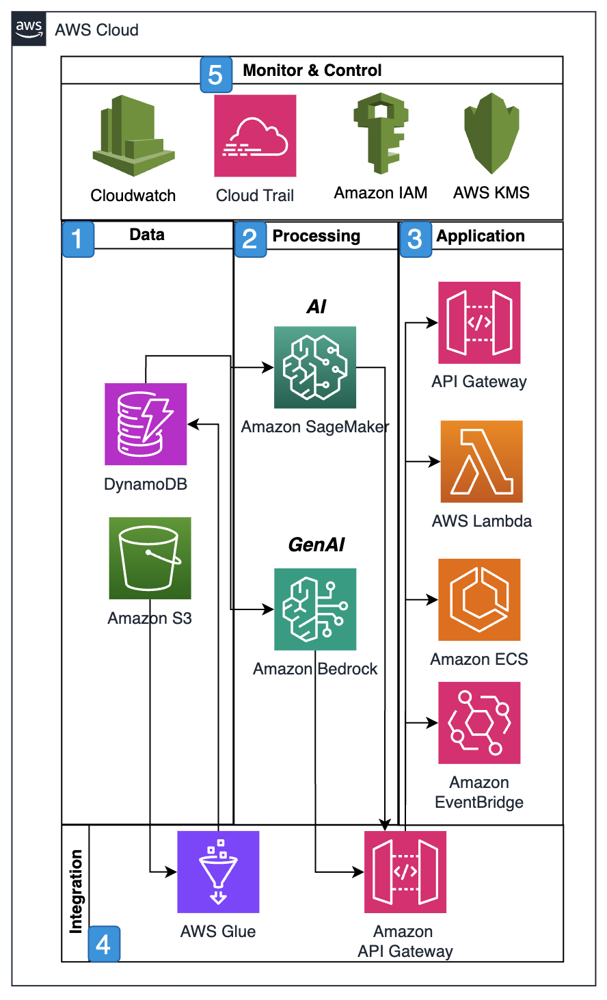

# Planning and operations

Supply chain planning and operations involve managing the flow of
goods, services, and information from suppliers to end customers.
This complex process encompasses demand forecasting, inventory
management, procurement, production scheduling, warehousing,
transportation, and distribution activities. Organizations use
supply chain planning to optimize their resources, reduce costs,
minimize risks, and make timely delivery of products to customers.
Effective supply chain operations require careful coordination
among various stakeholders, including suppliers, manufacturers,
distributors, retailers, and logistics providers.

AWS offers a powerful combination of Amazon SageMaker AI's machine
learning capabilities and Amazon Bedrock's generative AI models to
revolutionize supply chain planning and operations. In demand
planning and forecasting, while SageMaker AI processes historical
sales data and market trends to create statistical forecasting
models, Bedrock's Claude or Titan models analyze unstructured data
sources like news articles, social media trends, and market
reports to identify emerging patterns that might impact demand.
This combined approach provides more comprehensive and nuanced
demand predictions than traditional forecasting methods alone.

In manufacturing operations, Amazon SageMaker AI builds predictive
maintenance models that analyze equipment sensor data to forecast
potential failures days or weeks in advance, reducing unplanned
downtime. Amazon Bedrock enhances these insights by generating
equipment-specific maintenance procedures, step-by-step
troubleshooting guides, and repair documentation tailored to
detected anomalies.

Anthropic's Claude analyzes historical maintenance logs alongside
technical documentation to identify recurring issues and suggest
optimization opportunities, such as modified maintenance intervals
or alternative replacement parts, resulting in a more proactive
maintenance program that extends equipment lifespan.

For capacity planning, SageMaker AI algorithms optimize production
schedules by analyzing historical throughput data, labor
constraints, and material availability, while Bedrock generates
detailed production scenarios for various demand patterns,
equipment configurations, and workforce levels.

This enables manufacturing planners to evaluate multiple
operational strategies through intuitive natural language
interfaces where they can conversationally query complex
scheduling scenarios, such as _What happens to our
production capacity if supplier X delays deliveries by two
weeks?_

In logistics and distribution, SageMaker AI powers route optimization
models that reduce transportation costs and inventory management
systems that decrease holding costs while maintaining service
levels.

Bedrock complements these capabilities by generating comprehensive
logistics execution plans containing carrier-specific handling
instructions, temperature control requirements, customs
documentation checklists, and contingency procedures for
disruptions like port congestion or weather events.

Claude analyzes complex shipping documentation against constantly
changing customs regulations for different countries, identifying
compliance issues before shipment and suggesting corrective
actions that significantly reduce the risk of costly delays and
regulatory penalties.

For supply chain risk management, SageMaker AI analyzes quantifiable
risk factors such as historical supplier performance, lead time
variability, and demand volatility, while Bedrock continuously
monitors news feeds, weather forecasts, labor disputes, and
geopolitical developments affecting key trade routes or production
regions.

This combined approach enables the generation of comprehensive
risk reports with financial impact assessments, probability
ratings, and prioritized mitigation recommendations tailored to
specific business constraints.

Supplier relationship management benefits significantly from
SageMaker AI's ability to evaluate comprehensive supplier performance
metrics including quality, on-time delivery, responsiveness, and
cost competitiveness, creating segmentation models that identify
which suppliers require closer partnership versus transactional
relationships.

Bedrock assists procurement teams by generating professional
correspondence such as RFP documents, contract amendment requests,
and negotiation position summaries based on specific business
requirements and supplier history.

Claude analyzes complex supplier proposals and contract language
to identify favorable terms, potential risks, hidden costs, and
negotiation opportunities, improving overall supplier governance
and relationship management.

Implementation of these supply chain solutions follows a
structured approach in Amazon SageMaker AI Studio: setting up the
environment with appropriate IAM permissions; integrating supply
chain data from ERP systems, IoT devices, and external sources;
developing and training appropriate models for specific use cases;
connecting to Bedrock services for natural language capabilities;
creating automated pipelines for ongoing operations; deploying
models as scalable endpoints; and integrating these intelligent
capabilities into existing supply chain workflows and systems
through well-documented APIs and user interfaces.

The integration of SageMaker AI's machine learning capabilities with
Bedrock's generative AI creates a more comprehensive supply chain
management solution. This combination enables organizations to
handle both quantitative analysis and qualitative insights, while
providing natural language interfaces that make complex supply
chain operations more accessible to users across the organization.
The system can continuously learn and adapt to new conditions
while generating actionable insights and recommendations in
human-readable formats. This integrated approach helps
organizations maintain optimal inventory levels, respond quickly
to market changes, verify product quality, and ultimately enhance
customer satisfaction while maximizing operational efficiency and
profitability.

## Reference architecture

## Architecture description

1. Data ingestion from various sources.
2. Processing through ML models and AI services.
3. Real-time analysis and prediction.
4. API-based service delivery.
5. Continuous monitoring and optimization.

## Architecture objectives

- Scalable processing of supply chain data.
- Real-time insights and predictions.
- Secure and compliance-aligned operations.
- Integration with existing systems.
- Monitoring and optimization capabilities.

## Metrics

Based on the supply chain planning and operations scenario,
the three recommended metrics for an AWS
Well-Architected Framework analysis, along with their rationale are:

1. Simulation accuracy:
   - **Metric**: Percentage
     accuracy of simulations predicting the impact of changes in
     transportation strategies.
   - **Rationale**: This directly
     measures the reliability and effectiveness of the combined
     SageMaker AI and Bedrock solution in making accurate
     predictions, which is fundamental to the entire system's
     value proposition.
   - **Target**: Over or equal to
     90% accuracy in predictions when compared to actual
     outcomes.
   - **Well-Architected pillars**:
     Performance efficiency and reliability.

2. Route optimization savings:
   - **Metric**: Dollar savings
     achieved through last-mile and middle-mile route
     optimizations.
   - **Rationale**: Provides
     concrete financial validation of the system's effectiveness
     and demonstrates clear business value.
   - **Target**: Minimum 15%
     reduction in transportation costs.
   - **Well-Architected pillars**:
     Cost optimization and performance efficiency.

3. Frequency of emergency responses:
   - **Metric**: Number of
     emergency responses or corrective actions triggered by the
     application. For Example:
     - Supply chain disruptions like weather, political, labor
       or other developments impacting logistics or trade
       routes.
     - Equipment Failures flagged as imminent requiring
       immediate intervention.
     - Compliance issues impacting customs processing time or
       penalties.
     - Inventory shortages impending based on plan including
       supplier performance issues or unexpected demand spikes.
     - Quality control failures requiring immediate corrective
       action.

   - **Rationale**: Indicates the
     system's effectiveness in proactive risk management and its
     ability to prevent disruptions.
   - **Target**: Over or equal to
     30% reduction in emergency incidents year-over-year.
   - **Well-Architected pillars**:
     Reliability and operational excellence.

These metrics were selected because they:

- Directly align with core AWS Well-Architected Framework
  pillars.
- Provide measurable evidence of system effectiveness.
- Cover both technical performance and business outcomes.
- Address key aspects of the scenario: prediction accuracy,
  cost optimization, and risk management.
