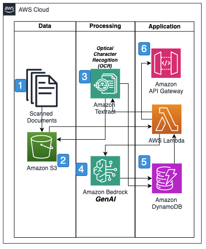

# Procurement automation

Implementing machine learning (ML) based procurement automation in
the supply chain using AWS services and the AWS Well-Architected
Framework provides organizations with a robust and scalable
solution. AWS offers a comprehensive suite of services that
transform traditional procurement processes into intelligent,
automated workflows.

The procurement automation system uses multiple AWS services to
create an intelligent end-to-end solution. Amazon Textract
analyzes supplier documentation using Optical Character
Recognition (OCR) to extract key information from unstructured
text. AWS Bedrock's Claude model processes this extracted document
information to analyze and categorize complex procurement
documents, including RFQs, purchase orders, and contracts, while
maintaining compliance with organizational policies and regulatory
requirements.

The solution automates key procurement workflows through
intelligent integration of AWS services. AWS Lambda functions
trigger automated actions based on predefined conditions, such as
generating purchase orders when specific criteria are met or
initiating supplier reviews based on performance metrics. Amazon EventBridge orchestrates these workflows, for smooth coordination
between different procurement processes and systems.

AWS Bedrock's generative AI capabilities enhance the procurement
process through intelligent document generation and analysis. The
system can automatically create detailed supplier communications,
analyze responses, and generate comparison reports. Claude can
evaluate complex contract terms, identify potential risks, and
suggest optimizations based on historical procurement patterns and
market conditions.

For supplier relationship management, the solution combines
SageMaker AI's analytical capabilities with Bedrock's natural
language processing to provide comprehensive supplier insights.
Amazon SageMaker AI provides sophisticated model training and
optimization capabilities, allowing companies to develop custom
models for supplier evaluation, risk assessment, and price
optimization using their historical procurement data. The system
monitors supplier performance, generates automated performance
reviews, and creates improvement plans when needed. Amazon Comprehend analyzes supplier communications and feedback to
identify potential issues or opportunities for relationship
enhancement.

Security and compliance are paramount in procurement operations.
The AWS Well-Architected Framework makes sure that the solution
implements robust security controls, including encryption of
sensitive procurement data, fine-grained access controls, and
comprehensive audit trails. AWS CloudTrail and Amazon GuardDuty
provide continuous security monitoring and threat detection to
protect procurement operations.

Together, these AWS services create a sophisticated procurement
automation solution that reduces manual effort, improves
decision-making, and enhances supplier relationships.
Organizations can handle both structured and unstructured
procurement data while providing intuitive interfaces for
procurement teams. The system continuously learns from procurement
patterns and outcomes, helping organizations optimize their
purchasing strategies, reduce costs, and maintain healthy supplier
relationships while supporting compliance with organizational
policies and regulatory requirements.

## Reference architecture

## Architecture description

1. Scanned documents are saved into Amazon S3.
2. AWS Lambda processes these documents through Amazon Textract.
3. Extracted data from the scanned documents are saved into
   Amazon S3.
4. AWS Lambda processes these documents through Amazon Bedrock
   for analysis, categorization, and generating additional
   information like summaries.
5. AWS Lambda posts the output to Amazon DynamoDB.
6. API integration is used to post the processed results

## Architecture objectives

- Process automation
- Intelligent document processing
- Supplier management
- Cost optimization
- Continuous improvement
- Integration and scalability

## Metrics

Three recommended metrics for the procurement automation
scenario are:

- Supplier performance score:
  - **What**: Measures
    overall supplier effectiveness and reliability
  - **Why**: Directly tracks
    the AI/ML system's ability to evaluate and manage
    suppliers
  - **Target**: 95% or higher
    performance rating
  - **Calculation**: Weighted
    average of:
    - Delivery accuracy (30%)
    - Quality compliance (30%)
    - Response time (20%)
    - Policy compliance (20%)

- SLA compliance rate:
  - **What**: Measures
    system's ability to meet service level agreements
  - **Why**: Critical for
    validating automation effectiveness
  - **Target**: 98% or higher
    compliance
  - **Key components:**
    - Document processing time
    - Order accuracy
    - System availability
    - Response times

- Perfect order rate:
  - **What**: Measures
    end-to-end procurement success
  - **Why**: Validates
    overall system effectiveness
  - **Target**: 99% or higher
    perfect orders
  - **Success criteria:**
    - Correct documentation
    - On-time processing
    - Accurate fulfillment
    - Compliance adherence

These metrics provide coverage of:

- System performance
- Business outcomes
- Automation effectiveness
- Risk management
- Operational excellence
