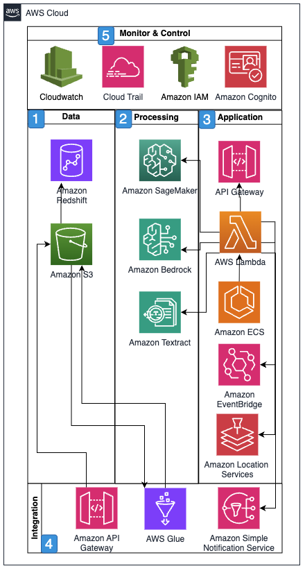

# Product traceability

Product traceability in supply chain management is the ability to
track and document the journey of products and their components
from raw materials to finished goods. Effective traceability
enables organizations to verify product authenticity, measure
contractual obligations, facilitate quality control, manage
recalls efficiently, and maintain regulatory compliance while
providing transparency to stakeholders.

Product traceability addresses the critical need for visibility
and validation of each party supporting a particular product's
supply chain. Tracing products back up the supply chain involves
frequent updates as there are changes in vendors, suppliers,
warehouses, manufacturing, and carriers. Begin with AWS Glue, for
seamless ingestion, cleaning, and processing of third-party data,
particularly focused on vital information such as shipping and
invoice details. A user-friendly, serverless portal, powered by
Amazon Route 53, Amazon Cognito, Amazon CloudFront, and Amazon S3,
enables stakeholders to upload supply chain certificates
effortlessly.

The pivotal feature of this architecture lies in its meticulous
data extraction process initiated by Amazon EventBridge and
orchestrated by AWS Step Functions. Here, Amazon Textract's
capabilities, including optical character recognition and plain
language queries, facilitate the extraction of key details from
certificates, such as expiration dates and certificate numbers.
The inclusion of Amazon Location Service further enhances
traceability by mapping supplier addresses to GPS coordinates,
offering a visual representation of geographical locations.
Notably, the system allows for optional crosschecking of the
extracted data against third-party information, providing a
validation mechanism crucial for the authenticity and accuracy of
product traceability data.

Product traceability from AWS Professional Services is
specifically tailored to meet the demands of global enterprises,
offering a seamless, automated, and secure solution. Through a
combination of data extraction, mapping, and validation processes,
it provides organizations with a comprehensive toolset to achieve
real-time visibility and accuracy in tracing activities throughout
the supply chain.

## Reference architecture

## Architecture description

1. Data is stored in Amazon S3 for processing into Amazon Redshift
   for the data lake.
2. Processing through Amazon SageMaker AI ML models and AI services
3. Real-time analysis and prediction
4. API-based service delivery
5. Continuous monitoring and optimization

## Architecture objectives

- Scalable processing of supply chain data
- Automated document processing
- Real-time insights and predictions for end-to-end supply
  chain
- Audit compliance and secure data interchange
- Integration with existing systems, internal and external
- Monitoring and optimization capabilities

## Metrics

Based on the product traceability scenario, the three relevant
metrics are:

- Data accuracy and validation:
  - **Primary metric:**
    Accuracy rate of extracted and validated product data
  - **Supporting metrics:**
    - Document extraction success rate
    - Data validation match rate
    - Certificate verification accuracy
    - Error detection rate in supply chain documentation
    - **Relevance**:
      Critical for reliable traceability and compliance
      verification

- Traceability response time
  - **Primary metric:** Time
    to trace a product's complete supply chain journey
  - **Supporting metrics:**
    - Data retrieval speed
    - Certificate processing time
    - Query response time for product history
    - Time to generate traceability reports
    - **Relevance:**
      Essential for rapid response to quality issues or
      recalls

1. Data integration completeness:
   - **Primary metric:**
     Percentage of supply chain events successfully captured
     and linked
   - **Supporting metrics:**
     - Supply chain visibility coverage
     - Partner data integration rate
     - Documentation completeness score
     - Chain of custody gaps identified
     - **Relevance:**
       Measures the effectiveness of end-to-end
       traceability

These metrics were selected because they:

- Focus on core traceability requirements
- Address key compliance and quality control needs
- Measure system effectiveness in maintaining complete chain
  of custody
- Align with regulatory and stakeholder requirements
- Support rapid response capabilities for quality issues or
  recalls
